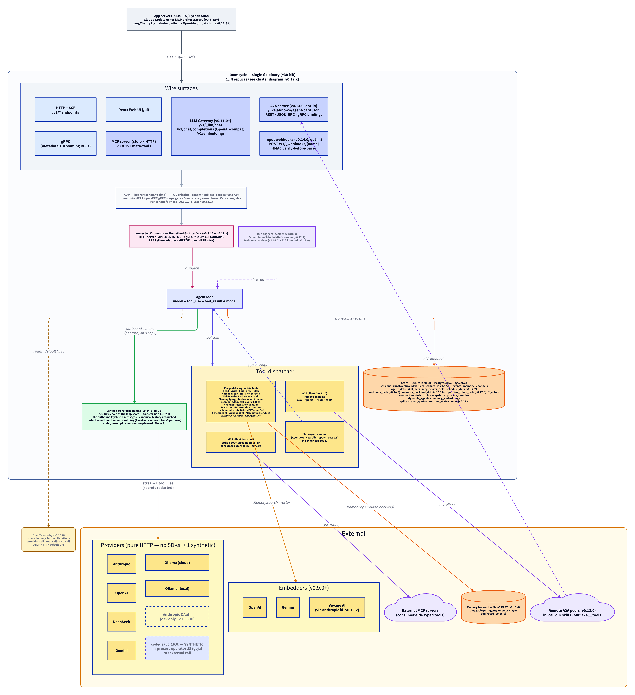

<p align="center">
  
</p>

<p align="center">
  <strong>Where agents live, talk, and learn.</strong><br/>
  <em>The runtime substrate for agentic systems.</em>
</p>

<p align="center">
  <a href="https://github.com/denn-gubsky/loomcycle/releases"></a>
  <a href="LICENSE"></a>
  
</p>

---

> 🌱 **Apache-2.0 open source — external contributions open at v1.x.** Loomcycle is in active v0.8 → v0.9 → v1.0 development. We're stabilizing the core primitives before opening the floodgates; today we welcome bug reports, security disclosures, downstream consumers, and forks. See [`CONTRIBUTING.md`](CONTRIBUTING.md) for the details.

---

## What it is

LoomCycle is the runtime substrate for production agents — one Go binary that hosts the LLM tool-use loop, governs six providers behind one interface, is configurable as a true managed sandbox or a full agentic dev environment, and is shaped like the kernel of an agentic OS.

A single ~30 MB binary owns the entire `model → tool_use → tool_result → model` cycle, free of vendor SDKs. **Six HTTP-only provider drivers** — Anthropic, OpenAI, DeepSeek, Gemini, Ollama cloud, Ollama local — behind one `Provider` interface. **Sixteen built-in tools** — Read, Write, Edit, HTTP, WebFetch, WebSearch, Bash, Agent, Skill, Memory, Channel, AgentDef, SkillDef (v0.8.22, runtime-mutable skill substrate), Evaluation, Interruption (v0.8.16, human-in-the-loop), Context (the v0.8.7 introspection primitive, with the v0.8.8 `help` op for narrative cross-cutting guidance). **AgentDef + SkillDef + Evaluation** (v0.8.5 / v0.8.22) — agents can fork themselves AND their skill bodies, then rate the results. **System channels + deferred publish** (v0.8.6) — operator-declared `_system/*` namespace with heartbeats, alarms, and runtime-state signals; any channel's publish can be deferred via `deliver_at`. **Built-in observability** (v0.8.11) — periodic process-resource sampler with bearer-authed `/v1/_metrics/*` API for per-run RSS / CPU% / goroutine correlation. **LoomCycle MCP server** (v0.8.15) — loomcycle exposes itself as a stdio MCP server with 21 meta-tools so external orchestrators (Claude Code, custom dashboards) drive it through standard MCP. **Pause / Resume / Snapshot** (v0.8.17) — runtime-wide quiesce + cross-version-portable JSON snapshot, the precondition for v0.9.x multi-replica HA. MCP-native both ways (consuming AND self-exposing). UNIX-style operator/caller trust separation: the operator config picks the posture, agents can't escape it. Embedded React monitoring UI at `/ui`. Runs on a cheap VPS; scales to multi-replica HA via Postgres + Redis.

Built today for production agentic workloads — built tomorrow for self-evolving multi-agent ecosystems where agents author other agents, talk through channels, and learn from evaluation feedback.

## Two postures, one binary

Same Go binary, same config schema. Operator flips a few env vars to pick the posture.

| Posture | Configuration shape | Use case |
|---|---|---|
| **True managed sandbox** | `LOOMCYCLE_BASH_ENABLED=0`, `LOOMCYCLE_READ_ROOT` / `LOOMCYCLE_WRITE_ROOT` unset, `LOOMCYCLE_HTTP_HOST_ALLOWLIST` empty, `LOOMCYCLE_HTTP_CALLER_AUTHORITATIVE=1`. Every tool default-deny; agents can only reach what the caller's per-request `allowed_hosts` says. | Shared-server deployments processing untrusted prompts. The runtime survives contact with adversarial input. |
| **Agentic dev environment** | Bash enabled, filesystem roots set to your workspace, broad `allowed_hosts`, optional local Ollama for offline work. | Local development. Internal trusted operators. Single-user research workstation. |

The trust boundary is **operator/caller** — the operator config is the floor, callers can narrow per-request but never widen. The bearer token (`LOOMCYCLE_AUTH_TOKEN`) is the authority. Treat anyone with the token as fully trusted to drive the runtime. For true isolation in the sandbox posture, run loomcycle inside a container or VM — `Bash` is restricted (cwd, env scrub, output bounds, timeouts) but is **not** a kernel-level sandbox.

## Quick start

```bash
# 1. Build (UI + binary in one shot)
make build-all
# Or Go-only (skips embedding the UI; /ui returns 503):
#   make build

# 2. Configure
cp .env.example .env.local       # set ANTHROPIC_API_KEY / GEMINI_API_KEY / etc.
cp loomcycle.example.yaml ~/.config/loomcycle/loomcycle.yaml

# 3. Run
./bin/loomcycle --config ~/.config/loomcycle/loomcycle.yaml

# 4. Smoke
curl http://127.0.0.1:8787/healthz
# {"ok":true}

# 5. Real call (from another terminal)
curl -N http://127.0.0.1:8787/v1/runs \
  -H "Authorization: Bearer $LOOMCYCLE_AUTH_TOKEN" \
  -H "Content-Type: application/json" \
  -d '{
    "agent": "default",
    "segments": [{"role":"user","content":[{"type":"trusted-text","text":"Hello"}]}]
  }'

# 6. Open the Web UI (one-time per browser session)
open "http://127.0.0.1:8787/ui?token=$LOOMCYCLE_AUTH_TOKEN"
# Sets a HttpOnly session cookie + redirects to /ui.
```

## Current and planned

**Shipped through v0.8.23:**

- **v0.8.23** — **`SkillDef` + `AgentDef` on every wire surface**. PR #163 lifts both substrate primitives onto HTTP admin endpoints (`POST /v1/_agentdef` + `/v1/_skilldef`), gRPC RPCs (`AgentDef` + `SkillDef` on the Loomcycle service), TS adapter methods (`client.agentDef()` + `skillDef()`), and Python adapter async methods (`client.agent_def()` + `skill_def()`). MCP gains the 26th meta-tool `skilldef`. Single op-discriminated method per tool — same body the in-process tools accept. New typed error class `SubstrateToolRefusedError` on both adapters distinguishes tool-level refusals (scope deny, empty body) from transport failures; carries a `tool` field for branching. Server-side `INVALID_ARGUMENT` now maps to Python's `InvalidArgumentError` (was bare `LoomcycleError`). Also bundles two v0.8.22 substrate hotfixes surfaced by code review: `runSubAgent` was bypassing `resolveSkillBodiesForRun` (sub-agents kept the static baked body forever); `resolveSkillBodiesForRun` was aborting the whole agent on a single store error instead of degrading per-skill. Adapter releases: `@loomcycle/client` 0.8.20 → 0.8.23 (+29 methods); `loomcycle` Python 0.6.1 → 0.7.0 (+24 async methods).
- **v0.8.22** — **`SkillDef` tool — runtime-mutable skill substrate**. Mirror of `AgentDef` (v0.8.5) but for SKILL bodies: same six ops (`create` / `fork` / `get` / `list` / `retire` / `promote`), same versioned append-only storage with `parent_def_id` lineage and an active pointer per name, same scope-policy gate (`skill_def_scopes:` yaml — closed set `any` / `named:<name>` / `descendants`; no `self`), same `AllowedTools` ceiling (forks may NARROW, never widen). Bootstrap from static SKILL.md when no DB row exists yet; the `Skill` tool consults `SkillDefGetActive` first and falls back to the on-disk body. Approach A (skill body baked into system prompt) re-resolves at run-creation so promoted versions take effect for new runs without restarting the binary; in-flight runs keep their locked prompt. Snapshot envelope grows two new sections (`skill_defs` / `skill_def_active`). The internal Hermes-comparison RFC's Tier-D entry ("deliberately don't adopt runtime skill mutation") moves to Tier A as substrate — selection stays policy, loomcycle does NOT auto-promote.
- **v0.8.21** — **Activity Monitor + audit view + UI polish**. New `/ui/activity` tab with live charts (memory vs running agents, CPU load, queue depth) backed by the v0.8.11 sampler; hand-rolled SVG `LineChart` keeps web/ dep count at three runtime packages. `/healthz` extended with `metrics_enabled` so the UI renders its "sampler off" empty state without probing `/v1/_metrics` first. New `/ui/audit` page over a new `GET /v1/_events` admin endpoint (paginated cross-session event log, filterable by event type + date range). Topbar version surfaces the actual running binary (was hard-coded). NavLink active-state underlines on the nav tabs. Copy buttons on every expanded EventCard. Resizable panes on `runs` + `memory` via a new `<Splitter>` component (localStorage-persisted widths). Running-agent rows get tinted backgrounds matching their await-state chip colour (green = running, orange = waiting on `Channel.subscribe`, violet = waiting on `Interruption.ask`).
- **v0.8.18** — **Cross-transport hardening of v0.8.17 Pause/Resume/Snapshot.** v0.8.17 shipped real impls behind HTTP + CLI + Web UI but the `connector.Connector` abstraction stayed in its v0.8.15 PREVIEW state, so MCP tools / gRPC / Python all received placeholder data. v0.8.18 swaps the 8 mocked Connector method bodies to real delegation (the architectural keystone — MCP becomes real for free), adds 9 gRPC RPCs covering the full surface, ships 9 async methods + 6 typed errors on the Python adapter (v0.6.0), and matures the TypeScript adapter v0.1.0-alpha.0 → v0.8.18 with 24 methods (full Python parity + Web UI's admin/memory/interrupt surface) + 14 typed error classes + a Vitest test suite (61 cases). Plus a new `GetSnapshot` Connector method returning the full envelope including JSON content (additive — MCP tool count 21 → 22). Wire shapes locked in v0.8.15 carry unchanged — orchestrators built against PREVIEW contracts keep working.
- **v0.8.17** — **Pause / Resume / Snapshot** (the v0.8.x → v0.9.x bridge). Runtime-wide quiesce + cross-version-portable JSON snapshot. `POST /v1/_pause` cancels idempotent tools immediately, gives non-idempotent + external tools a 30 s grace window then force-cancels; new `/v1/runs` get 503 during pause. `POST /v1/_resume` releases the brakes; runs re-enter the loop. `POST /v1/_snapshots` captures running-state into a per-section-semver JSON envelope (agent_defs / agent_def_active / memory / channels / evaluations / paused_runs / optional interaction_history). Restore is idempotent via ON CONFLICT DO NOTHING; counters reflect rows actually written. CLI mirrors (`loomcycle pause / resume / state / snapshot / snapshots list/export/delete / restore`); Web UI surface (topbar pill + `/ui/snapshots` admin page). State transitions publish to `_system/runtime-state` — no new SSE event types. Precondition for v0.9.x multi-replica HA.
- **v0.8.16** — **Interruption tool** (human-in-the-loop primitive). Three ops (`ask` / `notify` / `cancel`) with three delivery backends (built-in Web UI default, consumer-side MCP, CLI). Forward-compatible `kind` enum (`question` today; `pause` / `wait_until` / `approval` reserved). Signals flow through `_system/interrupts/*` channels; bus.Wait provides sub-millisecond wake on resolution. `interrupts` table mirrors the Memory / Channel / AgentDef pattern. LoomCycle MCP server gains a 21st meta-tool (`interruption_resolve`) so Claude Code can be the answerer.
- **v0.8.15** — **LoomCycle MCP server + `Connector` abstraction**. The v0.8.x capstone: loomcycle exposes itself as a stdio MCP server with a 20-tool surface (run lifecycle, agent management, all 5 substrate builtins, PREVIEW-mocked Pause/Resume/Snapshot — real impls now landed in v0.8.17). New `connector.Connector` Go interface unifies HTTP, gRPC, MCP, and future CLI surfaces around a single contract; HTTP server IMPLEMENTS, others CONSUME via direct method dispatch. Per-run MCP bearer tokens (`${run.user_bearer}` in operator yaml) carry per-end-user identity through to downstream MCP servers.
- **v0.8.13–v0.8.14** — **Pin-after-success fallback policy + per-run MCP bearer tokens + auto-version from `runtime/debug`** + the metrics sampler CI fix. `LOOMCYCLE_FALLBACK_PIN_AFTER_SUCCESS` suppresses cross-provider mid-conversation fallback after turn 1 succeeds — closes the entire class of transcript-translation bugs that v0.8.12's `reasoning_content` strip patched one-by-one.
- **v0.8.12** — **Strip `reasoning_content` on cross-provider fallback**. Fixes a production bug where mid-conversation fallback (e.g. `gemini-2.5-flash 503 → deepseek-v4-flash`) 400'd on the new provider because the conversation history carried thinking content from the previous provider. New typed event `EventReasoningInvalidated` mirrors v0.8.2's `EventCacheInvalidated` precedent. Safe across all current providers; tool-call shape unaffected.
- **v0.8.11** — **Process-resource metrics sampler + `/v1/_metrics/*` API**. Built-in periodic sampler captures process RSS, Go heap, goroutine count, CPU% (and optionally system-wide CPU/mem) while at least one agent is running; sleep-when-idle. Three bearer-authed endpoints for windowed sample lists, per-run rollups (via SQL JOIN on `[started_at, completed_at]`), and aggregated 1h/24h/7d buckets. Default OFF; opt-in via `LOOMCYCLE_METRICS_ENABLED=1`.
- **v0.8.10** — Gemini schema sanitizer with `$ref` inlining + `oneOf`/`anyOf`/`allOf` merge + type-conflict defense (closes the Zod-discriminatedUnion 400 bug), AND sqlite migration ordering fix that unblocks the v0.8.4 → v0.8.6+ upgrade path.
- **v0.8.9** — Gemini schema sanitizer initial pass (superseded by v0.8.10).
- **v0.8.8** — **`Context.help`** op + bundled topic registry. Tenth op on the Context tool returns a topic index (`{"op":"help"}`) or full markdown body (`{"op":"help","topic":"scopes"}`). Five bundled topics ship embedded in the binary (`loomcycle`, `scopes`, `subagents`, `experimentation`, `system-channels`); operators override or extend via `LOOMCYCLE_HELP_ROOT`. Symlinks under the help root are refused; per-file parse errors soft-skip rather than fail boot.
- **v0.8.7** — **Context** tool: nine ops covering `self` / `tools` / `doc` / `permissions` / `agents` / `lineage` / `evaluations` / `channels` / `history`. Auto-attached to every agent's `allowed_tools` at config-load (opt out via `disable_context: true`).
- **v0.8.6** — **System channels + deferred publish**. Operator-declared `_system/*` channels (heartbeat-1m/5m/1h, alarms/critical/warning/info, runtime-state, provider-events); `SystemPublisher` for loomcycle-authoritative publishes; bearer-authed admin endpoint `POST /v1/_channels/_system/{name}`; general `deliver_at` on any channel's publish with `(visible_at, msg_id)` tuple cursor.
- **v0.8.5** — **Self-Evolution Substrate**: `AgentDef` tool (6 ops — `create` / `fork` / `get` / `list` / `promote` / `retire`) + versioned `agent_defs` with lineage + `Evaluation` tool (5 ops — `submit` / `get` / `list_for_run` / `list_for_def` / `aggregate`). Sub-agent `def_id` pinning for A/B-testing forks. Selection stays policy — loomcycle does NOT auto-promote.
- **v0.8.4** — **Channel** tool (persistent inter-agent message bus — one agent writes to a named channel, another reads, no orchestrator handoff).
- **v0.8.3** — Ollama provider split into `ollama` (cloud) + `ollama-local`. Operators target each backend distinctly in per-agent yaml.
- **v0.8.2 and earlier** — six provider drivers, ten built-in tools (incl. persistent Memory), MCP integration (stdio pool + Streamable HTTP, with lazy retry on first agent call), embedded React Web UI, per-tier provider policy with runtime fallback, agent directory discovery (MD + yaml override), gRPC + HTTP+SSE wire surfaces, TypeScript + Python adapters, SQLite + Postgres backends.

**Planned for v0.9.x → v1.0:**

- **v0.9.x** — **Semantic Memory** (vector retrieval) extends the v0.8.0 Memory tool with a `search` op and an `embed: true` field on `set`; new `memory_embeddings` table joined on `(scope, scope_id, key)`; pgvector (Postgres) + sqlite-vec (SQLite) backends gated on operator env opt-in; server-side embedding via a new `providers.Embedder` interface (Anthropic + OpenAI + Gemini drivers). Snapshot Memory section schema reserves the optional `embedding` field today so v0.8.17 snapshots round-trip cleanly into a future loomcycle that has vector ops.
- **v0.9.x** — high-load capacity sweep: per-tenant fairness, OTEL traces, multi-replica HA via Redis cancel pubsub, in-memory run-status cache, heartbeat-sweeper hardening.
- **v1.0** — distribution channels (Homebrew, Docker, Helm), settings UI, operator cookbook of postures.

Full per-version release notes: [`REVISIONS.md`](REVISIONS.md).
Public roadmap with v0.8.x → v1.0 design details: [`docs/PLAN.md`](docs/PLAN.md).

## Architecture (one diagram)

<p align="center">
  
</p>

Diagram source: [`docs/architecture.d2`](docs/architecture.d2) (regenerate with `d2 docs/architecture.d2 docs/assets/architecture.png`).

The v0.8.15 `Connector` abstraction layer (the pink block in the middle of the diagram) is the architectural anchor every wire transport dispatches through. For the dedicated detail diagram showing the Connector interface + its implementers, consumers, and mirroring adapters, see [`docs/assets/architecture-connector.png`](docs/assets/architecture-connector.png) (source: [`docs/architecture-connector.d2`](docs/architecture-connector.d2)).

Full request flow, abstractions, and concurrency model: [`docs/ARCHITECTURE.md`](docs/ARCHITECTURE.md).

## Adapters

- **TypeScript** — `npm install @loomcycle/client` → see [`adapters/ts/`](adapters/ts/). HTTP+SSE.
- **Python** — `pip install loomcycle` → see [`adapters/python/`](adapters/python/). Async over `grpc.aio`.

## Security highlights

- **No vendor binary** in the loop. Pure HTTP to provider APIs. No subprocess auth inheritance.
- **Default-deny everything.** Every built-in tool is disabled until env-configured. Every agent gets zero tools until `allowed_tools` is set.
- **Two-layer policy + per-request narrowing.** Operator floor in env; agent narrowing in yaml; caller narrowing per-run. Caller can never widen.
- **SSRF defence.** Hostname allowlist + RFC1918/loopback/link-local IP block at the dial layer. Defeats DNS rebinding.
- **Constant-time bearer auth.** `sha256+CTC` on both HTTP and gRPC.
- **`Bash` is restricted, not isolated.** Run inside a container or VM if you need real isolation.

Full security model + the two-layer default-deny walkthrough: [`docs/TOOLS.md`](docs/TOOLS.md).

## Documentation

- [`docs/ARCHITECTURE.md`](docs/ARCHITECTURE.md) — request flow, provider abstraction, agent loop, sub-agents, skills, storage, concurrency, cancellation.
- [`docs/TOOLS.md`](docs/TOOLS.md) — two-layer default-deny model, every built-in tool, MCP / LocalAPI integrations, per-request narrowing.
- [`docs/MCP_INTEGRATION.md`](docs/MCP_INTEGRATION.md) — end-to-end MCP HTTP pipeline: request lifecycle, `${run.user_bearer}` substitution, model-visibility boundary, recipe for wrapping a REST API as an MCP server consumable by loomcycle.
- [`docs/CONFIGURATION.md`](docs/CONFIGURATION.md) — operator config guide: provider/tier/user_tier resolution rules, four cookbook patterns (single/multi-provider × single/multi-user-tier), `models:` alias map, and the agent `.md` frontmatter field reference.
- [`docs/POSTGRES.md`](docs/POSTGRES.md) — Postgres backend operator guide: configuration, migrations, sqlite→postgres runbook, concurrency benchmark.
- [`docs/GRPC.md`](docs/GRPC.md) — gRPC surface: enablement, wire-shape parity with HTTP+SSE, error mapping, Python adapter quick-start.
- [`docs/PLAN.md`](docs/PLAN.md) — public roadmap: shipped v0.4 → v0.8.12; planned v0.8.13 → v1.0.
- [`REVISIONS.md`](REVISIONS.md) — per-version release notes (v0.4.0 onward).
- [`CONTRIBUTING.md`](CONTRIBUTING.md) — contribution policy (closed for external PRs until v1.x).
- [`CLAUDE.md`](CLAUDE.md) — project guide for agents working in this repo (Claude Code).

## License

Apache-2.0. See [LICENSE](LICENSE).
