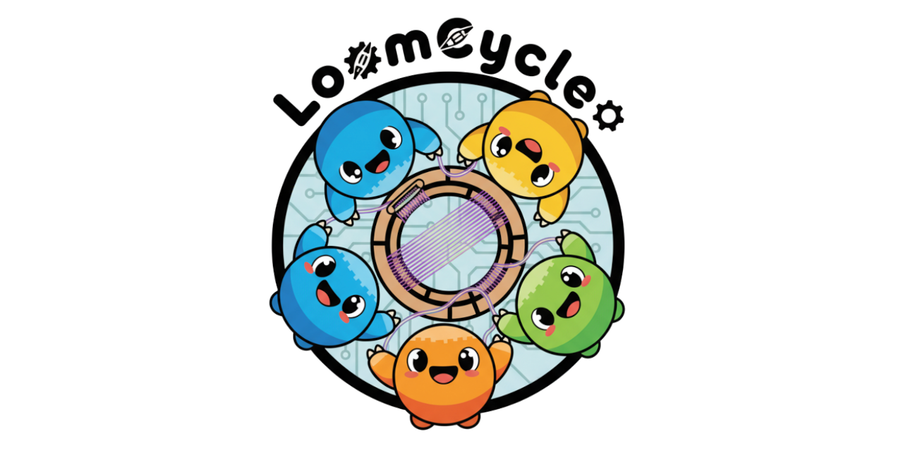
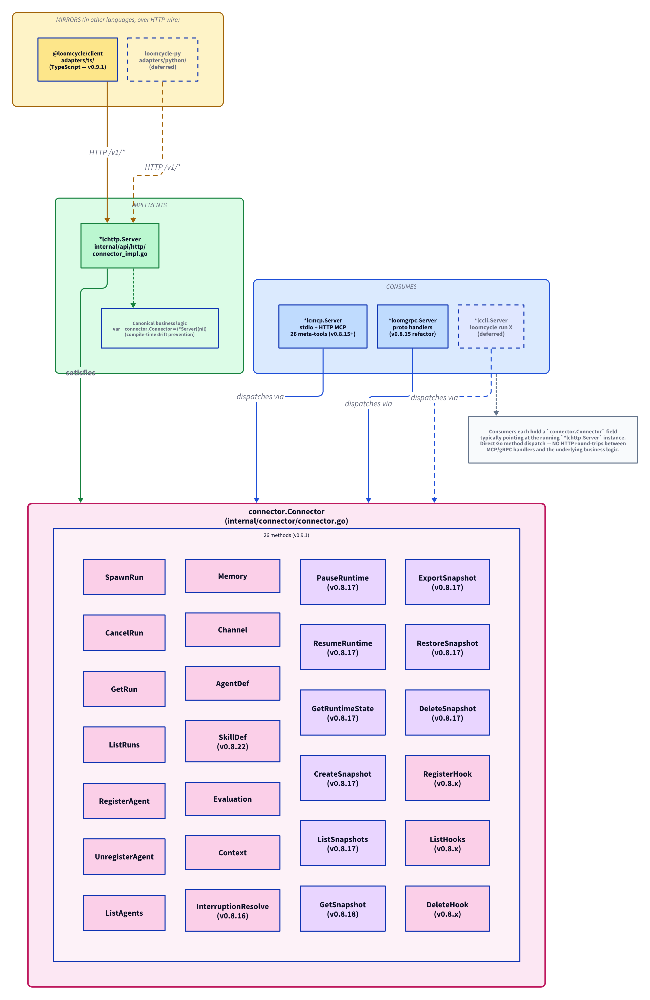

<p align="center">
  <a href="https://loomcycle.dev"></a>
</p>

<p align="center">
  <strong>The agentic runtime, in a sidecar.</strong><br/>
  <em>One Go binary alongside your application — hardened agent loop, MCP on both sides, multi-replica HA. Apache-2.0.</em>
</p>

<p align="center">
  🌐 <a href="https://loomcycle.dev"><strong>loomcycle.dev</strong></a> &nbsp;·&nbsp;
  📝 <a href="https://loomcycle.dev/blog/">Engineering blog</a> &nbsp;·&nbsp;
  📐 <a href="https://github.com/denn-gubsky/loomcycle/blob/main/docs/ARCHITECTURE.md">Architecture</a>
</p>

<p align="center">
  <a href="https://github.com/denn-gubsky/loomcycle/releases"></a>
  <a href="LICENSE"></a>
  
  <a href="https://github.com/sponsors/denn-gubsky"></a>
</p>

---

> 🌳 **Active development toward v1.0.** The core primitives stabilised through v0.8 → v0.16 — multi-replica HA, the substrate Defs (Agent/Skill/MCPServer/Schedule/Webhook/MemoryBackend), A2A interoperability, inbound webhooks, pluggable memory + a memory layer, and a synthetic code provider. **v0.17.0** shipped **OSS multi-tenant authorization** (per-principal bearer tokens + a role-aware Web UI) — see "Planned" below; v1.0 is now a pure hardening + distribution (Homebrew / Docker / Claude Code plugin) milestone. We welcome bug reports, security disclosures, feature contributions, downstream consumers, and forks. See [`CONTRIBUTING.md`](CONTRIBUTING.md).

---

## What it is

**The agentic runtime, in a sidecar.** loomcycle is one sub-40 MB Go binary that runs *alongside* your application — not inside it. Your app calls loomcycle over HTTP, gRPC, MCP, or via the TypeScript adapter; the agent loop, multi-provider routing, memory and channel primitives, MCP server identity, OpenTelemetry traces, and multi-replica coordination all live in the binary. It's the substrate your agents live on — and your application stays in whatever language you wrote it in.

**The shape that's different.** The agentic-systems market today gives you three choices — embed a Python or TypeScript library inside your process, rent a managed cloud service tied to one vendor's IAM, or proxy your model calls through a gateway that doesn't actually run agents. loomcycle is the fourth shape: a lightweight self-hostable runtime that owns the loop *and* speaks every wire format your stack already uses.

## What's shipped

| Capability | Released in |
|---|---|
| **Six providers, native HTTP, no vendor SDK** — Anthropic, OpenAI, DeepSeek, Gemini, Ollama cloud, Ollama local — behind one `Provider` interface with resolver-based routing per tier and effort | v0.4 → v0.8.x |
| **Nineteen built-in tools** including Claude Code parity (Read, Write, Edit, Grep, Glob, NotebookEdit), HTTP, WebFetch, WebSearch, Bash, Agent, Skill, Memory, Channel, AgentDef, SkillDef, Evaluation, Interruption, Context | v0.4 → v0.8.24 |
| **AgentDef + SkillDef + MCPServerDef substrate** — content-addressed by SHA-256, runtime-mutable, push-at-boot from your container image; verify-or-fork across deployments | v0.8.5 / v0.8.22 / v0.9.x |
| **Vector Memory** with semantic search — `embed: true` on writes, `op: search` on reads. sqlite-vec or pgvector; Voyage / OpenAI / Gemini / nomic-embed on the embedding side | v0.9.0 |
| **MCP on both sides** — loomcycle is both an MCP client (mounts external MCP servers as tools) and an MCP server (Claude Code and external orchestrators drive it via 21 meta-tools) | v0.8.15 |
| **OpenTelemetry** across loop + providers + tools + MCP — no transcripts in spans | v0.10.0 |
| **Per-tenant fairness** on the run-admitting semaphore (single-replica), cluster-wide (multi-replica) | v0.10.1 / v0.12.1 |
| **LLM Gateway + OpenAI-compatible shims** — `POST /v1/_llm/chat`, `POST /v1/chat/completions`, `POST /v1/embeddings`. Drop loomcycle in front of any LangChain / LlamaIndex / n8n / RAG pipeline that speaks OpenAI's wire format | v0.11.0 → v0.11.4 |
| **n8n community package** — `@loomcycle/n8n-nodes-loomcycle`. Five cluster sub-nodes, action nodes, two trigger nodes, six example workflows | v1.x (community) |
| **Anthropic MAX subscription OAuth for dev workflow** — reverse-engineered, dev-only, opt-in; see [`docs/PROVIDERS.md`](docs/PROVIDERS.md) | v0.11.10 |
| **Pause / Resume / Snapshot** — runtime-wide quiesce + cross-version-portable JSON snapshot. In-place upgrades, snapshot-based replica handoff | v0.8.17 → v0.8.18 |
| **Multi-replica HA** — Redis cancel pubsub, cross-replica run status, cluster-wide pause/resume + bus fanout, singleton sweepers, DB-backed session locks. Single binary scales from a cheap VPS to a multi-replica fleet | v0.12.0 → v0.12.5 |
| **UNIX-style trust model** — operator config is the floor; callers narrow per-request but never widen. Bearer auth at the HTTP frontier; sandbox (Posture A) vs operator-trusted (Posture B) selected via env | v0.4 → ongoing |
| **Embedded React Web UI** at `/ui` — full manual management console behind a **collapsible left-sidebar nav** (icons-only / icons+labels): Library admin (agents / skills / MCP servers), **Integrations admin** (webhooks / A2A server-cards / A2A agents / memory-backends), **Run launcher** (single run with live SSE transcript + multi-turn continue; **fan-out** of N independent runs; **orchestrator** view of a parallel-spawn parent→child tree), Channels view with **manual publish + broadcast / await fan-out/fan-in**, Memory editor, Activity Monitor, audit log, **Schedules admin** (fork + standalone create + version activate + `max_fires`) | v0.8.21 → v0.25.1 |
| **Multi-replica HA capstone** — singleton sweepers, DB-backed session locks + hook registry, docs + hardening pass | v0.12.6 |
| **ScheduleDef substrate** — operator-yaml `scheduled_runs:` templates + dynamic per-user forks with versioning + lineage. Sweeper fires due rows in parallel (resolving substrate agents in the def's tenant — F38); 5-op tool (`create`/`fork`/`get`/`list`/`retire`) + 2 hook ops (`add_hook`/`remove_hook`); `on_complete` delivery via `channel.publish` (honors the channel's declared scope — F37) / `memory.set` / `mcp.call`; `max_fires: N` self-retiring / one-shot schedules (RFC S). Full 4-transport CRUD + `/ui/schedules` admin tab | v0.12.7 |
| **Ensemble synchronization primitives (RFC S)** — `Context op=time` (agent clock), `Channel.await` (fan-in barrier across N channels — any/all/at_least N or timeout; complements `Agent.parallel_spawn`), `Channel.broadcast` (symmetric fan-out), `max_fires` (self-retiring schedules). `await` / `broadcast` reach the in-band tool, the MCP `channel` meta-tool, and client twins on REST + gRPC + `@loomcycle/client` | v0.25.0 |
| **Per-run named credentials** — `user_credentials: map<string,string>` on `POST /v1/runs` / gRPC / MCP / TS. `${run.credentials.<name>}` substitution in `mcp_servers.*.headers`. Back-compat: legacy `user_bearer` auto-promotes to `credentials.default` | v0.12.7 |
| **Bundled observability profiles** — three `docker compose up` stacks: Grafana+Tempo+Prom+Loki (open-source), Honeycomb (SaaS), Datadog APM. `GET /metrics` Prometheus endpoint | v0.12.7 |
| **Mock LLM provider** — cost-free 10K-agent stress harness. Variable latency + jitter + 429 / 5xx injection. Five model variants including `mock-mcp-caller` that exercises real MCP-tool dispatch end-to-end | v0.12.7 |
| **Curated MCP server recipe library** — bundled JSON templates (GitHub, Slack, Tavily, …) + `$LOOMCYCLE_MCP_RECIPES_ROOT` filesystem overlay + a 7-verb `loomcycle mcp-registry` CLI that copy-pastes a recipe into your `mcp_servers:` yaml | v0.12.8 |
| **Claude Code repo import** — `loomcycle import claude-code --from=./.claude/` walks agents / skills / mcp.json into loomcycle yaml (dry-run → review → `--write`); recipe-library rewrite, lossy-is-loud reporting. Paired with the `claude-code-plugin-loomcycle` Claude Code plugin (slash commands + skills + hooks over `loomcycle mcp`) | v0.12.8 |
| **Parent-context propagation** — opaque `parent_context` {root_agent_run_id, function_key, tier_at_run} on a run is inherited by every Agent-tool sub-agent, persisted, and echoed on the agent-status / run-state / SSE surfaces — so a consumer can attribute a child sub-agent's usage to the user-initiated request | v0.12.8 |
| **Tool-use hooks** — register HTTP webhooks against `(agent, tool, phase)` selectors via `POST /v1/hooks`. `pre` hooks rewrite a tool's input, deny it with a synthetic result, or (operator opt-in) widen hosts for one call; `post` hooks rewrite the result. Fail-open or fail-closed; narrows policy by default; DB-backed in cluster mode | v0.8.x → v0.12.5 |
| **A2A (Agent2Agent) interoperability** — loomcycle as an A2A **server** (well-known AgentCard + REST/JSON-RPC/gRPC bindings) and **client** (call remote peers as `a2a__<peer>__<skill>` tools). Two substrate Defs, signed cards (JWS/JCS), multi-tenant routing, `INPUT_REQUIRED` ↔ Interruption resume. Off by default | v0.13.0 |
| **Input webhooks** — `WebhookDef` substrate: external systems (GitHub/Stripe/Linear/CI/n8n) trigger agent runs or wake parked agents via signed `POST /v1/_webhooks/{name}`. HMAC-over-raw-body (verify-before-parse), strict JSONPath mapping, two-layer idempotency, per-Def rate limit, per-run credentials, `on_complete` hooks, admin triage. Off by default | v0.14.0 |
| **Memory ranking + pluggable backends** — `Memory.search` hybrid ranker (semantic + recency weights) + search-time dedup; `MemoryBackend` interface with in-process default + `MemoryBackendDef` substrate + Mem9 REST backend (per-agent `memory_backend` routing, tenancy + RFC-F creds + graceful fallback); `loomcycle memory-eval` scoring harness. Opt-in, zero-regression default | v0.15.0 |
| **Memory layer (add / recall)** — the `Memory` tool's optional LLM-extract paradigm: hand a backend conversation messages, it distils durable facts and answers natural-language recall (mem9 smart-mode). An optional capability alongside the frozen key/value `Backend`; the default in-process store fail-closes with `capability_unsupported` | v0.16.0 |
| **Synthetic `code-js` provider** — `provider: code-js` runs operator JavaScript (goja) as a first-class agent for deterministic glue at zero token cost; stateless **replay** execution (resumable across restart/replica, deterministic by construction); default-deny tools, off by default | v0.16.0 |
| **OSS multi-tenant authorization (RFC L)** — `OperatorTokenDef` mints per-principal bearer tokens (peppered SHA-256, closed scope catalog, rotation-with-grace, JSONL audit), each bound to an **authoritative `(tenant, subject, scopes)`** resolved from the token and overriding the wire — so per-subject fairness + per-tenant isolation become real. Per-route + per-gRPC-RPC scope gates. Role-aware Web UI (token login, tenant workspace, super-admin tenant-focus). `LOOMCYCLE_AUTH_TOKEN` keeps working; multi-tenancy is available, never required | v0.17.0 |

Full per-version log: [`REVISIONS.md`](REVISIONS.md).

## Two postures, one binary

Same Go binary, same config schema. Operator flips a few env vars to pick the posture.

| Posture | Configuration shape | Use case |
|---|---|---|
| **True managed sandbox** | `LOOMCYCLE_BASH_ENABLED=0`, `LOOMCYCLE_READ_ROOT` / `LOOMCYCLE_WRITE_ROOT` unset, `LOOMCYCLE_HTTP_HOST_ALLOWLIST` empty, `LOOMCYCLE_HTTP_CALLER_AUTHORITATIVE=1`. Every tool default-deny; agents can only reach what the caller's per-request `allowed_hosts` says. | Shared-server deployments processing untrusted prompts. The runtime survives contact with adversarial input. |
| **Agentic dev environment** | Bash enabled, filesystem roots set to your workspace, broad `allowed_hosts`, optional local Ollama for offline work. | Local development. Internal trusted operators. Single-user research workstation. |

The trust boundary is **operator/caller** — the operator config is the floor, callers can narrow per-request but never widen. The bearer token (`LOOMCYCLE_AUTH_TOKEN`) is the authority. Treat anyone with the token as fully trusted to drive the runtime. For true isolation in the sandbox posture, run loomcycle inside a container or VM — `Bash` is restricted (cwd, env scrub, output bounds, timeouts) but is **not** a kernel-level sandbox.

## Install

Pick the path that fits. All four ship the same single static binary
plus the v0.11.1 `init` / `doctor` first-run flow. `Context.help
installation` covers each in detail.

```sh
# Homebrew (macOS + Linux)
brew install denn-gubsky/loomcycle/loomcycle

# Docker (v0.11.2+; pull works on amd64 + arm64 including Apple Silicon)
docker pull denngubsky/loomcycle:latest

# go install from source (skips Web UI embedding — for dev only)
go install github.com/denn-gubsky/loomcycle/cmd/loomcycle@latest

# Direct tarball (one of darwin-arm64 / darwin-amd64 / linux-arm64 / linux-amd64)
curl -L https://github.com/denn-gubsky/loomcycle/releases/latest/download/loomcycle-darwin-arm64.tar.gz | tar xz
```

## Quick start (seconds, authenticated)

```sh
loomcycle init --with-token   # writes config + mints a token to ~/.config/loomcycle/auth.env (0600)
export ANTHROPIC_API_KEY=sk-...   # (or OPENAI_API_KEY / DEEPSEEK_API_KEY) — at least one provider key
loomcycle doctor              # verify env + keys + storage + the just-minted token
loomcycle                     # starts on 127.0.0.1:8787 (auto-loads auth.env — no shell-rc edit)
```

`init --with-token` prints the Web UI URL (`http://127.0.0.1:8787/ui`); open it, then paste the token from `~/.config/loomcycle/auth.env` at the login prompt. (The token is kept in the `0600` file and never embedded in a URL — a `?token=` link would leak the bearer into browser history and any fronting proxy's logs.) `loomcycle` and `loomcycle doctor` both auto-load `auth.env` from the config dir; a real `export LOOMCYCLE_AUTH_TOKEN=…` always overrides it.

## Bootstrap tiers

Pick the tier that fits — each is a superset of the one above. **Auth is enforced only once something is configured**, so Tier 1 needs no token at all.

### Tier 1 — zero-config dev (open mode, localhost)

No token, no flags. Fastest way to kick the tires on `127.0.0.1`.

```sh
loomcycle init               # config only — no secret written
export ANTHROPIC_API_KEY=sk-...
loomcycle                    # open mode: /v1/* + /ui pass through unauthenticated (logs a warning)
open http://127.0.0.1:8787/ui
```

With no `LOOMCYCLE_AUTH_TOKEN` and no minted tokens, the runtime runs **open** on localhost — every request is allowed, whoami returns a synthetic admin. Great for a 10-second smoke test; **never** expose this off localhost.

### Tier 2 — single shared token (the recommended default)

One bearer gates everything. `init --with-token` is the easy button (above). Equivalent manual setup:

```sh
loomcycle init
export LOOMCYCLE_AUTH_TOKEN=$(openssl rand -hex 32)   # or: loomcycle init --with-token
export ANTHROPIC_API_KEY=sk-...
loomcycle
open "http://127.0.0.1:8787/ui?token=$LOOMCYCLE_AUTH_TOKEN"   # sets the cookie once
```

Treat anyone holding the token as fully trusted to drive the runtime.

### Tier 3 — multi-tenant, per-principal tokens (RFC L, v0.17.0)

Mint a distinct bearer per developer/app, each bound to an authoritative `(tenant, subject, scopes)`. Migrate a Tier-2 deployment in place — no downtime:

```sh
# promote your existing shared token into the substrate, then mint scoped tokens
loomcycle operator-token create --copy-from-env --name ops --tenant ops --scopes substrate:admin
loomcycle operator-token create --name acme-app --tenant acme --subject alice --scopes runs:create
```

The first admin `OperatorTokenDef` disables the legacy shared-token fallback. Per-route HTTP + per-RPC gRPC scopes; the Web UI becomes role-aware (super-admin vs tenant). See `Context.help operator-tokens` and the v0.17.0 notes in [`REVISIONS.md`](REVISIONS.md).

**Smoke any tier:**

```sh
curl http://127.0.0.1:8787/healthz
# {"ok":true}
```

Real call (from another terminal):

```sh
curl -N http://127.0.0.1:8787/v1/runs \
  -H "Authorization: Bearer $LOOMCYCLE_AUTH_TOKEN" \
  -H "Content-Type: application/json" \
  -d '{"agent":"default","segments":[{"role":"user","content":[{"type":"trusted-text","text":"Hello"}]}]}'
```

Build from a checkout (for development):

```sh
make build-all       # UI + binary in one shot; output → ./bin/loomcycle
./bin/loomcycle --config loomcycle.example.yaml
```

**Multi-replica cluster demo (v0.12.x):** for a one-command `docker compose up` cluster (2 loomcycle replicas + Postgres + nginx LB) with a verify script, see [`examples/cluster/README.md`](examples/cluster/README.md). Full operator runbook in [`docs/MULTI-REPLICA.md`](docs/MULTI-REPLICA.md).

## Current and planned

**v0.25.2 — Patch: scheduled runs resolve runtime-created agents (F38).** Runtime-only — no wire change, no `@loomcycle/client` bump. A `scheduled_runs` def whose `agent` was created at runtime via `POST /v1/_agentdef` fired but **failed every time** with `unknown agent` (no run), while the *same* agent ran fine via `POST /v1/runs`. The scheduler fires through `srv.RunOnce`, which **does** resolve via the 3-tier `lookup.Agent` (static cfg → tenant-dynamic substrate → shared) — the failure was a **tenant mismatch**: `RunOnce` resolves at the tenant in the def **body**, but `POST /v1/_scheduledef` stamped the principal's tenant only onto the def **row** (owning tenant), leaving the body's *run-execution* tenant `""` → it resolved agents at the shared tenant and missed the AgentDef owned by the creator's tenant. Fix: create/fork now default the def body's `tenant_id` to the authoritative owning/principal tenant (an explicit overlay still wins; static agents unaffected). Plus a hardening: an agent-resolution failure no longer burns the `max_fires` budget (a misconfig was masquerading as N runs then a silent retire). A fully runtime-authored scheduler ensemble (agentdef + scheduledef + channel + MCP, all via REST) now runs end-to-end.

**v0.25.1 — Patch: scheduler fan-in correctness (F37) + Web UI catch-up.** Two post-v0.25.0 fixes, both runtime-internal / frontend-only — no wire change, no `@loomcycle/client` bump. **(1) F37 (RFC T) — the scheduler's `on_complete: channel.publish` hook ignored the channel's declared scope.** It published under the run's *user* scope regardless, so a hook on a `scope: global` channel landed in `user/<user_id>` and a global reader (admin peek, `Channel.await` / `subscribe` resolving global) saw **zero** — silent, the rows just sat at the wrong scope. Surfaced by a scheduler-driven fan-in experiment whose 5 collectors' pings were invisible to the consolidator's `await` (timed out at 0) though the rows existed under `user/<id>`. The hook now resolves the channel's **declared** scope through the same static-yaml + runtime-substrate merge the Channel tool uses (`global → ""`, `user → run user_id`, `agent → agent name`) and publishes under it; an undeclared channel fails the hook loudly instead of mis-scoping. (`memory.set` was already correct — it takes an explicit operator-specified scope.) The fix lets a scheduler→channel fan-in use the natural `scope: global` instead of a `scope: user` workaround. **(2) Web UI catch-up** — navigation moved to a **collapsible left-sidebar** (lucide icons; icons-only ↔ icons+labels), and the v0.25.0 primitives that lacked UI are now surfaced: schedule **`max_fires`** (create / fork / detail) and the Channels **broadcast** (fan-out) / **await** (fan-in) forms.

**v0.25.0 — The agentic-ensemble release: a full manual-management Web UI console + RFC S synchronization primitives, reachable from every wire surface.** Two thrusts. **(1) Web UI → hands-on console.** `/ui` becomes a complete manual management tool (no backend wire change — the SPA ships its own client): a new **Integrations** admin page for the four families that lacked UI (Webhook / A2A server-card / A2A agent / memory-backend), standalone schedule create + version-activate, a manual channel **publish** form, the memory editor — and a **Run launcher** that fires a single run with a live SSE transcript + multi-turn continue, a **fan-out** of N independent runs in a live grid, or an **orchestrator** view of a parallel-spawn parent→child tree. **(2) RFC S ensemble primitives** so a fan-out/fan-in ensemble is first-class instead of hand-rolled: **`Context op=time`** (an agent clock — now / elapsed / run-start, F34), **`Channel.await`** (a fan-IN barrier across N channels — any/all/at_least N or timeout; the complement to `Agent.parallel_spawn`, F35), **`Channel.broadcast`** (the symmetric fan-OUT — one payload to N channels), and **`max_fires`** (a lifetime fire cap that auto-retires a schedule after its Nth fire; SQLite + Postgres migration 0045, F36). `await` / `broadcast` reach **every surface** — the in-band tool, the MCP `channel` meta-tool, plus new **client twins** (`POST /v1/_channels/_await` + `/_broadcast`, the `AwaitChannels` / `BroadcastChannels` gRPC RPCs, and `awaitChannels()` / `broadcastChannels()` on `@loomcycle/client` 0.25.0) so an external orchestrator can fan-in/out over the same bus agents use. **Wire addition** (additive): two new channel routes/RPCs + two TS methods; existing surfaces unchanged.

**v0.24.0 — Architecture-review hardening: the RFC N tenant axis reaches every definition family, plus MCP/agent correctness fixes.** A full code review of the v0.21 → v0.23 line (which landed one feature at a time) surfaced structural gaps; v0.24.0 closes them with no new primitives. **(1)** RFC N had tenant-isolated only 3 of the 8 substrate Def families — v0.24.0 extends the active-pointer tenant axis to the remaining five (**MemoryBackend, A2AAgent, ScheduleDef, A2AServerCardDef, WebhookDef**) via Postgres migrations 0040–0044 + the SQLite fresh-DB/upgrade pattern, so all 8 isolate by `(tenant_id, name)` through the same `internal/lookup` precedence; the shared `""` tenant stays byte-identical to before. Inbound webhooks gain a per-tenant route `POST /v1/_webhooks/{tenant}/{name}` (the bare `/{name}` still resolves the shared tenant) — **wire change**: a multi-tenant downstream must prefix its delivery URLs. **(2)** The RFC P `spawn_run` timeout now also binds the HTTP/`--upstream` transport (it had only reached stdio). **(3, F14)** An agent's `channels` / `evaluation_scopes` / `interruption` ACLs are now part of its `content_sha256` (a fork changing only those is no longer silently deduped) — agents that don't use them hash byte-identically to before. Plus fixes: MD-declared `max_concurrent_children` now survives discovery, a stale boot-log tool count, and the removal of a tenant-blind internal MCP accessor. **No `@loomcycle/client` change** (all server-side).

**v0.23.0 — The MCP server stops wedging: single-runtime invariant + concurrent dispatch (RFCs O/P/R), plus a DeepSeek tool-use fix (Q).** Hands-on use surfaced a class of failures where the `loomcycle mcp` server (the stdio surface Claude Code drives) would hang or wedge the session — most often "an interruption was answered but the agent never resumed." Root causes fixed: (**O**) the stdio loop dispatched frames serially, so one long `spawn_run` head-of-line-blocked every later frame including `cancel_run` — now `tools/call` runs concurrently with a bounded slot for long-running tools; (**P**) `spawn_run` had no transport timeout — now an opt-in per-call `timeout_ms` / operator default cancels the run and returns `status:"timeout"`; (**R, the big one**) `loomcycle mcp` booted a *full second runtime* next to your real one (own in-process bus), so a cross-process `interruption_resolve` flipped the DB row but never woke the run — now `loomcycle mcp --upstream <url>` is a thin stdio↔`/v1/_mcp` proxy that holds **no runtime of its own**, so every call lands on the one authoritative runtime (`doctor` warns on a second runtime; **`--no-http` removed** — use `--upstream`; the Claude Code plugin 0.21.0 migrated). Plus (**Q**) the openai-compat driver now always serializes `content` on tool messages, fixing the DeepSeek `400 missing field content` that broke every tool-using DeepSeek agent on empty tool output. **Upgrade note:** Claude Code plugin users should move to plugin ≥ 0.21.0.

**v0.22.0 — Tenant isolation reaches the definition plane (RFC N).** RFC L (v0.17.0) isolated the *state* plane (runs, sessions, memory, fairness) behind an authoritative `(tenant, subject, scopes)` principal; the *definition* plane stayed global — any `runs:create` token could resolve and execute another tenant's agent, and same-name defs clobbered a single global pointer. v0.22.0 gives **agents, skills, MCP servers, and the run-triggering ScheduleDef / WebhookDef** a tenant axis, resolved at the `internal/lookup` chokepoint with a "static yaml = shared base, tenant-dynamic shadows by name" precedence; the authoritative tenant comes from the principal, never the wire, and the shared `""` tenant is byte-identical to pre-RFC-N behavior (single-tenant / open-mode unaffected). Ships with the RFC N runtime-QA fixes (tenant-correct run resolution, admin-crosses-tenants library reads, fork-from-shared-base migration), a **Postgres backend-parity fix** (admin tokens no longer fail-closed 401 from a nullable-column scan; the real-Postgres store contract now runs in CI), a code-js replay-determinism fix (sorted `input.metadata` keys), and Homebrew-surfaced first-run polish (registry-sourced meta-tool count, clean-boot starter config, and real op-schemas on the builtin MCP meta-tools so clients can discover their ops).

**v0.21.0 — Non-secret metadata channel + code-js run-budget overhaul.** A first-class `metadata` channel hands a run structured, non-secret context (repo name, review policy, PR number, preferred skills) — reaching a direct `/v1/runs` caller, a WebHook delivery, and a Scheduler fire identically — with a provenance-based trust split: `metadata` (operator/def-authored or first-party → trusted) vs `payload_metadata` (projected from an inbound webhook body → untrusted, fenced for LLM agents in a `<run_metadata>` block; both delivered structurally to a code-js agent as `input.metadata` / `input.payload_metadata`). Secrets stay on the orthogonal `user_credentials` path; WebhookDef gains fork-time `user_credentials` for ScheduleDef parity. Code-js runs gain a distinct **`code_agent_timeout`** error class (a wall-clock budget exhaustion is no longer misreported as a throw at an innocent JS line) and a per-agent / per-run **`run_timeout_seconds`** override (precedence per-run > per-agent > global) — the budget is total wall-clock from run start and spans the time a fan-out orchestrator is blocked in `Agent.parallel_spawn` awaiting its children, so the CPU-oriented global default no longer caps an orchestrator.

**v0.20.0 — Inline code-js bodies + Web UI + full runtime symmetry.** A code-js agent's JavaScript can be ingested **inline** through `AgentDef` and run with **no host filesystem bind** (registered, forked, versioned, lineage-tracked over the wire), and the Web UI can display and edit it. `MCPServerDef` auto-discovers its tools on ingestion (create / fork); static yaml schedules fire autonomously and post-boot substrate tools are advertised per-run, reaching full symmetry with their dynamic-substrate counterparts; the lazy MCP resolver routes through the shared `lookup.MCPServer` chain.

**v0.18.0 — Idempotent MCPServerDef ingestion.** Re-registering an MCP server no longer mints a new version each time — create is idempotent and re-discovers tools in place, driven by a typed TS `ensureMcpServer` / `mcpServerDefVerify` dedup flow. Dynamically-registered servers resolve their tools correctly, the private-host allowlist is honored at create-time, and the CLI bootstrap tightens (`init --with-token` + auto-loaded `auth.env`; `make build` produces a deployable binary).

**v0.17.0 — OSS multi-tenant authorization (RFC L).** The single shared `LOOMCYCLE_AUTH_TOKEN` is no longer the only way in. A new **`OperatorTokenDef`** substrate mints per-principal bearer tokens (`lct_` prefix, peppered SHA-256, a closed scope catalog with default-deny, two-token rotation-with-grace, a JSONL audit log), each bound to an **authoritative `(tenant, subject, scopes)`** resolved *from the token* and overriding the wire `tenant_id` / `user_id` — so per-subject fairness and per-tenant memory / run isolation, which previously keyed on caller-asserted fields, become real boundaries. Per-route HTTP scopes + per-RPC gRPC scopes (closed in an adversarial-QA pass: 1 CRITICAL gRPC scope bypass + 4 HIGH — cross-principal session hijack, retire-fail-open, scope-map gaps, token-cache outage/DoS — each with a fail-before test). A role-aware **Web UI**: token-entry login (scopes pick the role), a super-admin who sees every tenant's workspace + a tenant-focus switcher, and a tenant who sees only its own. **Zero-disruption** — `LOOMCYCLE_AUTH_TOKEN` keeps working and migrates in place via `operator-token create --copy-from-env`; multi-tenancy is *available*, never *required*. See `Context.help operator-tokens`. Originally scoped as the v1.0 capstone; shipped as its own minor so the v1.0 tag stays a pure hardening + distribution milestone.

**v0.16.0 — Memory layer + synthetic code provider.** The two capabilities that complete the substrate before the v1.0 hardening pass.

- **MemoryLayer (RFC K).** The `Memory` tool gains `add` / `recall` ops for LLM-extract memory products (mem9 smart-mode, mem0-style): you hand the backend conversation messages, it distils durable facts, and recall is a natural-language semantic search over them. It's an *optional* capability probed alongside the frozen flat key/value `Backend` (so every existing backend is untouched); the default in-process store is a key/value + vector store, **not** a memory layer, so it fail-closes `add`/`recall` with `capability_unsupported` rather than faking it. `add`/`recall` honor the agent's `memory_scopes` and the backend's tenancy prefix exactly like the key/value ops.
- **Synthetic `code-js` provider (RFC J).** An AgentDef with `provider: code-js` runs operator-authored JavaScript (via goja) instead of calling a model. From everywhere else in loomcycle it **is an agent** — same loop, OTEL spans, scheduler / webhook / A2A reachability, sub-agent composition, evaluation surface — at **zero token cost**, for the deterministic glue steps that don't need an LLM (ATS scrapes, known-shape SQL, format conversion, routing). Loop-driven dispatch (the provider only emits tool calls; the loop dispatches them with its hooks/OTEL/credentials). Stateless **replay** execution: each turn re-runs `run()` and replays the tool results recorded in the transcript, so the transcript is the durable state — a run is **resumable across restart / replica**, and ambient `Date.now()` / `Math.random()` are hooked so replay is deterministic by construction. Default-deny `allowed_tools` (a tool not granted simply isn't defined in JS); off by default behind `LOOMCYCLE_CODE_AGENTS_ENABLED=1` — operator-provided code runs in the operator's own trust posture.

**v0.15.0 — Memory ranking, dedup & pluggable backends (RFC I).** `Memory.search` gains a hybrid ranker (`semantic_weight·cos + recency_weight·decay + …`; default reproduces pure-cosine exactly) and optional search-time dedup of near-duplicate vectors. The storage path is refactored behind a `MemoryBackend` interface (in-process default + unconditional fallback) and a new **`MemoryBackendDef`** — the sixth substrate primitive — with full 4-transport CRUD; `AgentDef.memory_backend` routes a specific agent's memory to a named backend, including a **Mem9** REST backend (per-agent routing, tenancy + per-run creds + graceful fallback). New `loomcycle memory-eval` scoring harness. All opt-in, zero-regression.

**v0.14.0 / v0.14.1 — Input webhooks (RFC H).** A `WebhookDef` substrate so external systems (GitHub / Stripe / Linear / CI / n8n) trigger agent runs or wake parked agents via signed `POST /v1/_webhooks/{name}`: HMAC-over-raw-body (verify-before-parse), strict JSONPath request→run mapping, two-layer idempotency, per-Def rate limit, per-run credentials, `on_complete` hooks, and an admin triage surface. Off by default. (v0.14.1 is the first tagged cut of the v0.14 line — v0.14.0 was merged but never tagged independently — plus a docs correction.)

**Shipped before v0.14.0 (v0.4 → v0.13.x)** — the foundation and the substrate build-out:

- **Providers + loop:** six provider drivers (Anthropic, OpenAI, DeepSeek, Gemini, Ollama cloud + local) behind one `Provider` interface with resolver-based per-tier + effort routing and runtime fallback; the hardened model→tool_use→tool_result loop.
- **Tools + substrate:** the nineteen built-in tools (Claude Code parity — Read/Write/Edit/Grep/Glob/NotebookEdit — plus HTTP/WebFetch/WebSearch/Bash/Agent/Skill/Memory/Channel/Context/Interruption + the substrate Defs); the content-addressed, runtime-mutable **AgentDef / SkillDef / MCPServerDef / ScheduleDef** primitives (verify-or-fork across deployments); Vector Memory with semantic search (sqlite-vec / pgvector); **Channel** inter-agent bus; **Interruption** human-in-the-loop; tool-use **hooks**.
- **Interop:** MCP on both sides (client + the LoomCycle MCP server with meta-tools); the **LLM Gateway** + OpenAI-compatible chat/embeddings shims; **A2A (Agent2Agent)** server + client (v0.13.0); the `@loomcycle/n8n-nodes-loomcycle` community package; Anthropic MAX OAuth (dev-only).
- **Ops + HA:** OpenTelemetry across loop + providers + tools; per-tenant fairness; **Pause / Resume / Snapshot**; **multi-replica HA** (Redis cancel pubsub, cross-replica run status, DB-backed session locks, singleton sweepers); per-run named credentials; the embedded React Web UI (`/ui`); `loomcycle init` / `doctor`; Docker + Homebrew distribution.

Per-version detail for all of the above is in [`REVISIONS.md`](REVISIONS.md).

**Planned — v1.0 (hardening + distribution):**

With the multi-tenant-auth capstone shipped in v0.17.0, v1.0 is now a pure hardening + distribution milestone — no new primitives.

- **Distribution + bootstrapping.** A first-run install story that survives contact with a fresh machine: hardened **Homebrew** formula and **Docker** images (multi-arch, the `init` / `doctor` flow, a sane default config), so `brew install` / `docker run` gets an operator to a working sidecar without reading the docs first.
- **Claude Code plugin hardening.** The `claude-code-plugin-loomcycle` plugin (slash commands + skills + hooks over `loomcycle mcp`) gets a robustness pass — error surfaces, version-skew handling, and a clean bootstrap from the published binary.
- **Security + robustness + runtime-QA pass** across the v0.13–v0.17 surfaces (A2A, webhooks, pluggable memory + the memory layer, the code-js provider, the multi-tenant-auth substrate), then the **v1.0** tag.
- **Enterprise auth** (SSO / RBAC / SCIM / signed, queryable audit) stays out of scope for OSS — it's a separate edition built on the same `OperatorTokenDef` substrate.
- **Beyond** (polish): a settings UI, an operator cookbook of postures, broader distribution (Helm).

Full per-version release notes: [`REVISIONS.md`](REVISIONS.md).
Public roadmap with v0.8.x → v1.0 design details: [`docs/PLAN.md`](docs/PLAN.md).

## Architecture

Three diagrams cover different views of the same runtime:

<p align="center">
  
</p>

Diagram source: [`docs/architecture.d2`](docs/architecture.d2) (regenerate with `d2 docs/architecture.d2 docs/assets/architecture.png`).

**Connector detail** — the v0.8.15 `Connector` abstraction layer (the pink block in the middle of the main diagram) is the architectural anchor every wire transport dispatches through. The detail diagram enumerates all 36 methods + shows which transports IMPLEMENT, CONSUME, and MIRROR the interface:

<p align="center">
  
</p>

Source: [`docs/architecture-connector.d2`](docs/architecture-connector.d2).

**Multi-replica cluster mode (v0.12.x)** — when `LOOMCYCLE_REPLICA_ID` is set per process and the Postgres backend is used, loomcycle runs as a cluster behind any HTTP load balancer. The shared Postgres doubles as the LISTEN/NOTIFY backplane for cross-replica cancel, pause/resume, run-state fanout, and quota notifications. SQLite refuses cluster mode at boot.

<p align="center">
  
</p>

Source: [`docs/architecture-cluster.d2`](docs/architecture-cluster.d2). Operator runbook: [`docs/MULTI-REPLICA.md`](docs/MULTI-REPLICA.md). Demo: [`examples/cluster/README.md`](examples/cluster/README.md).

Full request flow, abstractions, and concurrency model: [`docs/ARCHITECTURE.md`](docs/ARCHITECTURE.md).

## Adapters

- **TypeScript** — `npm install @loomcycle/client` → see [`adapters/ts/`](adapters/ts/). HTTP+SSE.
- **Python** — `pip install loomcycle` → see [`adapters/python/`](adapters/python/). Async over `grpc.aio`.

## Security highlights

- **No vendor binary** in the loop. Pure HTTP to provider APIs. No subprocess auth inheritance.
- **Default-deny everything.** Every built-in tool is disabled until env-configured. Every agent gets zero tools until `allowed_tools` is set.
- **Two-layer policy + per-request narrowing.** Operator floor in env; agent narrowing in yaml; caller narrowing per-run. Caller can never widen.
- **SSRF defence.** Hostname allowlist + RFC1918/loopback/link-local IP block at the dial layer. Defeats DNS rebinding.
- **Constant-time bearer auth.** `sha256+CTC` on both HTTP and gRPC.
- **`Bash` is restricted, not isolated.** Run inside a container or VM if you need real isolation.

Full security model + the two-layer default-deny walkthrough: [`docs/TOOLS.md`](docs/TOOLS.md).

## Documentation

Repo-side docs (this directory):

- [`docs/ARCHITECTURE.md`](docs/ARCHITECTURE.md) — request flow, provider abstraction, agent loop, sub-agents, skills, storage, concurrency, cancellation.
- [`docs/TOOLS.md`](docs/TOOLS.md) — two-layer default-deny model, every built-in tool, MCP / LocalAPI integrations, per-request narrowing.
- [`docs/MCP_INTEGRATION.md`](docs/MCP_INTEGRATION.md) — end-to-end MCP HTTP pipeline: request lifecycle, `${run.user_bearer}` substitution, model-visibility boundary, recipe for wrapping a REST API as an MCP server consumable by loomcycle.
- [`docs/MCP_SERVER.md`](docs/MCP_SERVER.md) — register loomcycle as an MCP server in Claude Code / Claude Desktop: copy-paste config snippets for Docker / Homebrew / direct-binary transports + the `loomcycle mcp install` helper.
- [`docs/CLAUDE-CODE.md`](docs/CLAUDE-CODE.md) — driving loomcycle from Claude Code: the recommended `claude-code-plugin-loomcycle` plugin (slash commands + skills + hooks) vs. the manual `loomcycle mcp install` path.
- [`docs/CONFIGURATION.md`](docs/CONFIGURATION.md) — operator config guide: provider/tier/user_tier resolution rules, four cookbook patterns (single/multi-provider × single/multi-user-tier), `models:` alias map, and the agent `.md` frontmatter field reference.
- [`docs/POSTGRES.md`](docs/POSTGRES.md) — Postgres backend operator guide: configuration, migrations, sqlite→postgres runbook, concurrency benchmark.
- [`docs/GRPC.md`](docs/GRPC.md) — gRPC surface: enablement, wire-shape parity with HTTP+SSE, error mapping, Python adapter quick-start.
- [`docs/PLAN.md`](docs/PLAN.md) — public roadmap: shipped v0.4 → v0.8.12; planned v0.8.13 → v1.0.
- [`REVISIONS.md`](REVISIONS.md) — per-version release notes (v0.4.0 onward).
- [`CONTRIBUTING.md`](CONTRIBUTING.md) — contribution policy (closed for external PRs until v1.x).
- [`CLAUDE.md`](CLAUDE.md) — project guide for agents working in this repo (Claude Code).

In-binary docs (bundled `Context.help` topics — agents read these directly; operators hit `GET /v1/_help/<topic>` against a running instance):

- `installation` — all four install paths (Homebrew, Docker, `go install`, direct tarball) with verification + troubleshooting.
- `getting-started` — first-run walkthrough (`init` → set env vars → `doctor` → run).
- `llm-gateway` — direct LLM routing endpoint (v0.11.0; for n8n + LangChain consumers).
- `openai-compat` — drop-in OpenAI SDK shims (v0.11.3 chat + v0.11.4 embeddings) with Python + TypeScript examples.
- `fairness` — per-user concurrency quota policy.
- `observability` — OTEL trace export setup.
- `vector-memory`, `voyage-embedder`, `sqlite-vec` — Vector Memory backends.
- `dynamic-mcp` — register MCP servers at runtime.
- `bash-security` — Bash tool's restricted-not-isolated security posture.

Full list via `GET /v1/_help` against a running instance.

## Sponsor

If loomcycle is useful to you or your team, [GitHub Sponsors](https://github.com/sponsors/denn-gubsky) helps fund continued development. Individual supporters and corporate sponsors both welcome.

The runtime stays Apache-2.0 either way. Sponsorships directly fund the v0.12 → v1.0 runway: multi-replica HA, Helm chart, operator cookbook, settings UI, and the per-tier sustained engineering needed to keep the binary small and the substrate stable.

Current sponsors are listed in [`BACKERS.md`](BACKERS.md) (and at [loomcycle.dev/sponsors](https://loomcycle.dev/sponsors) with logos).

## License

Apache-2.0. See [LICENSE](LICENSE).
