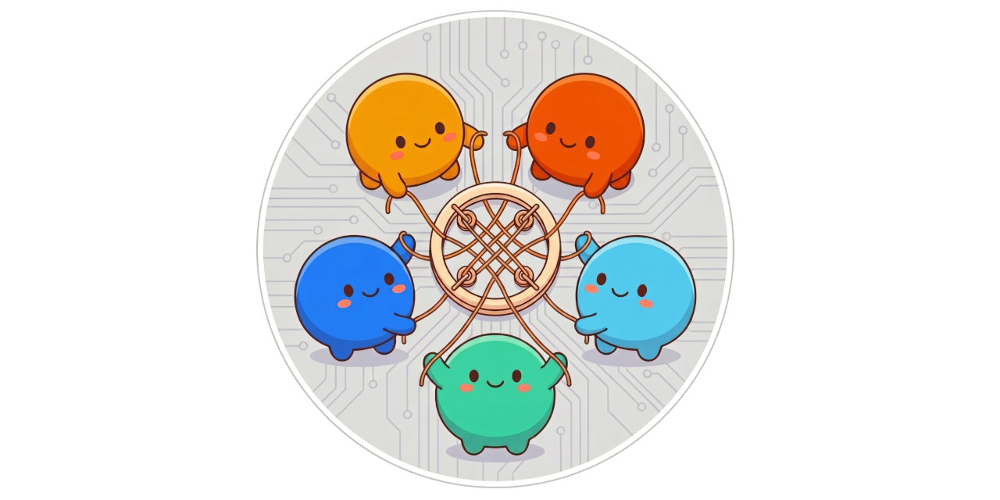

<p align="center">
  <a href="https://loomcycle.dev"></a>
</p>

<p align="center">
  <strong>The agentic runtime, in a sidecar.</strong><br/>
  <em>One Go binary alongside your application. Hardened agent loop, MCP on both sides, multi-replica HA. Apache-2.0.</em>
</p>

<p align="center">
  🌐 <a href="https://loomcycle.dev"><strong>loomcycle.dev</strong></a> &nbsp;·&nbsp;
  📝 <a href="https://loomcycle.dev/blog/">Engineering blog</a> &nbsp;·&nbsp;
  📐 <a href="https://github.com/denn-gubsky/loomcycle/blob/main/docs/ARCHITECTURE.md">Architecture</a>
</p>

<p align="center">
  <a href="https://github.com/denn-gubsky/loomcycle/releases"></a>
  <a href="LICENSE"></a>
  
  <a href="https://github.com/sponsors/denn-gubsky"></a>
</p>

---

> 🌳 **v1.0 is here.** loomcycle **1.0** is released — the feature set is complete and the runtime is hardened and distribution-ready. The core primitives stabilised across the v0.8 → v0.23 line (multi-replica HA; the substrate Defs Agent/Skill/MCPServer/Schedule/Webhook/MemoryBackend/A2A; A2A interoperability; inbound webhooks; pluggable memory + a memory layer; the synthetic `code-js` provider; and **OSS multi-tenant authorization** in v0.17.0 — per-principal bearer tokens + a role-aware Web UI). The v0.24 → v0.37 line was a hardening + operability run: the interactive terminal, pause/resume/snapshot + cross-instance resume, the context-compaction subsystem, context-transform plugins, external fan-out on every transport, and slow-local-model robustness. 1.0 itself is a pure hardening + distribution milestone — no new primitives — wired to Homebrew, multi-arch Docker, and the Claude Code plugin. 8-hour stability soak: 1.27M circuits, 3.8M agent runs, 100% completion across 468 waves, zero leaks. Apache-2.0. We welcome bug reports, security disclosures, feature contributions, downstream consumers, and forks. See [`CONTRIBUTING.md`](CONTRIBUTING.md).

---

## What it is

**The agentic runtime, in a sidecar.** loomcycle is one Go binary, ~50 MB. It runs *alongside* your application, not inside it. Your app calls loomcycle over HTTP, gRPC, MCP, the TypeScript adapter, or the Python adapter. The agent loop, multi-provider routing, memory and channel primitives, MCP server identity, OpenTelemetry traces, and multi-replica coordination all live in the binary. Your application stays in whatever language you wrote it in.

**The shape that's different.** Today's agentic-systems market gives you three options. One: embed a Python or TypeScript library inside your application process. Two: rent a managed cloud service tied to one vendor's IAM. Three: proxy your model calls through a gateway that doesn't actually run agents.

loomcycle is a fourth option. A lightweight self-hostable runtime that owns the loop *and* speaks every wire format your stack already uses.

## What's shipped

| Release | Highlights |
|---|---|
| **v0.4 → v0.26.x foundation** | Everything the runtime is built on, condensed. **Seven inference modes**: Anthropic, OpenAI, DeepSeek, Gemini, Ollama (cloud + local), plus the synthetic **`code-js`** provider and a mock provider. The hardened `model → tool_use → tool_result` loop. **19 built-in tools** with Claude Code parity (Read, Write, Edit, Grep, Glob, NotebookEdit), plus HTTP, WebFetch, WebSearch, Bash, Agent, Skill, Memory, Channel, AgentDef, SkillDef, Evaluation, Interruption, Context. The content-addressed, runtime-mutable **substrate** (Agent / Skill / MCPServer / Schedule / Webhook / MemoryBackend / A2A defs). **Vector Memory** (sqlite-vec / pgvector) on a pluggable **MemoryBackend**, with a memory layer above. **MCP on both sides.** The **LLM Gateway** + OpenAI-compatible shims. **A2A** interop. Input **webhooks**. Ensemble-sync primitives (RFC S). OTEL + per-tenant fairness + **Pause / Resume / Snapshot** + multi-replica **HA**. Per-run named credentials + tool-use hooks. **OSS multi-tenant authorization** (RFC L, v0.17.0) across both the state and definition planes. The embedded React **Web UI** + the **interactive terminal**. TS + Python + n8n adapters. Homebrew + Docker distribution. Per-version detail: [`REVISIONS.md`](REVISIONS.md). |
| **v0.27.0** | Interactive runs **survive leaving the terminal**. Background-goroutine execution under `context.WithoutCancel`, re-attach via `GET /v1/runs/{run_id}/stream` (replay-from-`?from_seq` + live-tail). `Context op=self` reports the resolved provider + model. |
| **v0.28.0** | Per-agent LLM **`sampling`** (temperature / top_p / top_k / penalties / seed / stop, set via yaml or AgentDef overlay or per-run). And **`pause` cooperative quiesce**: the loop parks at an iteration boundary and `Pause()` waits for in-flight runs, so a mid-run snapshot is reliable. |
| **v0.29.0** | Web UI + operability. Agent-editor sampling controls + a collapsible advanced JSON/YAML overlay, terminal message-echo + a context-size gauge, and **soft reclaim** of a retired agent name (no new runtime primitives). |
| **v0.30.0** | **Cross-instance resume of a snapshotted mid-run** (RFC X Phase 2). A paused run is re-dispatched by reconstructing its loop from the transcript, fired after a snapshot restore and at boot (crash recovery, cluster-gated). |
| **v0.31.0** | Park + resume a **fan-out parent** blocked in `Agent.parallel_spawn` (RFC X Phase 3). Pause-watcher + a no-schema-change spawn ledger, gated behind `LOOMCYCLE_RESUME_FANOUT`. |
| **v0.32.0** | **Context-compaction subsystem.** Replace older turns with a summary + keep-last-N verbatim (clean user-turn boundary, non-destructive). Manual / auto / self triggers and a per-agent `compaction` block that flows down the spawn tree. |
| **v0.33.0** | **External fan-out and the run-mutation surface on every transport.** `POST /v1/runs:batch`, a `spawn_runs` MCP tool (≤32 server-concurrent), a `SpawnRunBatch` RPC. `compact_run` / `CompactRun`. Per-run sampling + compaction on MCP/gRPC. `@loomcycle/client` 0.33.0. |
| **v0.34.0** | **Context-transform plugins** (RFC Z Phase 1a, with the `redact` outbound-secret-scrub plugin), an exp7 self-review hardening pass, and a cross-provider thinking-model fallback **downgrade** (`reasoner` → `chat`). |
| **v0.34.1** | **Hardening + branding** (no new features). A central tenant-scoping store accessor closing three live cross-tenant read gaps (security review S2), plus the new loomcycle **brand logo** and favicon in the Web UI. |
| **v0.34.2** | **Web UI design system + theming.** A tokenized `--lc-*` design system (spacing / type / radius / shadow / fonts + semantic colors), **light + dark themes** (OS default + a persistent topbar toggle), bundled brand fonts (Outfit / Inter / JetBrains Mono), and the **loom-wood `#56c596`** accent. Plus a loop fix (interactive runs unbounded by default; no more stop-at-16) and a `-race` test de-flake. |
| **v0.34.3** | **Patch.** `Context op=self` reports a **fresh context footprint right after a compaction**. It had kept showing the stale pre-compaction size (e.g. `164k / 82%`) for one turn even though the wire request had already shrunk. The loop now refreshes `lastCtxTokens` at every compaction site. |
| **v0.34.4** | **Patch.** Interactive-terminal UX + local-model fixes: a collapsible **interactive-sessions switcher** on the run page (and `interactive` tags on the runs page), a flashing **waiting indicator** in the terminal, the Ollama context gauge backed by `num_ctx`, generous **`ollama-local` timeouts** (300s), relative **sandbox** paths anchored to the root (not the process cwd), and the **static agent base** re-surfaced in the Library when no dynamic version is active. |
| **v0.34.5** | **Patch.** Ollama now reports the model's **actual loaded context window** (read from `/api/ps` at the stream's done frame) instead of only a pinned `num_ctx` — so the gauge is truthful for local models loaded at the server's `OLLAMA_CONTEXT_LENGTH`; plus docs (the architecture diagram + `ARCHITECTURE.md` show the context-transform plugin layer; a README v1.0 voice refresh). |
| **v0.35.0** | **Model aliases in tier candidates.** A `models:` alias (e.g. `local-gemma`) now resolves anywhere a tier candidate is accepted — per-agent `models:`, `user_tiers`, and the library `tiers:` — not only in an agent pin, closing the "pin expands aliases but tier candidates don't" 503. A candidate can be written as a bare alias string (`- local-gemma`); config-load validation and the Web UI Library editor know aliases too. |
| **v0.36.0** | **Jailed agents can see their sandbox.** The `Read`/`Write`/`Edit`/`Bash` path docs now instruct **relative** paths (they wrongly said "Absolute file path," so agents passed host paths that resolve outside the jail), and **`Context op=self`** reports the sandbox roots (`read_root`/`write_root`/`bash_cwd`) + the effective host allowlist. Plus a **collapsible left column** on the run page so the live terminal can use the full width. |
| **v0.37.0** | **Slow-local-model robustness.** Two loop fixes that keep an interactive run on a slow local model alive for hours: a **run-lifetime heartbeat** (a long prefill / retry no longer gets reaped as a crashed run) and a **compaction window cap** (auto-compaction always fits the model's window instead of "succeeding" yet still overflowing). Plus an **aliases-first** `loomcycle.example.yaml`, a **"Local models (Ollama)"** config guide + a `loomcycle.local-interactive.example.yaml`. Validated by a 133-min standalone local run. |
| **v1.0.0** | **🌳 1.0 — feature-complete, hardened, distribution-ready.** The milestone the roadmap pointed at: no new primitives, the culmination of the v0.8→v0.37 primitive + hardening line. Apache-2.0, wired to Homebrew / multi-arch Docker / the Claude Code plugin. Same codebase as v0.37.0, tagged as the stable 1.0. |
| **v1.0.1** | **🔐 `substrate:tenant` — the tenant-operator scope (RFC AF).** A security patch: a new closed-catalog scope giving a tenant FULL power WITHIN its own tenant — authoring all 8 substrate Def families (incl. the `_mcpserverdef` dynamic-MCP-ingestion surface) + registering tool-use hooks — WITHOUT `substrate:admin` (the cross-tenant superuser), so two tenants never both need admin. The route gate (HTTP + gRPC) moves the def + hook plane to `substrate:tenant`; minting (`_operatortokendef`), the MCP-server transport (`/v1/_mcp`), and runtime admin STAY admin-only. Includes a **hooks tenant-isolation** pass (the registry was global: a hook fired on every tenant — now `Tenant`-stamped, tenant-filtered `Match`, scoped List/Delete; migration `0047`). |
| **v1.0.2** | **🌐 Permitted host-widen grants work with no static allowlist.** A patch: when the operator runs no static `LOOMCYCLE_HTTP_HOST_ALLOWLIST` and relies on a permitted Pre-hook (`hooks.permit_host_widen.owners`) to grant hosts per call, the grant now takes effect. The HTTP/WebFetch tool used to short-circuit on an empty allowlist *before* consulting the per-call grant, so `permit_host_widen` was dead without a static floor; it now refuses only when the floor is empty **and** there's no permitted grant (the per-host check + dial-time SSRF guard still apply). Surfaced by the JobEmber VPS deploy. |
| **v1.1.0** | **📁 Filesystem Volumes — per-agent ro/rw filesystem scopes (RFC AH, Phases 1→5).** ⚠️ **BREAKING:** the legacy single jail (`LOOMCYCLE_READ_ROOT`/`WRITE_ROOT`/`BASH_CWD`) is **retired** — an agent gets filesystem access only via a `volumes:` binding (sandbox-by-default, mirroring "no `allowed_hosts` → no egress"); a `default` rw volume restores the old single-jail behaviour, and a deploy still setting the retired env vars now fails at config-load with a migration hint. Adds named, per-agent ro/rw **Volume** roots for Read/Write/Edit/Glob/Grep/Bash (the `resolveInsideRoot` confinement reused unchanged; spawn narrow-only child⊆parent); a runtime-mutable, tenant-scoped **`VolumeDef`** substrate (flat `create`/`delete`/`purge`, persistent + run-scoped **ephemeral** auto-purged on run completion, fenced `os.RemoveAll`); a Web UI **Volumes** tab; and cross-transport parity (gRPC / MCP / TS `@loomcycle/client` / Python). Plus two exp8 finding fixes: `Context op=tools` now lists the **Agent** tool (F45), and `POST /v1/runs` accepts a top-level **`prompt`** string + rejects empty input with a clear 400 (F47). |
| **v1.1.1** | **🗣️ Interactive agentic sessions over gRPC + TS (RFC AI).** The interactive session — a run that parks at `end_turn` for operator **steering**, survives client disconnect, and is **re-attachable** by `run_id` — was wired only over HTTP+SSE and driven only by the Web UI. v1.1.1 surfaces it on the official adapters: an `interactive` flag + `RunInput`/`StreamRun` (gRPC) → `run_input()`/`stream_run()` (Python) and `sendRunInput`/`streamRunByID` + a high-level `InteractiveSession` driver (TS). Steering + re-attach are lifted onto the `Connector` so a gRPC steer reaches the same in-process registry an HTTP run uses; the re-attach stream now **replays the operator's own turns** so a cold client (another device) reconstructs the whole conversation. Additive wire surface. Adapters realign to **1.1.1**: `@loomcycle/client@1.1.1` (npm, on this tag — also shipping the v0.35.0 volume surface) + `loomcycle` 1.1.1 (PyPI, on `python-v1.1.1`). |
| **v1.2.0** | **🗃️ SQL Memory — a per-scope SQL database for agents (RFC AA).** A third facet of the `Memory` tool: authorized agents run arbitrary SQL (`sql_query`/`sql_exec`) against a per-scope database the runtime hosts, isolated from the main store — relational tables/joins/aggregates without the `Bash + sqlite3` process-isolation hole. Default-deny **`sql_scopes`** gate; durable per-`(tenant, scope, scope_id)` + ephemeral per-run scopes; statement timeouts, byte quotas, optional TTL/size GC, full audit. **sqlite** tier (file-per-scope, statement-allowlist hardened) + **postgres** tier (schema-per-scope in a SEPARATE aux DB, isolated by a per-scope least-privilege `LOGIN` role). Plus explicit + **nested** transactions (`sql_begin`/`commit`/`rollback`, SAVEPOINT nesting); **vector columns** (pgvector + server-side `$embed`); snapshot/backup integration (tier-tagged logical per-scope dump) + a per-scope cap; operator-defined **read-only shared schemas**. Additive + off-by-default — **no breaking changes, no new wire RPCs** (SQL is an in-band `Memory`-tool capability; the MCP `memory` tool exposes it directly). Adapters unchanged since v1.1.1. |
| **v1.3.0** | **🧰 Bashbox — a TRUE in-process shell sandbox + operator host-command fallback (RFC AJ).** A new opt-in tool that runs shell commands in-process via [gbash](https://github.com/ewhauser/gbash) (pure-Go): **no OS process**, every path rooted at the bound volume, **no network**. Unlike the `Bash` tool ("restricted, not isolated" — `os/exec`), its isolation is real, so it **honors read-only volumes** — a `ro` binding mounts under an in-RAM write overlay, so writes succeed in-run but never touch the host (the asymmetry RFC AH left open). Opt-in like Bash (`LOOMCYCLE_BASHBOX_ENABLED=1` + `tools:[Bashbox]`); bundles pure-Go `awk`/`jq` on top of gbash's coreutils (~97% `/bin/sh` parity). Plus an **operator host-command fallback** (§13): allowlist specific host commands gbash lacks (`LOOMCYCLE_BASHBOX_FALLBACK_COMMANDS=git,gh`) to fall through to the real host shell — **only** those names escape, everything else stays sandboxed (no smuggling); rw-only, cwd-contained, with credentials via `LOOMCYCLE_BASHBOX_FALLBACK_ALLOWED_ENV` injected into the host child only (model-invisible). gbash is alpha + pinned; the per-agent gate is the escape hatch. Additive + off-by-default — **no breaking changes, no new wire RPCs.** Adapters unchanged since v1.1.1. |
| **v1.4.0** | **🗂️ Path + 📄 Document — a Unix-like VFS and chunked-graph documents, on every transport (RFC AL + RFC AK).** **Path** is a tenant-rooted, scope-aware VFS over Memory / Volumes / Documents: address resources by paths (`/docs/launch`) via a `dirents` inode/dirent table; six ops (`resolve`/`ls`/`stat`/`mkdir`/`mv`/`rm`), `..` rejected, tenant-isolated; a dirent is a name, not an authority grant. **Document** is a chunked graph — each chunk a first-class unit (UUID, hierarchy, type, fields, edges, Markdown body); bodies in Memory, structure in **SQL Memory** (queryable), 13 ops with optimistic `revision` concurrency and atomic/bidirectional deletes; named in the Path tree. Both are now first-class **off-run** on all surfaces — `POST /v1/_path` + `/v1/_document`, gRPC `Path`/`Document` RPCs, MCP `path`/`document` meta-tools, and `client.path()`/`client.document()` in the TS + Python adapters — so a human or UI co-authors the same namespace + documents agents build; **scope + tenant are resolved server-side from the principal, never the wire.** Additive — no breaking changes. Adapters bump: `@loomcycle/client@1.4.0` + `loomcycle` 1.4.0 (`python-v1.4.0`). |

| **v1.5.0** | **🔑 Per-tenant MCP transport + config-declared principals + config layering (RFC AG + AO + AN).** The loomcycle-as-MCP-server transport (`/v1/_mcp`) is now **per-principal**: it authenticates as the bearer's `(tenant, subject)` (was a fixed global operator), `applyPrincipal` overrides the wire identity on spawn, a per-tool gate withholds the admin-only meta-tools (minting / runtime admin / snapshots) from a non-admin session, and the route moves `substrate:admin → substrate:tenant` — so a **`substrate:tenant` token drives a fully tenant-confined MCP session**, and an MCP agent's user-scoped documents/memory land where the Web UI reads them. **Config-declared `principals:`** (RFC AO) declare static `(tenant, subject)` logins bound to env secrets, so ONE token serves both the Web UI login and an MCP thin client. **Config layering** (RFC AN) makes `--config` repeatable + deep-merged (last wins, `LOOMCYCLE_CONFIG_STRICT` for fatal-on-conflict), so a bundle stacks onto a local config without copy-paste. Plus a Web UI Document-viewer refinement (per-chunk markdown view + scroll). Additive — no breaking changes, no new wire RPCs; adapters unchanged since v1.4.0; the Claude Code plugin bumps to v1.5.0. |
| **v1.6.0** | **📦 Embedded config presets + the document-agent bundle, a Web UI Settings hub, and loomcycle-on-TrueNAS (RFC AQ + AR).** The binary `go:embed`s provider/tier **presets** (`base`/`oauth`/`local`) and **agent bundles** (`document-agent` — the Document Assistant + its skills inline) — `LOOMCYCLE_PRESETS=base,document-agent` layers them as the config base, so a deployment no longer restates the provider matrix or wires a skills root (`loomcycle presets` / `env-template` introspect them; opt-in). Config layering gains **inline `skills:`**, opt-in **`!prepend`/`!append`** sequence-merge (one-provider-per-file presets, no restatement), and **`LOOMCYCLE_CONFIG_DIR`** (a dir of layers). A top-right **Settings hub** (admin-only) web-reaches the critical CLI for no-shell deployments: **tenant-token generation** (RFC L), a presets viewer, runtime pause/resume, health — plus topbar **sign-out**. And **loomcycle on TrueNAS SCALE** (RFC AR): `deploy/truenas/` ships a validated paste compose + install walkthrough, a catalog-app source with an install wizard (its full env coverage generated by `loomcycle truenas-questions`), and `docs/TRUENAS.md`. Additive — no breaking changes, no new wire RPCs; adapters unchanged since v1.5.0. |
| **v1.6.1** | **🔌 Patch — the MCP thin client self-heals on upstream session expiry.** A long-running `loomcycle mcp --upstream` session would wedge after an idle gap: the upstream reaps idle MCP sessions after a 30-min TTL, so the proxy's cached `Mcp-Session-Id` goes dead (`404` / `-32001`) and — since it never refreshed — only a subprocess restart (`/exit` + relaunch) recovered. The proxy now caches the `initialize` frame and, on the session-expiry signal, transparently re-handshakes (fresh session) + retries the frame once — the client never sees it. Single-flighted, one-retry-bounded, runtime-only; binaries otherwise identical to v1.6.0. |
| **v1.6.2** | **💬 The `chat` bundle + a GPU-offload knob for local Ollama.** Two embedded conversational agents for the interactive `/run` terminal (`LOOMCYCLE_PRESETS=base,chat`): **`chat`** (`tier: middle`, cloud-capable) and **`chat-local`** (`model: local-medium`, pinned `ollama-local`, local-only). Both grant a broad working toolset — Read/Write/Edit/Grep/Glob, WebSearch/WebFetch, Bashbox + Bash, Document, Memory, Path, Skill (+ Context) — with `max_tokens` left to each provider's default. New **`LOOMCYCLE_OLLAMA_LOCAL_NUM_GPU`** (sibling of `NUM_CTX`, global to the ollama-local driver) sets `options.num_gpu` to force GPU offload where Ollama's auto-detection falls back to CPU (e.g. integrated/APU boxes). Plus a Web-UI fix (the agent name sits beside the status badges in run rows) and a docs pass (Postgres `≥ 14` is a floor, not a `16` pin; the TrueNAS install keeps secrets in an external `env_file`). Additive — no breaking changes, no new wire RPCs; adapters unchanged since v1.5.0. |
| **v1.6.3** | **🔑 The tenant-operator Web UI (RFC AS Phases 1+2).** A `substrate:tenant` operator now sees and manages its own tenant's surfaces, not just run/runs. The def-management list endpoints (`/v1/_library/*`, `/v1/_*def/names`) were tenant-blind — any token could enumerate every tenant's def names; each is now scoped to the caller's tenant (admin/legacy/open still see all + the `?tenant=` focus), and the Library routes were opened to `substrate:tenant` (they were 403'd at the `/v1/_*` admin catch-all before the scoped handler could run). The left-nav swaps its binary `adminOnly` flag for an `all`/`tenant`/`admin` visibility class: **library, integrations, volumes, paths, schedules, interrupts** show for a tenant operator; **channels + memory** stay admin-only (no `tenant_id` column to scope on — a tenant token would 403). Plus a lockout fix: the token-mint UI no longer offers `substrate:admin` (minting one disables the legacy `LOOMCYCLE_AUTH_TOKEN` login). Byte-identical for admin/legacy/open; no new wire RPCs; adapters unchanged since v1.5.0. |
| **v1.6.4** | **🔑 The tenant-operator Web UI, completed (RFC AS).** Extends v1.6.3 to the remaining surfaces, same posture (admin sees all + `?tenant=` focus; a `substrate:tenant` operator confined to its own tenant): **bundled/static agents** are now shown to tenant operators as the shared catalog floor (#580 — they previously saw zero); the **schedules** surface (`/v1/_schedules/*`) is tenant-scoped with per-def opaque-404 (#581); **Paths & Documents** can be browsed by subject — the topbar user-picker's manual subject entry drives an authorized `?scope_id=` / `?tenant=`, so an operator (or admin) can reach a document an MCP agent created under another subject (#582 + #583); and the **audit log** (`/v1/_events`) is tenant-scoped via the event's owning session, with the nav item un-gated (#585). Plus a TrueNAS deploy-doc fix: SQL Memory's Postgres role needs `CREATEROLE` (#584). Byte-identical for admin/legacy/open; no new wire RPCs; adapters unchanged since v1.5.0. |
| **v1.6.5** | **🩹 Patch — bundled skills in the Library + documents never orphaned.** Inline bundled skills (RFC AQ bundles' top-level `skills:` map) now appear in the Library for admin **and** tenant operators — they previously showed `0` for everyone because the skills handler read only the `SkillsRoot` set, not `cfg.Skills` (#587). And a document is never orphaned from the Path tree: `create_document` now always registers a dirent (defaulting to `/documents/<title>`), and a new `Document op=set_path` attaches/re-homes a Path-tree name for an existing document — the cure for a doc created without a path (reachable only by id, invisible in the Path/Library browser) (#588). Additive; no new wire RPCs or schema change; adapters unchanged since v1.5.0. |
| **v1.6.6** | **🩹 Patch — sub-agent session inherits the parent's tenant.** A sub-agent spawned via `Agent.spawn`/`parallel_spawn` got its run under the parent's tenant but its **session** with an empty `tenant_id` (`runSubAgent` passed `""`), so once transcript reads became tenant-gated the Web UI 404'd ("session not found") when a `substrate:tenant` operator opened a sub-agent run — while the run stayed visible and admin/open were unaffected. `runSubAgent` now passes `parentIdentity.TenantID` so the session and run share the parent's tenant (matching `POST /v1/runs`). Also closes a latent isolation gap. Additive; no new wire RPCs or schema change; adapters unchanged since v1.5.0. |
| **v1.6.7** | **🩹 Patch — `Context op=self` reports the agent's tenant, credential + server.** An agent (especially over MCP) couldn't identify which tenant it acts as, what its credential is, or which instance it's connected to. `self` now also returns `tenant_id`, a `principal` block (subject / tenant / scopes / `is_admin` / `token_def_id` / `token_suffix` — never the bearer; present on authed paths), and a `server` block (`listen_addr` + `url` from a new `LOOMCYCLE_PUBLIC_URL`, falling back to the A2A advertise URL). The TrueNAS deploy compose + INSTALL.md surface the new knob. Additive tool output (all transports); no wire/schema change; adapters unchanged since v1.5.0. |
| **v1.7.0** | **🖼️ Image / vision input across every provider and transport (RFC AT).** loomcycle was text-only; v1.7.0 adds one `image` content block (user-segment only; `media_type` whitelist png/jpeg/gif/webp; inline bytes, no URL form — SSRF) serialized natively by Anthropic / OpenAI / Gemini / Ollama (DeepSeek text models gated). The loop validates + **capability-gates** it — an image to a non-vision model errors *before* the call, never a silent drop. Reachable over **HTTP, MCP** (`spawn_run` schema), **gRPC** (`media_type`+`data` bytes — native, no base64 inflation), the **TS** adapter (`PromptContent` `image` variant, `@loomcycle/client` 1.7.0) and **Python** (raw-bytes dict). The run-ingest body cap is now **`LOOMCYCLE_MAX_REQUEST_BYTES`** (default 16 MiB, was 1 MiB; over-cap → 413). Additive; out of scope: image output, audio, URLs. |
| **v1.7.1** | **🩹 Patch — the vision gate now covers the provider-fallback target (RFC AT §4.4).** The v1.7.0 gate checked only the initially-resolved provider; a vision-bearing run that failed over mid-flight to a text-only provider (e.g. DeepSeek) leaked the `image_url` part and got a raw 400. `tryProviderFallback` now re-checks `SupportsVision` against the re-resolved target — if the run carries an image and the target isn't vision-capable, the swap is refused (no `EventProviderFallback`; an `EventFallbackSuppressed` is emitted; the original error propagates), never leaking. Additive; no wire change; adapters unchanged since v1.7.0. |
| **v1.8.0** | **🧠 Ollama thinking traces via the `effort` hint.** loomcycle couldn't enable a *local* reasoning model's thinking trace. Ollama's `/api/chat` `think` boolean (qwen3, deepseek-r1, gemma-thinking, …) was never sent — so the model ran on its own default and `effort` on an Ollama agent was logged as "dropped". `buildRequestBody` now maps `effort` → `think` (`medium`/`high`→`true`, `low`→`false`, unset→omit), matching the cloud drivers; the trace returns as `EventThinking`. `Capabilities()` reports `SupportsThinking`/`SupportsEffort`=true. **Behavior change:** `effort` on a non-thinking Ollama model now errors (was a silent no-op) — consistent with Anthropic/OpenAI/Gemini. Applies to `ollama` + `ollama-local`. No wire change; adapters unchanged since v1.7.0. |
| **v1.8.1** | **🩹 Patch — CLI config-layering fix + Ollama think diagnostic.** `validate` / `agents list` / `doctor` loaded a single file and ignored `LOOMCYCLE_PRESETS`/`CONFIG_DIR`/`CONFIG_FILES`, so an agent using a preset-defined model alias (e.g. `deepseek-pro`) showed a false `no provider resolved` — while the running server resolved it fine. They now assemble the same layered stack the server does. Plus an opt-in `LOOMCYCLE_OLLAMA_DEBUG_THINK=1` that logs each Ollama request's model/effort/`think` flag for debugging local thinking. Server-side only; adapters unchanged since v1.7.0. |
| **v1.8.2** | **🩹 Patch — the loop now forwards `EventThinking` to clients.** The loop's event switch had no case for `EventThinking` (and no default), so a driver's streamed reasoning trace was silently dropped at the loop — no client (SSE/gRPC/adapters) could render "thinking…" for **any** provider, even though the driver emitted it and (for Ollama) `think:true` was sent + the trace generated. Fix: `case EventThinking: emit(ev)` — forwarded live, still not echoed into history (the full trace stays on `EventDone.Reasoning`). Provider-agnostic; gRPC clients now receive it too. Server-side only; adapters unchanged since v1.7.0. |
| **v1.9.0** | **🧭 A routing view + a model-alias API, plus a fallback-downgrade fix.** **`GET /v1/_routing` + a Web UI "routing" page** show, for each **user_tier × tier**, the provider/model cascade a consumer resolves to *right now* (top → fallbacks) — an admin sees live availability + which entry is **selected** (what runs now) + an active-providers header; a `substrate:tenant` operator sees the config cascade only (RFC AS posture). Backed by a new lock-free `resolve.Resolver.Cascade` that can't drift from `Resolve`'s order. **`GET /v1/_models`** exposes the configured `models:` aliases (tenant-readable, non-secret) so a fork can track an operator's local override instead of pinning a concrete model. **🩹 Fix:** the R2 thinking-model fallback downgrade now also **drops the effort hint** — `deepseek-v4-pro`→`deepseek-v4-flash` still 400'd with *"reasoning_content … must be passed back"* because the surviving `effort=high` maps to `reasoning_effort`, which re-enables thinking mode on the hybrid V4 flash model regardless of the name; clearing it lets the sibling stay non-thinking. Server-side + Web UI; adapters unchanged since v1.7.0. |
| **v1.9.1** | **🔒 Security + robustness hardening patch** — a whole-repo security review plus provider-driver and MCP-resilience fixes. **Security:** gRPC tenant/subject isolation on read + channel RPCs (#611); A2A peers authenticated via the operator-token substrate, not just legacy (#612); mem9 SSRF + API-key exfil blocked on a model-authored `base_url` (#613); run cancel + interrupt-resolve tenant-gated on every transport (#614); a `runstate` send-on-closed-channel panic fixed (#615); a `Grep` symlink-escape re-checked before opening walked files (#616); four secret-exposure gaps closed (#620); a per-user-cap read locked + terminal-error channel drained (#621); an opt-in DNS-rebinding guard on the MCP-HTTP client, default-allow (#622). **Provider drivers:** Anthropic replays the thinking block on tool-use continuations (#617); OpenAI reasoning models use `max_completion_tokens` (#618); Ollama surfaces in-stream error frames instead of a silent success (#619); DeepSeek thinking-model fallback downgrades to `deepseek-chat`, not the hybrid `-flash` (#624). **Robustness:** the webhook `user_tier` is pinned to the def, not the payload (#623); the `ollama-local` default header/idle timeout is 600s for slow local models (#625); and the **`loomcycle mcp --upstream` thin client now self-recovers from dropped upstream connections** (#626) — a bounded-backoff reconnect on any transport error, composing with the session re-handshake, a sub-server-idle `IdleConnTimeout` so it reopens before the server severs an idle socket, and a stall guard that carves out agent-run/LLM tools so a slow run is never retried into a double-execution. Server-side + thin-client binary; adapters unchanged since v1.7.0. |
| **v1.10.0** | **🔑 Tenant credentials + 📊 per-scope token-usage & cost attribution** — two feature lines. **RFC AR tenant credentials:** a secure per-tenant/user encrypted **CredentialDef** store (#630, AES-256-GCM + per-tenant HKDF key from `LOOMCYCLE_SECRET_KEY`, AAD row-binding, fail-closed, metadata-only reads); `$cred:<name>` header consumption for http MCP servers so a user-authorized agent posts via **each user's own** Telegram/Slack channel (#631); and a **provider/tool key override by env-var name** — a tenant's own `ANTHROPIC_API_KEY`/`BRAVE_API_KEY` overrides the operator's host key for that tenant/user's requests, all five LLM drivers + WebSearch (#632). **RFC AV usage/cost attribution:** a per-call **`token_usage`** ledger tagged with which key paid (operator vs tenant/user) + a per-run cost summary (#633); **`GET /v1/_usage`** grouped report, tenant-scoped (#634); a rollup-and-prune retention sweeper + compact `usage_archive` (#635); a **Web UI Usage page** with the operator-vs-tenant split (#636); an opt-in old-run archiver (#637); and gRPC + TS + Python **adapter parity** (`UsageReport` RPC / `usageReport()` / `usage_report()`, #638). loomcycle owns a `pricing:` table (provider-reported cost wins). Plus **RFC AU** Web-UI self-service import of Claude Code skills + MCP servers into tenant substrate (#628) and a Path one-level `ls` implicit-dir fix (#629). A 15-finding post-merge code review hardened the line (#639/#641): per-tenant ledger identity, UTC archive bucketing, prune-by-session, redactor registration of resolved secrets. `@loomcycle/client` **1.10.0**. |
| **v1.11.0** | **🎚️ Per-scope token budgets (RFC AW)** — dynamically-configured **soft + hard token limits per operator / tenant / user**, no row = unlimited (calendar-month window, UTC). A **hard** limit refuses **new** runs at admission (HTTP 429 / gRPC `ResourceExhausted`) across every trigger surface (they all route through `RunOnce`); an in-flight run that crosses hard **warns but finishes** (no mid-run abort); most-restrictive scope wins. A new **`EventLimit`** warn event carries each crossing to SSE + gRPC + the TS/Python adapters + MCP `spawn_run` + the run transcript, rendered as a banner in the terminal (#642). Budgets are managed via a tenant-scoped **`GET/PUT/DELETE /v1/_limits`** + a **Web UI Limits console**, with a gRPC **`TokenLimit`** RPC and `listLimits()`/`setLimit()`/`deleteLimit()` on the adapters (#643). A post-merge review closed four findings (#644): a cross-tenant oracle (the operator scope's platform-wide `used`/`limit` no longer leak to a tenant's refusal/events), an O(1) ceiling-cache update so a persisted budget is never left unenforced, webhook 429 parity, and blocking-`spawn_run` crossing surfacing. Counters seed from the RFC AV usage ledger; enforcement is advisory (per-replica, fail-open). `@loomcycle/client` **1.11.0**. |
| **v1.11.1** | **🩹 Web UI patch.** The **Usage** page no longer blanks on an empty report — `GET /v1/_usage` returned a Go nil slice (JSON `null`) and the UI's `resp.rows.length` crashed the view to a blank overlay on any no-usage window (fresh deploy / tenant with no spend); the endpoint now returns `[]` and the page guards defensively (#647). The RFC AW **token-limit editors** now accept **K/M/G shorthand** — `500K`, `5M`, `2G` (also `B`/`T`, decimals, separators) — with a live `= 5,000,000` recognition hint, so a multi-million-token budget isn't eye-counted zero-by-zero (#648). Also realigns the **Python adapter → 1.11.0** (#646) so its RFC AV/AW gRPC methods publish on `python-v1.11.0`. Binaries otherwise identical to v1.11.0; `@loomcycle/client` unchanged at 1.11.0. |
| **v1.12.0** | **🔑 `providers:operator-key` scope (RFC AX)** — gate the operator-API-key fallback for **cost-isolated, bring-your-own-key tenants**. RFC AR let a tenant *override* with its own key; the fallback to the operator's host key on a miss was unconditional, so any tenant could spend the operator's LLM/search budget by not bringing a key. Behind a **default-off gate `LOOMCYCLE_OPERATOR_KEY_RESTRICTION`** (gate-off ⇒ byte-identical), a run whose principal lacks the tenant-implied `providers:operator-key` scope is **restricted**: **Layer 1** credential-aware routing sends it only to providers it can key itself and refuses **403** (`operator_key_restricted` / gRPC `PermissionDenied`) if none; **Layer 2** a mandatory driver backstop never serves a restricted run the operator's key (covers pinned agents). Universal + backward-safe via a negative `OperatorKeyRestricted` bit + a `runs` column (migration 0055, both backends), stamped at every run-start, inherited by sub-agents, restored on resume, captured on Schedule/Webhook defs (anti-bypass), derived from the authenticated peer's scopes for A2A, and fail-closed on the LLM gateway/embeddings/compaction (#650). Grant it at token mint (Web UI scope list). `@loomcycle/client` + the Python adapter unchanged (server-side auth feature). |
| **v1.12.1** | **🧩 `@loomcycle/client` 1.12.1 — Path/Document browse-by-subject + the full Document op set.** A lockstep adapter-surface release (binary functionally identical to v1.12.0) that extends the TypeScript client so the upcoming **`@loomcycle/explorer`** reusable React component (RFC AZ — the Path/Document twin of `@loomcycle/library`) can drive the tools through the SDK: `path()`/`document()` gain an optional `{ scopeId, tenant }` browse override sent as `?scope_id=`/`?tenant=` query params (the RFC AS off-run browse the server reads from the URL and re-authorizes; omit both → byte-identical request), and `DocumentToolInput.op` now mirrors the backend enum 1:1 (16 ops — adding `set_path`/`export_md`/`import_md` + the `include_metadata`/`markdown` fields) where it previously exposed only 13. Additive; no server/wire change, no behavior change for existing callers (#655). |
| **v1.13.0** | **⚠️ Breaking — the tool-allowlist key `allowed_tools` is renamed to `tools`.** The agent tool ceiling, the per-run caller filter, the MCP-server filter, and the skill list — plus the YAML schema, the gRPC/HTTP/MCP wire, and the TS/Python adapters — all now use one canonical key, **`tools`** (which also aligns the agent field natively with Claude Code). The old `allowed_tools` key is dropped entirely (no alias). The Claude Code skill-import kebab `allowed-tools` stays as an import fallback, and the skill loader now honors the canonical `tools` key in SKILL.md frontmatter (it was kebab-only, silently dropping `tools:` requirements). Content hashes change (the canonical JSON key changed); proto field numbers are preserved. `@loomcycle/client` + the Python adapter **1.13.0**. Downstream callers sending `allowed_tools` on run requests must switch to `tools` (#659). |
| **v1.13.1** | **🩹 WebUI patch.** Cleans the last `allowed_tools`→`tools` residuals in the WebUI — the Library edit-modal camelCase identifiers + the `lib-tools` DOM id, and bundling `@loomcycle/client` 1.13.0 so the SPA no longer carries the old client's `allowed_tools` wire-mapping dead-code (the visible field label was already "tools") (#661); **Settings→Routing** now shows live provider availability to **tenants** (filtered to their keyable providers when `LOOMCYCLE_OPERATOR_KEY_RESTRICTION=1`; raw `last_error` stays admin-only); and the **Settings→Credentials** key-name field is a combobox of the known provider/tool keys (#662). Server + WebUI only; TS/Python adapters unchanged at 1.13.0. |
| **v1.14.0** | **⚠️ Breaking — RFC BA: skills go on-demand + one `skills:` pattern allowlist.** Skill bodies are no longer bundled into the system prompt; every agent that may use a skill gets the **`Skill` tool auto-added** and loads bodies **on demand** (`Skill(op=list)` to discover, `Skill(name=…)` to load — the tool is now op-discriminated; `{name}` still invokes). **`skills:` is now a pattern ALLOWLIST** (not an exact-name bundle list) governing listing + use + authoring uniformly: `/`-globs with `+`/`-` signs (`doc/*`, `-doc/secret`, `-*`); empty/absent = allow all, `-*` = nothing. Skill names may be **`/`-grouped** (`doc/redactor`; nested `SkillsRoot` dirs). **`skill_def_scopes` is removed** — a config using it fails to load with a migration error (re-express as `skills:` patterns). `skills:` leaves `content_sha256` (authority, not content). The `skills:` wire shape (`string[]`) is unchanged, so TS/Python adapters need no bump (unchanged at 1.13.0); only the field's meaning changed. Pre-production clean cutover (#664). |
| **v1.14.1** | **🩹 Bundle patch — `document-agent` skills grouped under `doc/*` + local-first default routing.** Dogfoods RFC BA's `/`-grouping in the shipped bundle: the four document skills move to the **`doc/*`** domain (`skills/doc/<name>/SKILL.md` nested dirs → names `doc/semantic-chunking`/`doc/edge-linking`/`doc/restructuring`/`doc/md-import`; the embedded inline `skills:` keys renamed to match; body cross-references repointed), and `doc-manager`'s allowlist collapses from four restated names to the single pattern **`skills: [doc/*]`** — it now lists/uses/authors the whole doc domain and inherits any future `doc/*` skill (#666). Plus the standalone `document-agent` + `chat` bundle yamls switch to **local-first** routing (`provider_priority: [ollama-local, deepseek, anthropic]`, `models:` aliases, `autocompact_at_pct` 80→60). `skills:` is excluded from `content_sha256`, so no agent re-hash; binary + embedded WebUI only, TS/Python adapters unchanged at 1.13.0. |
| **v1.15.0** | **🔎 First-class web-search providers with a fallback circuit (RFC BB).** Web search becomes a config-declared provider catalog like the LLM stack, not a single hardcoded Brave backend: a new `internal/search` connector with five built-in drivers (**Brave** / **Serper** / **Exa** / **Tavily** / **SearXNG**, each normalizing to `{title,url,snippet}`) behind a flat resolver, and the `WebSearch` tool generalized in place into a **fallback circuit** — it walks a `search_priority:` cascade (or a per-agent `search_providers:` override), resolves each provider's key via `ResolveKeyOrOperator` (a tenant CredentialDef overrides the operator host key; RFC AX honored), and on error/rate-limit/empty falls over to the next, with the same numbered output. A `search` block on **Settings → Routing** shows per-provider keyable/available/**selected** with the LLM cascade's admin/tenant posture; per-agent `search_providers` is content-identifying (round-trips the substrate overlay + `content_sha256`); plus a `search-providers` help topic and `@loomcycle/client` **1.15.0** (`LibraryAgentDefinition.search_providers?`). Back-compat: WebSearch still works on `BRAVE_API_KEY` alone. No wire change — output byte-identical, the routing block + config additive (#670/#671/#672). |
| **v1.15.1** | **🩹 Web-UI scroll fix + search polish.** A patch on the search line: the Library **detail panel now scrolls independently** of the agents/skills/mcp list (#674 — the Splitter grid row was content-sized, so the whole view scrolled as one and a selected agent low in the list had its detail scrolled off-screen, reading as blank); `search_providers` is documented in `loomcycle.example.yaml` (#675, incl. the SearXNG `base_url` + the required `formats: [html, json]`); and an **opt-in WebSearch provenance footer** (`LOOMCYCLE_WEBSEARCH_PROVENANCE=1` → `(via searxng)` / `(via brave — searxng fell over)`) makes a fallover visible per query (#676, off by default). Binary + embedded WebUI only; no wire/schema change; adapters unchanged at 1.13.0. |
| **v1.16.0** | **🔌 Client-executed tools over a WebSocket — local tool host (RFC BC).** An agent can invoke a tool that runs on the **user's own machine** (the open browser DOM, local files, a shell) over a persistent WebSocket the client opens to loomcycle. A client (browser extension / desktop app) connects to **`GET /v1/client-tools`**, `hello`s the tools it provides, and a matching agent tool call is routed to that connection — **delegate-and-block** — returning the reply as an ordinary `tools.Result`; the agent follows no protocol. Client-tools are advertised as `client:`-prefixed names, granted through the agent's normal `tools:` allowlist (`client:browser.*`), and routed by `RunIdentity` so a run can only reach its **own** user's machine. Bearer-gated (`runs:create`) with the token on the `Sec-WebSocket-Protocol` subprotocol; a connection serves only its own principal; client-tool output is **untrusted**. Adds `internal/clienttools` + a `coder/websocket` dep + a `client-tools` help topic + `LOOMCYCLE_CLIENT_TOOL_*` knobs; `@loomcycle/client` **1.16.0** ships a `connectClientTools({tools,onInvoke})` helper (Python gRPC-only, unaffected). Supersedes the ad-hoc Channel-bridge pattern for client actuation. **Purely additive** — no existing tool/agent/wire changed (#678). |
| **v1.16.1** | **🩹 Client-tool patch — wire-safe names + a working Library scroll fix.** Client-tools shipped in v1.16.0 with a model-facing name that isn't a valid LLM function name (`client:browser.read_page` — the `client:` colon + dotted bare names fall outside `[a-zA-Z0-9_-]{1,64}`), so a client-tool was **uncallable end-to-end** (qwen mangled it → `tool not found`; Anthropic/OpenAI would 400). Fixed: `ToolPrefix` `client:`→**`client__`** + bare-name validation at the WS `hello` boundary (grants become `client__browser_*`), with a regression test asserting exposed names are valid function names (#680). Plus the Library **list + detail now scroll independently** — the v1.15.1 fix bounded the Splitter grid row but the `@loomcycle/library` root had no height, so the chain broke above it; bounding `.loomcycle-library` + `.library-view` completes it (#681). Binary + embedded WebUI only; no wire/schema change; adapters unchanged (`@loomcycle/client` 1.16.0). |
| **v1.16.3** | **✨ Agent `/`-grouping + a Web UI Library filter/sort (+ `*` host allow-all).** Agent names may now be **`/`-grouped** (`doc/manager`, `chat/medium`) like skill names in RFC BA — a dedicated `agents.ValidateName` gates create/**fork**/`RegisterAgent`/config-load/`/channels`; the run paths were already name-safe (`validIdent` gates the server-generated `AgentID`, not the name); code-js allows nested `agent_code/doc/manager/index.js` while still blocking `..` escapes. The **bundled agents are renamed**: `chat`→`chat/medium`, `chat-local`→`chat/local`, `doc-manager`→`doc/manager`, `file-editor`→`doc/file-editor` (bundle *selector* names + starter-config examples unchanged; ⚠️ update any config that pins a bundled agent by its old name) (#687). The Web UI **Library** gains a per-tab toolbar — name filter (`doc/` = prefix), type dropdown (All/Dynamic/Static), sort (None/Type/A→Z/Z→A), and **Hide-retired** (which added `live_version_count`/`active_retired` to the skills + mcp summaries so it works on all three tabs) (#688). And **`LOOMCYCLE_HTTP_HOST_ALLOWLIST=*`** is now an explicit allow-all for HTTP/WebFetch/WebSearch — name layer only; the dial-time private-IP guard still blocks internal addresses, and a caller can't use `*` to widen a narrower operator floor (#686). Binary + embedded WebUI only; no wire break, no migration, no adapter bump (1.16.0 / 1.13.0). |
| **v1.16.2** | **🩹 Client-tool patch — accept cross-origin WebSocket handshakes.** The `/v1/client-tools` endpoint rejected **every real browser client** with 403: `websocket.Accept` used coder/websocket's default same-origin check (403 any handshake whose `Origin` host ≠ `Host`), and a browser always sends `Origin` (the extension sends `chrome-extension://<id>`) while `curl` sends none — so every test passed and every browser failed (same "curl not a browser" gap as v1.16.1). Fixed with `AcceptOptions.InsecureSkipVerify` (coder/websocket's **Origin-check** skip — not TLS): safe because auth is a **bearer** in `Sec-WebSocket-Protocol` (unforgeable cross-origin) + the only cookie path is `SameSite=Strict` (never sent cross-site), so the Origin check guarded nothing and only blocked real browsers. Regression test drives a cross-origin `Origin`. Unblocks the loomboard extension end-to-end (#684). Binary + embedded WebUI only; no wire/schema change; adapters unchanged (1.16.0). |
| **v1.17.0** | **🧑‍🤝‍🧑 Agent Teams & Task Workflows (RFC AP) + the LLM Team Orchestrator (RFC BD).** A **TeamDef** is a content-addressed, tenant-scoped, versioned workflow **state machine** — author-defined states + transitions (`success`/`pushback:<reason>`/`conditional`, loops bounded by a per-state `max_iterations` cap) + a per-state handler (`agent`/`parallel`+consolidator/`terminal`); new `internal/teamgraph` (Parse/Validate/Sign, colours excluded from the content hash) + `internal/teamrun` (a deterministic walk engine + sub-agent runner). Ops **`render_diagram`** (a colour-schemed Mermaid `stateDiagram-v2`) + **`run`** (walk a linear team end-to-end via the sub-agent machinery), over HTTP `/v1/_teamdef` + the MCP `teamdef` tool (gRPC + TS/Python twins deferred); op=run routes through run admission (token budget + operator-key + depth), and snapshots preserve tenant across all def families. A bundled interactive **`team/orchestrator`** LLM agent drives a team on a Document task board (`chunk.status` = live state), decides routing, and is the human's steerable contact point — with a **domain-pluggable workspace** (software → an ephemeral repo volume + a `gh` PR via Bashbox, with **per-tenant tokens** through `LOOMCYCLE_BASHBOX_FALLBACK_ALLOWED_CREDS`; marketing → Documents; accounting → SQL Memory / Excel). Ships the **`agent-teams`** bundle (`agent/assistant` + `team/assistant` + `team/orchestrator` + `team/*` skills), a runnable **`team-examples`** bundle (SDLC + marketing starter teams + handlers), and a read-only Web UI **teams** board. Model-visible **RFC citations replaced with `Context op=help` pointers** (+ new `agent-teams` / `credentials` help articles). Additive; no adapter bump (1.16.0 / 1.13.0). (#690–703) |
| **v1.17.1** | **🩹 Teams made usable — `TeamDef` reaches agents, a Web UI "create team", + Interruption grants.** v1.17.0 shipped the team primitive but the `team/assistant` / `team/orchestrator` agents couldn't author or run teams: the **`TeamDef` tool was wired for the HTTP/MCP/Connector surfaces but never added to the in-loop agent tool set** (`allTools`), so an agent's `tools: [TeamDef]` was silently dropped at run time and the `team/structure` / `team/workflow` skills refused to load. Fixed by registering the one TeamDef instance in `allTools` (Store late-bound; Spawn + op=run admission still injected by `SetTeamDefTool`), exactly like AgentDef/SkillDef. Plus: `team/assistant` + `chat/medium` + `chat/local` now grant **`Interruption`** (ask-the-human; `team/orchestrator` already had it), and the Web UI **teams** board gains a **+ create team** dialog (name + graph-overlay JSON → `TeamDef op=create`, validated server-side) with **starter templates** (SDLC / marketing) — the missing "add" path, since runtime-only TeamDefs can't be pre-created by a bundle. Binary + embedded WebUI only; no wire/schema change; adapters unchanged (1.16.0 / 1.13.0). |
| **v1.17.2** | **🎨 The Web UI teams board renders the diagram in-page.** v1.17.1 showed the raw Mermaid `stateDiagram-v2` source in a low-contrast code block; the board now **renders the state machine as an SVG** via **mermaid** (lazy-loaded — its own ~620 KB chunk, only on the teams page, out of the main bundle), **theme-aware** (mermaid dark/default follows the app so edges + labels stay legible), with node fills from the def's colour scheme + the current-state highlight. A **"view source"** toggle keeps the raw stateDiagram-v2 for copy-paste, and a render error falls back to it. Safe injection: source is server-generated + sanitized and mermaid runs `securityLevel:"strict"` (DOMPurify). Web UI only; no wire/schema change; adapters unchanged (1.16.0 / 1.13.0). |
| **v1.17.3** | **🎨 Teams board polish — legible selection + an inline editor.** Two Web UI fixes on the v1.17.2 board: the **selected team card was invisible** (it filled with a hardcoded light lavender — an `--accent-bg` alias absent from the token set — while the text stayed the theme foreground, so near-white on light lavender on the dark theme); it now uses the app's active-row pattern (accent border + translucent `--lc-accent-soft` fill) so the foreground stays readable. And the **"create team" form is now an inline panel beside the diagram** instead of a full-screen modal — authoring a workflow and reading the current one sit side by side (wraps below on narrow screens); the header button toggles it (`+ create team` / `close editor`). Web UI only; no wire/schema change; adapters unchanged (1.16.0 / 1.13.0). |
| **v1.18.0** | **✏️ Teams board — editor + live diagram preview.** Selecting a team now loads its **editable graph JSON** into an editor pane (left) beside its diagram (right), split by the draggable handle. **Refresh diagram** previews your *unsaved* edits — the server **syntax-checks + renders without persisting** — then **Save new version** forks+promotes it; **+ create team** shows the editor beside an **empty** diagram (no stale one) until you refresh. Backed by one **additive** change to the `render_diagram` op (HTTP `/v1/_teamdef` + MCP `teamdef`): an inline **`overlay`** renders a dry-run of the unsaved graph (same `Parse`+`Validate` as create, then `RenderMermaid`, no store write); render-by-`name`/`def_id` unchanged. Regression `TestTeamDefTool_RenderDiagram_InlineOverlayDryRun`. Web UI + one tool field; no migration; adapters unchanged (1.16.0 / 1.13.0). |
| **v1.17.4** | **🎨 Teams board — a draggable splitter between diagram + editor.** v1.17.3's inline editor and the diagram were plain flex siblings, so a wide diagram could **overlap** the editor. The board is now a **full-height layout** (fixed team list + a diagram/editor region) with the diagram and the create-team editor divided by the app's **draggable `Splitter`** (as used by Agents/Memory/Schedules) — drag to rebalance, and the split width **persists** (`localStorage`). Each pane scrolls internally (a tall diagram / long overlay JSON no longer pushes content off-screen or into the other pane); with the editor closed the diagram fills the width. Web UI only; no wire/schema change; adapters unchanged (1.16.0 / 1.13.0). |

Full per-version log: [`REVISIONS.md`](REVISIONS.md).

## Two postures, one binary

Same Go binary, same config schema. Operator flips a few env vars to pick the posture.

| Posture | Configuration shape | Use case |
|---|---|---|
| **True managed sandbox** | `LOOMCYCLE_BASH_ENABLED=0`, no `volumes:` block (sandbox-by-default — agents get no disk access), `LOOMCYCLE_HTTP_HOST_ALLOWLIST` empty, `LOOMCYCLE_HTTP_CALLER_AUTHORITATIVE=1`. Every tool default-deny; agents can only reach what the caller's per-request `allowed_hosts` says. | Shared-server deployments processing untrusted prompts. The runtime survives contact with adversarial input. |
| **Agentic dev environment** | Bash enabled, a `default` rw `volumes:` entry pointing at your workspace, broad `allowed_hosts`, optional local Ollama for offline work. | Local development. Internal trusted operators. Single-user research workstation. |

The trust boundary is **operator / caller**. The operator config is the floor; callers can narrow per-request but never widen. The bearer token (`LOOMCYCLE_AUTH_TOKEN`) is the authority. Treat anyone with the token as fully trusted to drive the runtime. For true isolation in the sandbox posture, run loomcycle inside a container or VM. `Bash` is restricted (cwd, env scrub, output bounds, timeouts) but it is **not** a kernel-level sandbox.

## Install

Pick the path that fits. All four ship the same single static binary
plus the v0.11.1 `init` / `doctor` first-run flow. `Context.help
installation` covers each in detail.

```sh
# Homebrew (macOS + Linux)
brew install denn-gubsky/loomcycle/loomcycle

# Docker (v0.11.2+; pull works on amd64 + arm64 including Apple Silicon)
docker pull denngubsky/loomcycle:latest

# go install from source (skips Web UI embedding — for dev only)
go install github.com/denn-gubsky/loomcycle/cmd/loomcycle@latest

# Direct tarball (one of darwin-arm64 / darwin-amd64 / linux-arm64 / linux-amd64)
curl -L https://github.com/denn-gubsky/loomcycle/releases/latest/download/loomcycle-darwin-arm64.tar.gz | tar xz
```

## Quick start (seconds, authenticated)

```sh
loomcycle init --with-token   # writes config + mints a token to ~/.config/loomcycle/auth.env (0600)
export ANTHROPIC_API_KEY=sk-...   # (or OPENAI_API_KEY / DEEPSEEK_API_KEY) — at least one provider key
loomcycle doctor              # verify env + keys + storage + the just-minted token
loomcycle                     # starts on 127.0.0.1:8787 (auto-loads auth.env — no shell-rc edit)
```

`init --with-token` prints the Web UI URL (`http://127.0.0.1:8787/ui`). Open it, then paste the token from `~/.config/loomcycle/auth.env` at the login prompt. (The token is kept in the `0600` file and never embedded in a URL. A `?token=` link would leak the bearer into browser history and into any fronting proxy's logs.) `loomcycle` and `loomcycle doctor` both auto-load `auth.env` from the config dir; a real `export LOOMCYCLE_AUTH_TOKEN=…` always overrides it.

## Bootstrap tiers

Pick the tier that fits. Each is a superset of the one above. **Auth is enforced only once something is configured**, so Tier 1 needs no token at all.

### Tier 1: zero-config dev (open mode, localhost)

No token, no flags. Fastest way to kick the tires on `127.0.0.1`.

```sh
loomcycle init               # config only — no secret written
export ANTHROPIC_API_KEY=sk-...
loomcycle                    # open mode: /v1/* + /ui pass through unauthenticated (logs a warning)
open http://127.0.0.1:8787/ui
```

With no `LOOMCYCLE_AUTH_TOKEN` and no minted tokens, the runtime runs **open** on localhost. Every request is allowed, whoami returns a synthetic admin. Good for a 10-second smoke test. **Never** expose this off localhost.

### Tier 2: single shared token (the recommended default)

One bearer gates everything. `init --with-token` is the easy button (above). Equivalent manual setup:

```sh
loomcycle init
export LOOMCYCLE_AUTH_TOKEN=$(openssl rand -hex 32)   # or: loomcycle init --with-token
export ANTHROPIC_API_KEY=sk-...
loomcycle
open "http://127.0.0.1:8787/ui?token=$LOOMCYCLE_AUTH_TOKEN"   # sets the cookie once
```

Treat anyone holding the token as fully trusted to drive the runtime.

### Tier 3: multi-tenant, per-principal tokens (RFC L, v0.17.0)

Mint a distinct bearer per developer / app, each bound to an authoritative `(tenant, subject, scopes)`. Migrate a Tier-2 deployment in place, no downtime:

```sh
# promote your existing shared token into the substrate, then mint scoped tokens
loomcycle operator-token create --copy-from-env --name ops --tenant ops --scopes substrate:admin
loomcycle operator-token create --name acme-app --tenant acme --subject alice --scopes runs:create
```

The first admin `OperatorTokenDef` disables the legacy shared-token fallback. Per-route HTTP and per-RPC gRPC scopes. The Web UI becomes role-aware (super-admin vs tenant). See `Context.help operator-tokens` and the v0.17.0 notes in [`REVISIONS.md`](REVISIONS.md).

**Smoke any tier:**

```sh
curl http://127.0.0.1:8787/healthz
# {"ok":true}
```

Real call (from another terminal):

```sh
curl -N http://127.0.0.1:8787/v1/runs \
  -H "Authorization: Bearer $LOOMCYCLE_AUTH_TOKEN" \
  -H "Content-Type: application/json" \
  -d '{"agent":"default","segments":[{"role":"user","content":[{"type":"trusted-text","text":"Hello"}]}]}'
```

Build from a checkout (for development):

```sh
make build-all       # UI + binary in one shot; output → ./bin/loomcycle
./bin/loomcycle --config loomcycle.example.yaml
```

**Multi-replica cluster demo (v0.12.x).** For a one-command `docker compose up` cluster (2 loomcycle replicas, Postgres, nginx LB) with a verify script, see [`examples/cluster/README.md`](examples/cluster/README.md). Full operator runbook in [`docs/MULTI-REPLICA.md`](docs/MULTI-REPLICA.md).

## Current and planned

**v1.2.0: SQL Memory — a per-scope SQL database for agents (RFC AA).** 🗃️ A feature release — the largest new primitive since Volumes. Sandboxed / short-lived agents that need related tables, joins, and aggregates previously had only k/v + vector Memory, or `Bash + sqlite3` (which is not a sandbox and carries a process-isolation hole). v1.2.0 adds a third facet of the `Memory` tool: authorized agents run arbitrary SQL against a **per-scope database the runtime owns**, isolated from the main loomcycle store. The threat model isn't injection (the agent is authorized to run SQL) — it's escaping the scope or exhausting resources, so every statement is bounded (timeout + row cap + byte quota) and **fully audited**, behind a default-deny **`sql_scopes`** capability gate (`Memory` in `tools` is not enough). Two tiers, following the main store: **sqlite** (one file per scope; a Go-layer statement validator is the floor, since the pure-Go driver exposes no authorizer) and **postgres** (one schema per scope in a SEPARATE aux DB, isolated by a dedicated per-scope least-privilege `LOGIN` role whose `session_user` **is** the scope role — so no role-switch primitive can pivot across scopes). Scopes are durable per-`(tenant, scope, scope_id)` (`agent`/`user`) or ephemeral per-run, with optional TTL + aggregate-size GC for the durable ones. The subsystem shipped across RFC AA Phases 1→3g: explicit + **nested** transactions (`sql_begin`/`commit`/`rollback`, LIFO SAVEPOINT nesting with depth reporting); **vector columns** on postgres (pgvector + a server-side `{"$embed": …}` directive that keeps raw vectors out of the model's context); snapshot/backup integration (a tier-tagged logical per-scope dump replayed through the provisioned path, plus a per-scope size cap); and operator-defined **read-only shared schemas** (curated reference tables every scope can `SELECT` but not write). All additive + off-by-default — no breaking changes and **no new wire RPCs**: SQL is an in-band `Memory`-tool capability (the MCP `memory` tool exposes it directly; it is reachable in-band to agents on every transport). Also: a client-disconnected run is now recorded as `cancelled`, not `failed`. The TS/Python adapters are **unchanged** since v1.1.1.

**v1.1.1: Interactive agentic sessions over gRPC + TS (RFC AI).** 🗣️ A feature release. loomcycle's *interactive session* — a run that parks at `end_turn` awaiting operator **steering**, survives a client disconnect, and is **re-attachable** by `run_id` — was fully wired over HTTP+SSE but driven only by the embedded Web UI; the official adapters exposed a one-shot model. v1.1.1 surfaces it on both adapter transports so 3rd-party apps get the same terminal. The mechanism is reused, not reinvented: steering + re-attach are lifted onto the transport-shared `Connector` (mirroring the v0.33.0 `CompactRun` lift), so a gRPC steer reaches the **same in-process** steer registry an HTTP-started run uses, and cross-replica routing comes free. New `RunInput` + `StreamRun` gRPC RPCs + an `interactive` flag on `Run`/`Continue` map to **`run_input()` / `stream_run()` / `interactive=True`** in the Python client (42-RPC parity); the **TS** client adds the flag + `sendRunInput` + `streamRunByID` re-attach + a high-level **`InteractiveSession`** driver (`events()` / `send()` / `cancel()` — the port of the Web UI run terminal). The re-attach stream now **replays the operator's own prior turns** (as `steer` events), so a cold client — e.g. resuming on another device — reconstructs the whole conversation from the stream alone. Additive wire surface; existing Run/Continue streams + every adapter method are byte-compatible. Adapter releases: `@loomcycle/client` **1.1.1** publishes on this tag (also shipping the previously-unpublished v0.35.0 volume surface); the Python `loomcycle` **1.1.1** ships on its own `python-v1.1.1` tag.

**v1.1.0: Filesystem Volumes — per-agent ro/rw filesystem scopes (RFC AH).** 📁 A feature release, and the first with a **breaking** change. Every agent and ensemble used to share one filesystem jail (`LOOMCYCLE_READ_ROOT`/`WRITE_ROOT`/`BASH_CWD`), so two ensembles in one runtime could clobber each other's working tree with no operator control. v1.1.0 replaces the jail with a **Volume** — a named, per-agent, ro/rw filesystem root that backs Read/Write/Edit/Glob/Grep/Bash via an optional `volume` tool arg. The core `resolveInsideRoot` containment is reused unchanged; a sub-agent's volume set is its parent's narrowed (child⊆parent, ro wins), mirroring the caller-authoritative host policy. **⚠️ The legacy jail is retired:** the three env vars are removed, access is **sandbox-by-default** (an unbound agent — and a deploy with no `volumes:` block — has *no* filesystem access; a `default` rw volume reproduces the old single-jail behaviour), and a config still setting the retired vars fails at load with a migration hint. Beyond static volumes, a runtime-mutable, tenant-scoped **`VolumeDef`** substrate provisions confined dynamic volumes (a flat `create`/`delete`/`purge` lifecycle — not the content-addressed retire/promote/fork, since a Volume points at mutable on-disk state — auto-`mkdir` inside an operator-blessed parent, plus **run-scoped ephemeral** volumes purged on run completion behind a four-fence `os.RemoveAll`), authored over HTTP / gRPC / MCP / the TS + Python adapters and managed in a Web UI **Volumes** tab. Two exp8 finding fixes ride along: `Context op=tools` now advertises the **Agent** tool it always could call (F45), and `POST /v1/runs` accepts a top-level **`prompt`** string (expanded to a user segment) and returns a clear `400` on empty input instead of a confusing provider-side error (F47). Adapter releases: `@loomcycle/client` **0.35.0** publishes on this tag; the Python `loomcycle` **0.9.0** ships on its own `python-v0.9.0` tag.

**v1.0.2: permitted host-widen grants work with no static HTTP allowlist.** 🌐 A patch. When an operator ran no static HTTP floor (`LOOMCYCLE_HTTP_HOST_ALLOWLIST` unset) and relied on a permitted Pre-hook (`hooks.permit_host_widen.owners`) to grant hosts dynamically per call, the grant had no effect — `HTTP.do` short-circuited on the empty `HostAllowlist` before the per-call `ExtraAllowedHosts` grant was consulted, so every HTTP/WebFetch call was refused and `permit_host_widen` was effectively dead without a static floor. The guard now refuses only when the floor is empty **and** there is no permitted per-call grant; the per-host check still enforces the grant covers the requested host and the dial-time private-IP (SSRF) guard still applies, so nothing widens that the operator didn't opt in to (`ExtraAllowedHosts` comes only from the dispatcher after `IsHostWidenPermitted`). Surfaced by the JobEmber VPS deploy. Behaviour with a non-empty allowlist is byte-identical.

**v1.0.1: `substrate:tenant` — the tenant-operator scope (RFC AF).** 🔐 A security patch. A new closed-catalog scope gives a tenant operator FULL power WITHIN its own tenant — authoring all 8 substrate Def families (Agent/Skill/MCPServer/Schedule/Webhook/MemoryBackend/A2AAgent/A2AServerCard, including `_mcpserverdef`, the "dynamic MCP tools ingestion" surface) and registering tool-use hooks — WITHOUT holding `substrate:admin` (the cross-tenant superuser). It exists so a self-provisioning tenant (JobEmber's boot-time AgentDef sync + hooks) authors its own surface on a narrow token, and you never grant two tenants admin rights. The HTTP **and** gRPC route gates move the def + hook plane to `substrate:tenant`; **token minting (`_operatortokendef`), the loomcycle-as-MCP-server transport (`/v1/_mcp` — it runs as a global operator with no per-principal confinement), and runtime admin STAY `substrate:admin`.** Confinement reuses the RFC L/N infra that already keys on the principal's tenant (writes stamp the authoritative tenant, cross-tenant reads opaque-404). Ships a **hooks tenant-isolation** pass — the registry was global (a hook fired on every tenant's tool calls; List/Delete spanned all tenants), now `Tenant`-stamped with a tenant-filtered hot-path `Match` (operator/global hooks still fire on all runs) and scoped List/Delete (migration `0047`). No wire-shape change beyond an additive `tenant` field; existing single-tenant + admin behaviour is byte-identical.

**v1.0.0: feature-complete, hardened, distribution-ready.** 🌳 The 1.0 milestone — the point the roadmap pointed at since the multi-tenant-auth capstone (v0.17.0) and the substrate-completeness line (v0.18–v0.23). 1.0 adds **no new primitives**; it's the stable tag on the runtime that stabilised across v0.8→v0.23 (the providers, built-in tools, substrate Defs, triggers, multi-tenant authz, HA) and was hardened across v0.24→v0.37 (interactive terminal, pause/resume/snapshot + cross-instance resume, the context-compaction subsystem, context-transform plugins, external fan-out on every transport, slow-local-model robustness). Distribution is wired end-to-end: Homebrew + multi-arch Docker, `init` / `doctor` first-run, the Claude Code plugin, the TS (`@loomcycle/client`) + Python adapters, and the embedded Web UI. Apache-2.0. Code-identical to v0.37.0 — 1.0 is the stability stamp, not a feature delta. Beyond 1.0 (unscheduled): a settings UI, an operator cookbook, Helm.

**v0.37.0: slow-local-model robustness + aliases-first docs.** Two loop fixes from a slow-local-model stress test, plus a config/docs pass. (1) **Heartbeat during a model call (#502)** — `OnHeartbeat` fired only at iteration start, so a single iteration that blocked far longer than the cadence (a large-context prefill on a slow local model, or a same-provider retry) let the heartbeat go stale and the stale-run sweeper reaped the **live** run as `heartbeat_timeout`. A run-lifetime ticker now pulses every 30s while the run goroutine is alive; the HTTP timeouts remain the authority on a genuinely stuck call. (2) **Compaction caps the kept tail to the window (#503)** — auto-compaction could "succeed" yet leave the context still over the window (a tool-heavy agent's `keep_last_n` tail of huge file reads); the loop now folds the oldest kept turns into the summary until the tail fits ~half the window, so compaction always relieves pressure. (3) **Aliases-first config + local-model guide (#504)** — `loomcycle.example.yaml` restructured aliases-first, a new `docs/CONFIGURATION.md` §6b "Local models (Ollama)" (the global `num_ctx` knob, header/idle timeouts, compaction tuning), a new `loomcycle.local-interactive.example.yaml`, and a runs-page chip fix. Validated by a **133-minute** standalone interactive `code-reviewer` run on a local GPU; the one edge it surfaced (compaction can't reduce a single indivisible tool-chain) is captured for a follow-up. Runtime + docs; no `@loomcycle/client` bump.

**v0.36.0: jailed agents can see their sandbox + a roomier run terminal.** Two features. (1) Agents jailed to a filesystem sandbox kept addressing files with absolute host paths, which resolve outside the root and fail — because the `Read`/`Write`/`Edit` path params said "Absolute file path" (what the model reads every turn) even though the resolver anchors *relative* paths to the root. The descriptions now instruct relative paths, and **`Context op=self`** additionally reports the jail (`sandbox.read_root`/`write_root`/`bash_cwd` + the relative-path convention) and the granted host allowlist (`network.allowed_hosts` + `source`), so an agent can introspect its sandbox instead of guessing. `docs/TOOLS.md` is corrected too (it documented the old relative-to-process-cwd behaviour). (2) The run page's left column (interactive-sessions switcher + run form) is now **collapsible** to a thin strip showing the running-interactive count, so the live terminal can use the full width during a run. Runtime + Web UI + docs; op=self fields are additive; no `@loomcycle/client` bump (#499, #500).

**v0.35.0: model aliases work in tier candidates.** A `models:` alias (e.g. `local-gemma → {ollama-local, gemma4:max}`) now resolves anywhere a tier candidate is accepted — per-agent `models:`, `user_tiers.*.tiers`, and the library `tiers:` — not only in an agent pin. Previously a tier candidate naming an alias failed with `503 no provider available for requested tier` because the resolver matched the model string literally. Expansion now happens at the two resolver-entry boundaries through one shared helper (the same rule the pin path uses), covering HTTP, gRPC, and dynamic / Web-UI / MCP-authored agents. A candidate can also be written as a bare alias string (`- local-gemma`), and both config-load validation and the Web UI Library editor understand aliases. Wire-shape-neutral; no `@loomcycle/client` bump (#497).

**v0.34.5 patch: Ollama reports the model's real loaded context window.** Runtime + docs. The `ollama` / `ollama-local` context gauge previously showed a window only when `LOOMCYCLE_OLLAMA_LOCAL_NUM_CTX` was pinned — and that knob is also sent as `options.num_ctx`, so it both caps and reports the context, overriding the ollama server's own setting. With it unset, loomcycle reported "unknown" even when ollama loaded the model at a larger window (a 256K-trained model running at a real 128K). The driver now reads the **actual loaded `context_length` from ollama's `/api/ps`** at the stream's done frame (the model is in VRAM by then) and stamps it on the usage event — so the gauge reflects what ollama actually allocated. An explicit `num_ctx` still wins; a not-yet-loaded model reports 0 ("unknown"); per-model cached, best-effort (gauge-only, never correctness). The loop prefers this per-call window over the static capability default (#495). Docs: the architecture diagram + `ARCHITECTURE.md` now show the context-transform plugin layer (#493), plus a README v1.0 voice refresh (#494). No `@loomcycle/client` bump.

**v0.34.4 patch: interactive-terminal UX, local-model fixes, two sandbox/Library fixes.** Web UI + runtime; no new primitives.

**(1) Interactive-session switcher (#491).** Leaving the `/run` terminal stranded an interactive run behind the runs-page "resume in terminal" link. The run page (Single tab) now has a collapsible **Interactive sessions** list in its left column. Each row is one of the operator's running interactive sessions, re-attaching in the terminal on click (replay + live-tail), the current one marked *open*, collapsed shows "N interactive sessions". The runs page (tree + detail) gains an **`interactive`** tag. Backed by an additive `interactive` field on the `GET /v1/users/{id}/agents` row.

**(2) Terminal waiting indicator (#488).** A flashing indicator with an adaptive label ("running `<tool>`…" vs "waiting for the model…") while the agent works, so a slow turn doesn't look stalled.

**(3) Local Ollama (#488).** The context gauge renders the operator-pinned `num_ctx` as the window (`Capabilities().MaxContextTokens` was hard-coded `0`), and `ollama-local` gets generous **300s / 300s** default timeouts (overridable via `LOOMCYCLE_OLLAMA_LOCAL_HEADER_TIMEOUT_MS` / `_IDLE_TIMEOUT_MS`) so a cold local model isn't cut off before its first token.

**(4) Sandbox paths (#489).** The file tools resolved a relative path against the loomcycle *process* cwd, disagreeing with the Bash tool (cwd = jail). This let a relative tool path land outside the sandbox (cryptic `ENOTDIR` when a like-named file sat at the server's cwd). Relative targets now anchor to the **sandbox root**. Absolute paths and the symlink-escape guard are unchanged.

**(5) Static agent base in the Library (#490).** A static agent buried under retired/inactive dynamic versions (no active pointer) is now surfaced as the **effective** lineage row and is editable/forkable again ("Edit (forks from yaml)"). The runtime already resolved it; this was a UI visibility fix.

No `@loomcycle/client` bump.

**v0.34.3 patch: `Context op=self` footprint is fresh after a compaction.** A compaction rewrites the loop's in-memory history to `[summary, ack] ++ last-N`. But the **context footprint** the loop tracks (`lastCtxTokens`) was only ever updated from a *completed* provider turn's usage. That's the value `Context op=self` reports as `used_tokens` / `used_pct`, and the same value the auto-compact threshold reads. So for one turn after a compaction the agent kept reporting its **pre-compaction** size (e.g. `~164k / 82%`) even though the actual outbound request had already shrunk (the operator saw `in=1504` on the wire).

The loop now refreshes `lastCtxTokens` (via `estimateMessageTokens`, the same estimator behind the `context_compaction` event's before/after numbers) at **every** compaction site: the parked-run `steer.KindCompact` path, the running-run `drainSteer` `KindCompact` path, and the inline auto/self `maybeAutoCompact` path. The footprint stamp also moves below the loop's compaction block so a *same-turn* `op=self` is correct too. Fail-before regression test (`TestRun_Interactive_ContextUsageRefreshedAfterCompaction`). Runtime-only; no `@loomcycle/client` bump.

**v0.34.2: Web UI design system + light/dark theming.** No runtime primitives. A Web UI design pass and two small fixes.

**(1) Tokenized design system.** A new `--lc-*` token layer (`web/src/tokens.css`) mirrors the brand design system: spacing, type-scale, radius, shadow, fonts, semantic colors. The legacy `--bg` / `--fg` / `--accent` / … names become aliases of the themed tokens, so the whole stylesheet themes for free.

**(2) Light + dark themes.** Default follows the OS `prefers-color-scheme`. A persistent topbar sun/moon toggle overrides it (localStorage), with a pre-paint script so there's no flash-of-wrong-theme. Dark is the current palette verbatim; light ships as a functional basic-neutral palette (the brand-cream refinement is the next step).

**(3) Brand fonts + accent.** Self-hosted, bundled Outfit (display), Inter (body), JetBrains Mono (code). No CDN, embedded, offline-safe. The accent moves from light-blue `#5b9dff` to the loom-wood brand green **`#56c596`** everywhere (CSS + charts). Form controls and the Activity charts theme against the tokens, and the topbar wordmark swaps per theme (near-white on dark, black-ink on light).

**(4) Fixes.** Interactive runs are now **unbounded by default** (an interactive terminal no longer stops after 16 turns with `max_iterations`; the runaway guard was never meant for an operator-driven, Cancel-bounded session, and an explicit `max_iterations` is still honored). The `TestSchedulerBearerCompound` `-race` load-flake is fixed at the root (the 310-scale load test is capped under `-race`). The agent editor's **advanced (raw overlay) now round-trips visibly**: it pre-fills from the source on reopen instead of starting empty (the overlay was always persisted; the empty box just made it look unsaved).

Web-UI / CI only; no `@loomcycle/client` bump.

**v0.34.1: hardening + branding (no new features).** A security-hardening and cosmetic release on the road to v1.0.

**(1) Central tenant-scoping (security review S2).** The per-handler tenant-isolation convention (`tenantVisible` / `sessionOwnershipOK`) becomes a single choke-point: a per-request **`tenantScopedStore`** accessor that folds a cross-tenant row into an opaque `*store.ErrNotFound` (no existence oracle). Three **live cross-tenant read gaps** are closed: the run-scoped interrupt list (`GET /v1/runs/{id}/interrupts`), the user interrupt inbox (`GET /v1/users/{id}/interrupts`, via a new `tenantID` arg on `store.InterruptListByUser`), and the user run-state stream (`GET /v1/users/{id}/agents/stream`, via a `TenantID` on the run-state event + a filter). Per-user channel routes are gated to the principal's own subject. The whole-tenant model is preserved: same-tenant subjects collaborate, super-admin sees all.

**(2) New brand identity in the Web UI.** The topbar shows the new loomcycle **wordmark logo** (top-left; the dark-theme variant has the wordmark recoloured to the theme foreground, loom-mark colours kept) and the new **favicon**.

Runtime change is server-side only; no `@loomcycle/client` bump.

**v0.34.0: context-transform plugins, exp7 (v0.33.0 re-run) hardening, and a cross-provider thinking-fallback fix.** One new primitive, one hardening line, one fix line.

**(1) Context-transform plugins (RFC Z Phase 1a).** A runtime-wide plugin chain sits between the agent's assembled context and the outbound LLM request, transforming a **copy**. Deterministic, copy-on-write; the caller's history is never mutated. The synthetic `code-js` provider is exempt so replay stays byte-stable. Phase 1a ships the **`redact`** plugin: outbound secret scrubbing that reuses the F32 `redact.Redactor`. Tier-A is exact env-value masking; Tier-B is heuristic patterns (`Authorization`, `sk-`, `AKIA`, `xox`, `ghp_`, `key=value`). The model never sees a configured secret, even when it leaks into history. Configured via a top-level `context_plugins:` block.

**(2) exp7 self-review re-run hardening.** Every finding from a 10-agent fan-out review was independently verified against `main` (≈9 of ~40 refuted on verification, including a Go-1.24 `crypto/rand`-never-errors catch). The confirmed set landed as correctness / robustness fixes: admin POST `MaxBytesReader` caps, `ExportPretty` checksum, an OAuth-refresher `Stop()`-before-`Start()` deadlock, a `HeartbeatRunner` cancel race, a bounded backplane publish in `Bus.Notify`, scheduler `on_complete` hooks on the survival ctx, pause `Glob`/`Grep` idempotency, an absolute-in-root `Glob` pattern (R1), evaluation-`dimensions` parse logging, cmd shutdown-budget + SSE-safe `IdleTimeout`. Plus a dead-code / cosmetic cleanup sweep.

**(3) R2: cross-provider thinking-model fallback downgrade.** A DeepSeek thinking model (`deepseek-reasoner` / `*-pro`) 400s ("reasoning_content must be passed back") when a fallback hands it a history whose assistant turns lack `reasoning_content` (a foreign provider produced them, or the reasoning strip zeroed them). A new optional `providers.ThinkingDowngrader` lets the loop downgrade to the non-thinking sibling (`reasoner` → `chat`, `*-pro` → `*-flash`) for that leg, emitting a new `model_downgraded` event.

**(4) `@loomcycle/client` 0.34.0.** Version-aligned lockstep release; no client-surface change. The new event passes through the generic stream; context plugins are server config.

**v0.33.0: external fan-out, the run-mutation surface on every transport, and exp7 hardening.** Three feature lines and a self-review fix line.

**(1) RFC Y external fan-out.** **`POST /v1/runs:batch`** and a **`spawn_runs`** MCP tool (mode `"join"`) spawn up to 32 fresh runs **server-side concurrent** in one call. Bounded by the existing per-user admission gate. Returns a combined **index-aligned** envelope once all settle. A per-child failure rides in-envelope (`status` + `error`), never failing the batch. The batch caller's authoritative tenant stamps every child. Replaces the "fire N serializing `spawn_run` calls" / in-loomcycle-dispatcher workaround. (`mode: "detach"` awaits RFC P. `timeout_ms` caps the join.)

**(2) Compaction + sampling on every transport.** A **`compact_run`** MCP tool and a **`CompactRun`** gRPC RPC (the `POST /v1/runs/{id}/compact` op lifted to a shared `connector.CompactRun`; HTTP byte-identical). Per-run **`sampling`** and **`compaction`** overrides now on `spawn_run` / `spawn_runs` (MCP), the gRPC `RunRequest` / `ContinueRequest` (proto3 `optional`, so `temperature: 0` stays deterministic), and `@loomcycle/client`'s `runStreaming` / `continueSession`.

**(3) `@loomcycle/client` 0.33.0.** New `spawnRunBatch()` + `compactRun()` + per-run sampling / compaction (52 → 54 methods).

**(4) exp7 self-review.** Tenant-scope `DynamicAgentDelete` (cross-tenant delete), infra-secret YAML-expand deny + newline reject, `/v1/runs/{id}/input` scope-gate, scheduler error logging, an O(1) `ChannelGet`, an additive snapshot checksum, and three smaller hardening fixes.

**v0.32.0: context compaction subsystem (keep-last-N, auto-compact, per-agent settings + spawn inheritance).** A long session crowds the model's window. Compaction summarizes older turns and continues from the summary. The loop's in-memory history is replaced with `[pinned task? + summary, ack] ++ last-N kept verbatim`, snapped to a clean user-turn boundary so a `tool_use` / `tool_result` pair is never split. A `context_compaction` marker records summary + keep-N / keep-first so `replayTranscript` rebuilds the identical form on resume (full transcript retained, non-destructive).

Four triggers, one shared summarizer (`loop.Summarize`):

- **manual.** The `/run` Compact button calls `POST /v1/runs/{id}/compact`.
- **auto.** When `compaction.enabled` and the footprint crosses `autocompact_at_pct`, the loop compacts inline at a boundary. Works for **autonomous** runs too. Off by default, self-debouncing.
- **self.** `Context op=compact`.

All three emit the marker and an OTEL `context.compaction` span event.

The per-agent **`compaction`** block mirrors `sampling`: yaml, AgentDef overlay, per-run, content-identifying, exposed by `Context op=self`. Fields: `enabled`, `target_percentage` (10-50), `keep_last_n`, `keep_first`, `autocompact_at_pct` (50-95), optional cheaper summary `model`. The block **flows down the spawn tree**: a child inherits the parent's effective policy, its own def fills the gaps, and the parent overrides per-spawn via the Agent tool. Bundles the `/run` composer restyle (#458), the ✕ Stop button (#459), and the manual Compact button (#460). Runtime-only; no `@loomcycle/client` bump.

**v0.31.0: park + resume a fan-out parent blocked in `parallel_spawn` (F42 / RFC X Phase 3).** Closes the documented Phase-2 deferral. A run blocked inside `Agent.parallel_spawn` → `wg.Wait()` is *inside a tool call*, not at the loop's only park point, so on pause it never parked. `paused_runs_count` excluded it, the pause Manager warned "fan-out PARENT … did not reach a pause boundary", and a mid-fan-out snapshot missed the parent. v0.31.0 fixes both sides, **gated behind `LOOMCYCLE_RESUME_FANOUT`** (default OFF, so existing behavior is byte-identical until opt-in).

**(1) Capture.** A pause-watcher goroutine in `executeParallelSpawn` calls the existing `PauseGate.Park` on pause and unparks on resume, **without touching `wg.Wait`** or result collection. The parent now counts as parked (warning gone, count accurate) and a same-instance pause → resume mid-fan-out just works.

**(2) Durability.** A two-event **spawn ledger** on the parent transcript: `spawn_child_started` is index → run_id, `spawn_child_result` is a child that finished pre-snapshot. Rides the existing event emitter, **no schema change**, ignored by `replayTranscript`.

**(3) Resume.** `resumePausedRun` detects the parked fan-out parent. In its background goroutine, before taking a run slot (no semaphore deadlock), it reconciles each child (durable ledger result, else **awaits** the re-dispatched child to terminal and reads its transcript), synthesizes the byte-compatible `{"results": [...]}` envelope, and seeds it into `PriorMessages` so the loop continues. Edges: pre-snapshot completion, gone agent (error result), never-dispatched-past-cap (re-issuable error), depth > 1.

Deferred: a mixed tool turn (parked fan-out + sibling in-flight tools) is flagged for manual re-attach. Default-ON awaits exp6.5 re-validation. Runtime-only; no `@loomcycle/client` bump.

**v0.30.0: cross-instance resume of a snapshotted mid-run (F42 / RFC X Phase 2).** v0.28.0 made `pause` quiesce in-flight runs (Phase 1) so a mid-run snapshot is reliable. But a snapshotted `pause_state='paused'` run restored on another instance was **data only**: nothing relaunched its loop. `POST /v1/_resume` returned `409 not_paused`, and a restart didn't relaunch it.

v0.30.0 **re-dispatches paused runs by reconstructing their loop from the transcript**. `ResumePausedRuns` re-resolves the agent, replays the transcript into `PriorMessages`, flips the row to `running`, re-registers cancel / pause / steer, and re-enters `loop.Run` under the **existing run_id** in a background goroutine. It fires after a **snapshot restore** (response reports `paused_runs_resumed`) and at **boot** for crash recovery (cluster-gated by an advisory lock so one replica resurrects each run).

A new additive `runs.interactive` column (captured + restored) preserves park-vs-complete semantics. The stale-run sweeper now skips parked (`paused` / `pausing`) runs so they aren't killed before resume.

Limitations: per-run secrets (`user_bearer` / credentials) and call-time overrides (allowed_hosts / sampling / metadata) aren't snapshotted; they're re-derived from the agent def. A run idle-awaiting-input when paused is flagged for manual re-attach, not auto-resumed. Runtime-only; no `@loomcycle/client` bump.

**v0.29.1 patch: adapter lockstep publish.** The additive `max_context_tokens` usage-event field (v0.29.0) shipped in the runtime but the `@loomcycle/client` npm publish skipped. The publish workflow only fires when the adapter's `package.json` version equals the release tag, and it was at `0.26.0`. v0.29.1 realigns the adapter version with the tag so `@loomcycle/client@0.29.1` publishes with the field. No runtime change (binaries identical to v0.29.0).

**v0.29.0: Web UI + operability (agent-editor controls, terminal UX, soft reclaim).** Three operator-facing improvements (no new runtime primitives).

**(1) Agent editor (#449).** Dedicated **sampling** controls (temperature / top_p / top_k / penalties / seed / stop, string-typed so blank means unset and `0` means explicit). Plus a collapsible **advanced JSON / YAML overlay** for the long tail (channels, interruption, `*_def_scopes`, …) the substrate already accepts. Empty box never blocks; a malformed non-empty body blocks inline.

**(2) Interactive terminal (#450).** Your own messages now echo into the transcript (`❯ …` for initial prompt, steer, continue; they were filtered from the live tail). Plus a **context-size gauge** `ctx 47.2k / 200k (24%)` backed by an additive `max_context_tokens` on the usage event. `@loomcycle/client` publishes the field in **0.29.1** (the v0.29.0 adapter publish skipped on a version mismatch); gRPC parity is a fast-follow.

**(3) Soft reclaim (#452).** Retiring the active agent now clears the active pointer so the **name is reclaimable**. Recreate to grant more tools: a fork can't widen the `tools` ceiling, a fresh create can. Also fixes a latent bug where a retired-but-active def was still served to runs. The Library badges inactive / retired names. No hard delete; full audit lineage preserved.

Plus a bundled `examples/exp6-self-evolving-agents/` (#451). `allowed_hosts` per-run narrowing already lives in the run launcher (caller-authoritative).

**v0.28.0: per-agent LLM sampling, and `pause` actually quiesces.** Two features.

**(1) Per-agent sampling.** A grouped `sampling:` block (`temperature`, `top_p`, `top_k`, `frequency_penalty`, `presence_penalty`, `seed`, `stop`), settable via static yaml, the AgentDef substrate (create / fork; this is how a self-evolving breeder mints variants), and per-instance on `POST /v1/runs`. Overlays / overrides merge **per field**: per-run > per-agent > provider default. (`temperature: 0.0` is deterministic, not unset.) Each driver maps what its provider supports; Anthropic drops temperature when `effort` engages thinking. Content-identifying. Reported back via `Context op=self`.

**(2) `pause` cooperative quiesce (F41 / RFC X).** The run loop now parks at a clean iteration boundary. `Pause()` waits (up to `timeout_ms`) for in-flight runs to park, so `paused_runs_count` is accurate. New runs are 503-gated on `/v1/runs`, gRPC, and webhook / A2A. That makes "pause + snapshot a mid-run" reliable. (A fan-out parent mid-`parallel_spawn` is the documented Phase-2 deferral.) Runtime-only; no `@loomcycle/client` bump.

**v0.27.2 patch: collapsed tool results actually fold.** The collapsed `tool_result` summary used `oneLine(text)` (flattens whitespace, doesn't truncate), so a large result showed in full whether folded or not. It's now truncated to a 100-char summary like `tool_call`. The full output stays in the expand. Frontend-only.

**v0.27.1 patch: interactive-terminal Web UI polish.** Three follow-ups to the v0.27.0 terminal. The transcript now **auto-scrolls** to follow live output. (Streaming text coalesces into one line, so the old line-count trigger stalled the tail; it now follows the `events` stream with a stick-to-bottom ref that pauses when you scroll up.) **`tool_call` collapses** to a one-line summary + expand-on-click, so a `Write`'s full file body no longer floods the scrollback, matching `tool_result`. And the continue / steer box is a **multi-line `<textarea>`**: Enter sends, Shift+Enter inserts a newline, auto-growing up to a cap. Frontend-only; no `@loomcycle/client` bump.

**v0.27.0: interactive runs survive leaving the terminal, and you can come back.** v0.26.x's interactive `/run` run was bound to its HTTP request. Navigating to the runs menu closed the SSE stream, cancelled the request ctx, and killed the parked run.

v0.27.0 runs an interactive run in a **background goroutine** under `context.WithoutCancel`. That keeps the request's auth / tenant values; the run isn't cancelled on disconnect and stops only via the cancel registry. It also adds **`GET /v1/runs/{run_id}/stream`** to **re-attach**: replay from `?from_seq` + live-tail, re-emitting stored events as SSE frames. `ScopeRunsRead` + tenant-ownership gated. A new run-scoped incremental store read (`GetRunEventsSince`, sqlite + postgres) backs the tail. A **"resume in terminal"** link on a running agent in the runs list is the way back.

Two more changes ride along. **`Context op=self`** now returns the resolved **`provider`** and **`model`** (non-secret introspection, stamped per-iteration so it's fallback-truthful). The terminal UI caps its height (inner-scroll instead of growing the page) and **collapses tool results** (one-line summary + expand-on-click; operator / agent messages stay full).

Behaviour note: the steer *echo* frame is no longer on the live wire for interactive runs (steering itself is unchanged). Single-replica re-attach (DB-backed deployments work cluster-wide since events are in the shared store). Cross-replica + multi-viewer deferred. Adds one GET route; no `@loomcycle/client` bump.

**v0.4 → v0.26.x foundation and substrate build-out.** Summarized in the changelog table above. Full per-version detail in [`REVISIONS.md`](REVISIONS.md).

**Planned: v1.0 (hardening + distribution).**

**No new features are planned before v1.0.** The feature set is complete. The remaining work is the in-progress test / QA + security-hardening pass across the shipped surfaces. Once that's green, the **v1.0** tag ships. No new primitives, no new wire surface. Every change from here is a fix, a test, or distribution polish. (With the multi-tenant-auth capstone shipped in v0.17.0, v1.0 is a pure hardening + distribution milestone.)

8-hour stability soak completed: 1.27M circuits, 3.8M agent runs, 100% completion across 468 waves, zero leaks.

- **Distribution + bootstrapping.** A first-run install story that survives contact with a fresh machine. Hardened **Homebrew** formula and **Docker** images (multi-arch, the `init` / `doctor` flow, a sane default config), so `brew install` / `docker run` gets an operator to a working sidecar without reading the docs first.
- **Claude Code plugin hardening.** The `claude-code-plugin-loomcycle` plugin (slash commands + skills + hooks over `loomcycle mcp`) gets a hardening pass: error surfaces, version-skew handling, and a clean bootstrap from the published binary.
- **Security + runtime-QA pass** across the v0.13-v0.17 surfaces (A2A, webhooks, pluggable memory + the memory layer, the code-js provider, the multi-tenant-auth substrate). Then the **v1.0** tag.
- **Enterprise auth** (SSO / RBAC / SCIM / signed, queryable audit) stays out of scope for OSS. It's a separate edition built on the same `OperatorTokenDef` substrate.
- **Beyond** (polish): a settings UI, an operator cookbook of postures, broader distribution (Helm).

**Post-v1.0 design RFCs.**

Three named design lines beyond v1.0. Designs are drafted; locks and PRs come after the v1.0 hardening pass clears.

- **Context-compress plugin (RFC Z Phase 2).** A second built-in plugin in the same contextplugin chain that ships `redact` in v0.34.0. Operator-configurable, LLMLingua-style content compression at the per-turn boundary: tokenizer + content compressor compose with `redact`, transform a copy of the outbound request, leave the canonical history and the persisted transcript untouched. The seam is the same one auto-compaction already uses; the new dependency is a tokenizer. **In preparation.**
- **SQL Memory (RFC AA).** A second facet of the Memory primitive: per-scope SQL databases the runtime owns, isolated from the main loomcycle store, that sandboxed agents query with arbitrary SQL. Memory ops `sql_query` / `sql_exec` (+ `sql_begin` / `sql_commit` / `sql_rollback` for atomic multi-step transactions), durable per-`(tenant, scope, scope_id)` plus an ephemeral per-run scratch DB, default-deny `sql_scopes` ACL, statement timeouts, byte quotas, optional TTL GC for idle durable scopes, full audit. sqlite tier (one file per scope, statement-allowlist hardened) for compact installs; **postgres tier (one schema per scope in a separate aux DB, isolated by a per-scope least-privilege role)** for multi-replica — SQL Memory follows the main store backend. On postgres, **vector columns** (pgvector) let agents keep embeddings in their own tables and do semantic KNN + structured filters in one query, with server-side embedding via an `{"$embed": …}` bind directive (no raw vector in context). Durable scopes are included in the runtime **snapshot** (a tier-tagged logical dump — schema + data — restored through the provisioned path; same-tier, idempotent, opt-in). The "agents that need structured tables today need `Bash + sqlite3`" gap.
- **Capability-based memory interface + mem0 backend (RFC K).** Generalize the v0.15.0 `memory.Backend` contract with an optional `MemoryLayer` capability so LLM-extract memory products work natively (`add(messages) → recall(query)`) rather than degraded into a KV store. mem0 lands as the first `MemoryLayer` backend (Apache-2.0, 57k★, daily commits). The flat `Backend` stays canonical; an external memory-layer backend declines `Backend` and serves `MemoryLayer` only. Mem9 demotes to PREVIEW and re-targets at `MemoryLayer`.

Full per-version release notes: [`REVISIONS.md`](REVISIONS.md).
Public roadmap with v0.8.x → v1.0 design details: [`docs/PLAN.md`](docs/PLAN.md).

## Architecture

Three diagrams cover different views of the same runtime:

<p align="center">
  
</p>

Diagram source: [`docs/architecture.d2`](docs/architecture.d2) (regenerate with `d2 docs/architecture.d2 docs/assets/architecture.png`).

**Connector detail.** The v0.8.15 `Connector` abstraction layer (the pink block in the middle of the main diagram) is the architectural anchor every wire transport dispatches through. The detail diagram enumerates all 36 methods and shows which transports IMPLEMENT, CONSUME, and MIRROR the interface:

<p align="center">
  
</p>

Source: [`docs/architecture-connector.d2`](docs/architecture-connector.d2).

**Multi-replica cluster mode (v0.12.x).** When `LOOMCYCLE_REPLICA_ID` is set per process and the Postgres backend is used, loomcycle runs as a cluster behind any HTTP load balancer. The shared Postgres doubles as the LISTEN / NOTIFY backplane for cross-replica cancel, pause / resume, run-state fanout, and quota notifications. SQLite refuses cluster mode at boot.

<p align="center">
  
</p>

Source: [`docs/architecture-cluster.d2`](docs/architecture-cluster.d2). Operator runbook: [`docs/MULTI-REPLICA.md`](docs/MULTI-REPLICA.md). Demo: [`examples/cluster/README.md`](examples/cluster/README.md).

Full request flow, abstractions, and concurrency model: [`docs/ARCHITECTURE.md`](docs/ARCHITECTURE.md).

## Adapters

- **TypeScript.** `npm install @loomcycle/client` (see [`adapters/ts/`](adapters/ts/)). HTTP + SSE.
- **Python.** `pip install loomcycle` (see [`adapters/python/`](adapters/python/)). Async over `grpc.aio`.

## Security highlights

- **No vendor binary** in the loop. Pure HTTP to provider APIs. No subprocess auth inheritance.
- **Default-deny everything.** Every built-in tool is disabled until env-configured. Every agent gets zero tools until `tools` is set.
- **Two-layer policy + per-request narrowing.** Operator floor in env; agent narrowing in yaml; caller narrowing per-run. Caller can never widen.
- **SSRF defence.** Hostname allowlist + RFC1918/loopback/link-local IP block at the dial layer. Defeats DNS rebinding.
- **Constant-time bearer auth.** `sha256+CTC` on both HTTP and gRPC.
- **`Bash` is restricted, not isolated.** Run inside a container or VM if you need real isolation.

Full security model and the two-layer default-deny walkthrough: [`docs/TOOLS.md`](docs/TOOLS.md).

## Documentation

Repo-side docs (this directory):

- [`docs/ARCHITECTURE.md`](docs/ARCHITECTURE.md). Request flow, provider abstraction, agent loop, sub-agents, skills, storage, concurrency, cancellation.
- [`docs/TOOLS.md`](docs/TOOLS.md). Two-layer default-deny model, every built-in tool, MCP / LocalAPI integrations, per-request narrowing.
- [`docs/PATH.md`](docs/PATH.md). The Path primitive (RFC AL): a Unix-like VFS over Memory / Volumes / Documents — the dirent model, the six ops, and the off-run cross-transport surface (HTTP / gRPC / MCP / TS / Python).
- [`docs/DOCUMENTS.md`](docs/DOCUMENTS.md). The Document primitive (RFC AK): chunked-graph documents — content/structure split, the 13 ops, optimistic concurrency, atomic deletes, and the off-run cross-transport surface.
- [`docs/MCP_INTEGRATION.md`](docs/MCP_INTEGRATION.md). End-to-end MCP HTTP pipeline: request lifecycle, `${run.user_bearer}` substitution, model-visibility boundary, recipe for wrapping a REST API as an MCP server consumable by loomcycle.
- [`docs/MCP_SERVER.md`](docs/MCP_SERVER.md). Register loomcycle as an MCP server in Claude Code / Claude Desktop. Copy-paste config snippets for Docker / Homebrew / direct-binary transports, plus the `loomcycle mcp install` helper.
- [`docs/CLAUDE-CODE.md`](docs/CLAUDE-CODE.md). Driving loomcycle from Claude Code: the recommended `claude-code-plugin-loomcycle` plugin (slash commands + skills + hooks) vs. the manual `loomcycle mcp install` path.
- [`docs/CONFIGURATION.md`](docs/CONFIGURATION.md). Operator config guide: provider / tier / user_tier resolution rules, four cookbook patterns (single / multi-provider × single / multi-user-tier), `models:` alias map, and the agent `.md` frontmatter field reference.
- [`docs/SEARCH.md`](docs/SEARCH.md). Web-search providers (RFC BB): the catalog + fallback circuit, `search_providers` / `search_priority` config, per-agent lists, operator/tenant keys, the routing view — and a self-hosted **SearXNG** deploy recipe (the sidecar + the three `settings.yml` knobs + verification).
- [`docs/POSTGRES.md`](docs/POSTGRES.md). Postgres backend operator guide: configuration, migrations, sqlite → postgres runbook, concurrency benchmark.
- [`docs/GRPC.md`](docs/GRPC.md). gRPC surface: enablement, wire-shape parity with HTTP + SSE, error mapping, Python adapter quick-start.
- [`docs/PLAN.md`](docs/PLAN.md). Public roadmap: shipped v0.4 → v0.8.12; planned v0.8.13 → v1.0.
- [`REVISIONS.md`](REVISIONS.md). Per-version release notes (v0.4.0 onward).
- [`CONTRIBUTING.md`](CONTRIBUTING.md). Contribution policy (closed for external PRs until v1.x).
- [`CLAUDE.md`](CLAUDE.md). Project guide for agents working in this repo (Claude Code).

In-binary docs (bundled `Context.help` topics; agents read these directly, operators hit `GET /v1/_help/<topic>` against a running instance):

- `installation`. All four install paths (Homebrew, Docker, `go install`, direct tarball) with verification + troubleshooting.
- `getting-started`. First-run walkthrough: `init` → set env vars → `doctor` → run.
- `llm-gateway`. Direct LLM routing endpoint (v0.11.0; for n8n + LangChain consumers).
- `openai-compat`. Drop-in OpenAI SDK shims (v0.11.3 chat + v0.11.4 embeddings) with Python + TypeScript examples.
- `fairness`. Per-user concurrency quota policy.
- `observability`. OTEL trace export setup.
- `vector-memory`, `voyage-embedder`, `sqlite-vec`. Vector Memory backends.
- `dynamic-mcp`. Register MCP servers at runtime.
- `bash-security`. The Bash tool's restricted-not-isolated security posture.

Full list via `GET /v1/_help` against a running instance.

## Sponsor

If loomcycle is useful to you or your team, [GitHub Sponsors](https://github.com/sponsors/denn-gubsky) helps fund continued development. Individual supporters and corporate sponsors both welcome.

The runtime stays Apache-2.0 either way. Sponsorships fund the v1.x runway: Helm chart, operator cookbook, settings UI, and the sustained engineering that keeps the binary small and the substrate stable.

Current sponsors are listed in [`BACKERS.md`](BACKERS.md) (and at [loomcycle.dev/sponsors](https://loomcycle.dev/sponsors) with logos).

## License

Apache-2.0. See [LICENSE](LICENSE).
