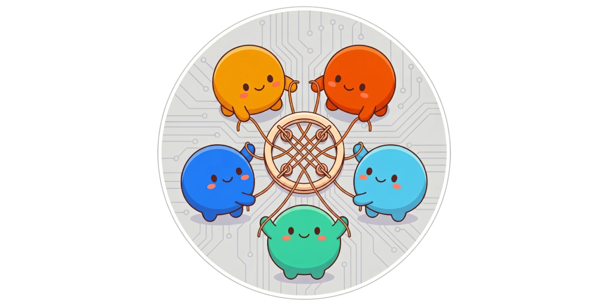
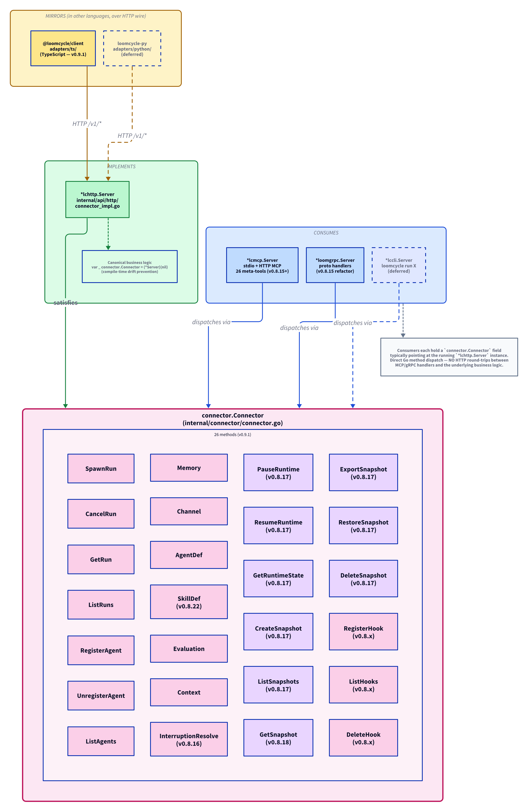

<p align="center">
  <a href="https://loomcycle.dev"></a>
</p>

<p align="center">
  <strong>The agentic runtime, in a sidecar.</strong><br/>
  <em>One Go binary alongside your application. Hardened agent loop, MCP on both sides, multi-replica HA. Apache-2.0.</em>
</p>

<p align="center">
  🌐 <a href="https://loomcycle.dev"><strong>loomcycle.dev</strong></a> &nbsp;·&nbsp;
  📝 <a href="https://loomcycle.dev/blog/">Engineering blog</a> &nbsp;·&nbsp;
  📐 <a href="https://github.com/denn-gubsky/loomcycle/blob/main/docs/ARCHITECTURE.md">Architecture</a>
</p>

<p align="center">
  <a href="https://github.com/denn-gubsky/loomcycle/releases"></a>
  <a href="LICENSE"></a>
  
  <a href="https://github.com/sponsors/denn-gubsky"></a>
</p>

---

> 🌳 **Stable and in production.** loomcycle is past v1.0 — feature-complete, hardened, and distribution-ready (Homebrew, multi-arch Docker, a Claude Code plugin, TS + Python adapters, a TrueNAS app). Validated by an 8-hour soak: 1.27M circuits, 3.8M agent runs, zero leaks. Development since v1.0 has been new primitives plus hardening — see [`REVISIONS.md`](REVISIONS.md) for recent releases and [the releases page](https://github.com/denn-gubsky/loomcycle/releases) for the full history. Apache-2.0. We welcome bug reports, security disclosures, feature contributions, downstream consumers, and forks. See [`CONTRIBUTING.md`](CONTRIBUTING.md).

---

## What it is

**The agentic runtime, in a sidecar.** loomcycle is one Go binary, ~50 MB. It runs *alongside* your application, not inside it. Your app calls loomcycle over HTTP, gRPC, MCP, the TypeScript adapter, or the Python adapter. The agent loop, multi-provider routing, memory and channel primitives, MCP server identity, OpenTelemetry traces, and multi-replica coordination all live in the binary. Your application stays in whatever language you wrote it in.

**The shape that's different.** Today's agentic-systems market gives you three options. One: embed a Python or TypeScript library inside your application process. Two: rent a managed cloud service tied to one vendor's IAM. Three: proxy your model calls through a gateway that doesn't actually run agents.

loomcycle is a fourth option. A lightweight self-hostable runtime that owns the loop *and* speaks every wire format your stack already uses.

## What's shipped

Organised by what the runtime *does*, not by when each piece landed — for the
release-by-release view see [`REVISIONS.md`](REVISIONS.md) and the
[GitHub releases](https://github.com/denn-gubsky/loomcycle/releases).

| Capability | What you get |
|---|---|
| **Providers** | Anthropic, OpenAI, DeepSeek, Gemini, Ollama (cloud + local) over native HTTP with no vendor SDK, behind one `Provider` interface. Config-driven `providers:` map, per-tier/effort routing, user-tier fallback cascade, `PinAfterSuccess`, model aliases and `model_pattern` globs. Plus a synthetic **`code-js`** provider (deterministic, zero token cost) and a **mock** provider for load tests. |
| **Built-in tools** | Read / Write / Edit / Grep / Glob / NotebookEdit / HTTP / WebFetch / WebSearch / Bash / Agent / Skill / Memory / Channel / History / Path / Document / AgentDef / SkillDef / Evaluation / Interruption / Context. |
| **Memory** | Four facets on one tool: key-value, **vector** (sqlite-vec / pgvector), **SQL** (a per-scope database, sqlite + postgres tiers), and an agentic **memory layer** (background consolidation, hybrid recall, bi-temporal entity graph with a layered ontology). Scoped agent / user / tenant / run, tenant-isolated, capability-gated. |
| **Documents & paths** | Chunked-graph **Documents** (chunk bodies in Memory, structure in SQL Memory) with images, Mermaid diagrams, cross-references and Markdown import/export — addressed through a Unix-like **Path** VFS. |
| **Substrate** | Content-addressed (SHA-256), runtime-mutable, tenant-scoped defs pushed at boot: Agent / Skill / MCPServer / Schedule / Webhook / MemoryBackend / A2A / Team / Volume / Credential / OperatorToken. Authored over every transport; verify-or-fork across deployments. |
| **Multi-agent** | Sub-agents via the `Agent` tool, `parallel_spawn` fan-out, external batch fan-out, resident/interactive sub-agents, and a state-machine **Team** orchestrator. |
| **Isolation** | Per-agent ro/rw filesystem **Volumes** (sandbox-by-default), an in-process **Bashbox**, and a **sandboxed code-execution** sidecar with a dev toolchain. |
| **Triggers** | Scheduler, inbound **Webhooks** (HMAC verify-before-parse), and **A2A** peer interop. |
| **Multi-tenancy** | Per-principal bearer tokens bound to an authoritative `(tenant, subject, scopes)`; per-route HTTP and per-RPC gRPC gates; tenant isolation across both the state and definition planes. Per-tenant credentials, per-scope usage/cost attribution, token budgets, and data-retention + subject-erasure surfaces. Single-tenant stays the default. |
| **Context** | A compaction subsystem (manual / auto / self, per-agent policy that flows down the spawn tree), context-transform plugins including a secret **redactor**, and `{{memory:…}}` / `{{tool:…}}` prompt expansion. |
| **Operations** | Pause / Resume / Snapshot with cross-instance resume, multi-replica HA (Redis cancel pubsub, DB-backed session locks, singleton sweepers), OTEL + Prometheus, per-tenant fairness, tool-use hooks. |
| **Interfaces** | HTTP+SSE, gRPC, loomcycle-as-an-MCP-server (`loomcycle mcp [--upstream]`), MCP client, the TS (`@loomcycle/client`) and Python adapters, an n8n package, an OpenAI-compatible LLM gateway, and an embedded React Web UI. |
| **Distribution** | Homebrew, multi-arch Docker, a Claude Code plugin, embedded config presets + agent bundles, and a TrueNAS SCALE app. |

## Two postures, one binary

Same Go binary, same config schema. Operator flips a few env vars to pick the posture.

| Posture | Configuration shape | Use case |
|---|---|---|
| **True managed sandbox** | `LOOMCYCLE_BASH_ENABLED=0`, no `volumes:` block (sandbox-by-default — agents get no disk access), `LOOMCYCLE_HTTP_HOST_ALLOWLIST` empty, `LOOMCYCLE_HTTP_CALLER_AUTHORITATIVE=1`. Every tool default-deny; agents can only reach what the caller's per-request `allowed_hosts` says. | Shared-server deployments processing untrusted prompts. The runtime survives contact with adversarial input. |
| **Agentic dev environment** | Bash enabled, a `default` rw `volumes:` entry pointing at your workspace, broad `allowed_hosts`, optional local Ollama for offline work. | Local development. Internal trusted operators. Single-user research workstation. |

The trust boundary is **operator / caller**. The operator config is the floor; callers can narrow per-request but never widen. The bearer token (`LOOMCYCLE_AUTH_TOKEN`) is the authority. Treat anyone with the token as fully trusted to drive the runtime. For true isolation in the sandbox posture, run loomcycle inside a container or VM. `Bash` is restricted (cwd, env scrub, output bounds, timeouts) but it is **not** a kernel-level sandbox.

## Install

Pick the path that fits. All four ship the same single static binary
plus the v0.11.1 `init` / `doctor` first-run flow. `Context.help
installation` covers each in detail.

```sh
# Homebrew (macOS + Linux)
brew install denn-gubsky/loomcycle/loomcycle

# Docker (v0.11.2+; pull works on amd64 + arm64 including Apple Silicon)
docker pull denngubsky/loomcycle:latest

# go install from source (skips Web UI embedding — for dev only)
go install github.com/denn-gubsky/loomcycle/cmd/loomcycle@latest

# Direct tarball (one of darwin-arm64 / darwin-amd64 / linux-arm64 / linux-amd64)
curl -L https://github.com/denn-gubsky/loomcycle/releases/latest/download/loomcycle-darwin-arm64.tar.gz | tar xz
```

## Quick start (seconds, authenticated)

```sh
loomcycle init --with-token   # writes config + mints a token to ~/.config/loomcycle/auth.env (0600)
export ANTHROPIC_API_KEY=sk-...   # (or OPENAI_API_KEY / DEEPSEEK_API_KEY) — at least one provider key
loomcycle doctor              # verify env + keys + storage + the just-minted token
loomcycle                     # starts on 127.0.0.1:8787 (auto-loads auth.env — no shell-rc edit)
```

`init --with-token` prints the Web UI URL (`http://127.0.0.1:8787/ui`). Open it, then paste the token from `~/.config/loomcycle/auth.env` at the login prompt. (The token is kept in the `0600` file and never embedded in a URL. A `?token=` link would leak the bearer into browser history and into any fronting proxy's logs.) `loomcycle` and `loomcycle doctor` both auto-load `auth.env` from the config dir; a real `export LOOMCYCLE_AUTH_TOKEN=…` always overrides it.

## Bootstrap tiers

Pick the tier that fits. Each is a superset of the one above. **Auth is enforced only once something is configured**, so Tier 1 needs no token at all.

### Tier 1: zero-config dev (open mode, localhost)

No token, no flags. Fastest way to kick the tires on `127.0.0.1`.

```sh
loomcycle init               # config only — no secret written
export ANTHROPIC_API_KEY=sk-...
loomcycle                    # open mode: /v1/* + /ui pass through unauthenticated (logs a warning)
open http://127.0.0.1:8787/ui
```

With no `LOOMCYCLE_AUTH_TOKEN` and no minted tokens, the runtime runs **open** on localhost. Every request is allowed, whoami returns a synthetic admin. Good for a 10-second smoke test. **Never** expose this off localhost.

### Tier 2: single shared token (the recommended default)

One bearer gates everything. `init --with-token` is the easy button (above). Equivalent manual setup:

```sh
loomcycle init
export LOOMCYCLE_AUTH_TOKEN=$(openssl rand -hex 32)   # or: loomcycle init --with-token
export ANTHROPIC_API_KEY=sk-...
loomcycle
open "http://127.0.0.1:8787/ui?token=$LOOMCYCLE_AUTH_TOKEN"   # sets the cookie once
```

Treat anyone holding the token as fully trusted to drive the runtime.

### Tier 3: multi-tenant, per-principal tokens (RFC L, v0.17.0)

Mint a distinct bearer per developer / app, each bound to an authoritative `(tenant, subject, scopes)`. Migrate a Tier-2 deployment in place, no downtime:

```sh
# promote your existing shared token into the substrate, then mint scoped tokens
loomcycle operator-token create --copy-from-env --name ops --tenant ops --scopes substrate:admin
loomcycle operator-token create --name acme-app --tenant acme --subject alice --scopes runs:create
```

The first admin `OperatorTokenDef` disables the legacy shared-token fallback. Per-route HTTP and per-RPC gRPC scopes. The Web UI becomes role-aware (super-admin vs tenant). See `Context.help operator-tokens` and the v0.17.0 notes in [`REVISIONS.md`](REVISIONS.md).

**Smoke any tier:**

```sh
curl http://127.0.0.1:8787/healthz
# {"ok":true}
```

Real call (from another terminal):

```sh
curl -N http://127.0.0.1:8787/v1/runs \
  -H "Authorization: Bearer $LOOMCYCLE_AUTH_TOKEN" \
  -H "Content-Type: application/json" \
  -d '{"agent":"default","segments":[{"role":"user","content":[{"type":"trusted-text","text":"Hello"}]}]}'
```

Build from a checkout (for development):

```sh
make build-all       # UI + binary in one shot; output → ./bin/loomcycle
./bin/loomcycle --config loomcycle.example.yaml
```

**Multi-replica cluster demo (v0.12.x).** For a one-command `docker compose up` cluster (2 loomcycle replicas, Postgres, nginx LB) with a verify script, see [`examples/cluster/README.md`](examples/cluster/README.md). Full operator runbook in [`docs/MULTI-REPLICA.md`](docs/MULTI-REPLICA.md).

## Where it's going

Recent releases are in [`REVISIONS.md`](REVISIONS.md); the roadmap is
[`docs/PLAN.md`](docs/PLAN.md).

loomcycle is past its feature-complete milestone (v1.0.0) and the line since has
been primitives plus hardening: memory, documents, teams, sandboxing, retention
and erasure. Current direction is the agentic-memory subsystem and the document
surfaces built on it.

## Architecture

Three diagrams cover different views of the same runtime:

<p align="center">
  
</p>

Diagram source: [`docs/architecture.d2`](docs/architecture.d2) (regenerate with `d2 docs/architecture.d2 docs/assets/architecture.png`).

**Connector detail.** The v0.8.15 `Connector` abstraction layer (the pink block in the middle of the main diagram) is the architectural anchor every wire transport dispatches through. The detail diagram enumerates all 36 methods and shows which transports IMPLEMENT, CONSUME, and MIRROR the interface:

<p align="center">
  
</p>

Source: [`docs/architecture-connector.d2`](docs/architecture-connector.d2).

**Multi-replica cluster mode (v0.12.x).** When `LOOMCYCLE_REPLICA_ID` is set per process and the Postgres backend is used, loomcycle runs as a cluster behind any HTTP load balancer. The shared Postgres doubles as the LISTEN / NOTIFY backplane for cross-replica cancel, pause / resume, run-state fanout, and quota notifications. SQLite refuses cluster mode at boot.

<p align="center">
  
</p>

Source: [`docs/architecture-cluster.d2`](docs/architecture-cluster.d2). Operator runbook: [`docs/MULTI-REPLICA.md`](docs/MULTI-REPLICA.md). Demo: [`examples/cluster/README.md`](examples/cluster/README.md).

Full request flow, abstractions, and concurrency model: [`docs/ARCHITECTURE.md`](docs/ARCHITECTURE.md).

## Adapters

- **TypeScript.** `npm install @loomcycle/client` (see [`adapters/ts/`](adapters/ts/)). HTTP + SSE.
- **Python.** `pip install loomcycle` (see [`adapters/python/`](adapters/python/)). Async over `grpc.aio`.

## Security highlights

- **No vendor binary** in the loop. Pure HTTP to provider APIs. No subprocess auth inheritance.
- **Default-deny everything.** Every built-in tool is disabled until env-configured. Every agent gets zero tools until `tools` is set.
- **Two-layer policy + per-request narrowing.** Operator floor in env; agent narrowing in yaml; caller narrowing per-run. Caller can never widen.
- **SSRF defence.** Hostname allowlist + RFC1918/loopback/link-local IP block at the dial layer. Defeats DNS rebinding.
- **Constant-time bearer auth.** `sha256+CTC` on both HTTP and gRPC.
- **`Bash` is restricted, not isolated.** Run inside a container or VM if you need real isolation.

Full security model and the two-layer default-deny walkthrough: [`docs/TOOLS.md`](docs/TOOLS.md).

## Documentation

Repo-side docs (this directory):

- [`docs/ARCHITECTURE.md`](docs/ARCHITECTURE.md). Request flow, provider abstraction, agent loop, sub-agents, skills, storage, concurrency, cancellation.
- [`docs/TOOLS.md`](docs/TOOLS.md). Two-layer default-deny model, every built-in tool, MCP / LocalAPI integrations, per-request narrowing.
- [`docs/CUSTOMIZING_AGENTS.md`](docs/CUSTOMIZING_AGENTS.md). Adding a skill, tool, or whole MCP server to a chat agent: the capability model (who may widen a tool ceiling and why), when a skill is free vs when you must derive a new agent, `mcp__<server>__*` grants, in-place widening of dynamic agents, and delegation.
- [`docs/PATH.md`](docs/PATH.md). The Path primitive (RFC AL): a Unix-like VFS over Memory / Volumes / Documents — the dirent model, the six ops, and the off-run cross-transport surface (HTTP / gRPC / MCP / TS / Python).
- [`docs/DOCUMENTS.md`](docs/DOCUMENTS.md). The Document primitive (RFC AK): chunked-graph documents — content/structure split, the 13 ops, optimistic concurrency, atomic deletes, and the off-run cross-transport surface.
- [`docs/MCP_INTEGRATION.md`](docs/MCP_INTEGRATION.md). End-to-end MCP HTTP pipeline: request lifecycle, `${run.user_bearer}` substitution, model-visibility boundary, recipe for wrapping a REST API as an MCP server consumable by loomcycle.
- [`docs/MCP_SERVER.md`](docs/MCP_SERVER.md). Register loomcycle as an MCP server in Claude Code / Claude Desktop. Copy-paste config snippets for Docker / Homebrew / direct-binary transports, plus the `loomcycle mcp install` helper.
- [`docs/CLAUDE-CODE.md`](docs/CLAUDE-CODE.md). Driving loomcycle from Claude Code: the recommended `claude-code-plugin-loomcycle` plugin (slash commands + skills + hooks) vs. the manual `loomcycle mcp install` path.
- [`docs/CONFIGURATION.md`](docs/CONFIGURATION.md). Operator config guide: provider / tier / user_tier resolution rules, four cookbook patterns (single / multi-provider × single / multi-user-tier), `models:` alias map, and the agent `.md` frontmatter field reference.
- [`docs/SEARCH.md`](docs/SEARCH.md). Web-search providers (RFC BB): the catalog + fallback circuit, `search_providers` / `search_priority` config, per-agent lists, operator/tenant keys, the routing view — and a self-hosted **SearXNG** deploy recipe (the sidecar + the three `settings.yml` knobs + verification).
- [`docs/POSTGRES.md`](docs/POSTGRES.md). Postgres backend operator guide: configuration, migrations, sqlite → postgres runbook, concurrency benchmark.
- [`docs/GRPC.md`](docs/GRPC.md). gRPC surface: enablement, wire-shape parity with HTTP + SSE, error mapping, Python adapter quick-start.
- [`docs/PLAN.md`](docs/PLAN.md). Public roadmap and current direction.
- [`REVISIONS.md`](REVISIONS.md). Release notes for the most recent versions; older ones are on the [releases page](https://github.com/denn-gubsky/loomcycle/releases).
- [`CONTRIBUTING.md`](CONTRIBUTING.md). Contribution policy (closed for external PRs until v1.x).
- [`CLAUDE.md`](CLAUDE.md). Project guide for agents working in this repo (Claude Code).

In-binary docs (bundled `Context.help` topics; agents read these directly, operators hit `GET /v1/_help/<topic>` against a running instance):

- `installation`. All four install paths (Homebrew, Docker, `go install`, direct tarball) with verification + troubleshooting.
- `getting-started`. First-run walkthrough: `init` → set env vars → `doctor` → run.
- `llm-gateway`. Direct LLM routing endpoint (v0.11.0; for n8n + LangChain consumers).
- `openai-compat`. Drop-in OpenAI SDK shims (v0.11.3 chat + v0.11.4 embeddings) with Python + TypeScript examples.
- `fairness`. Per-user concurrency quota policy.
- `observability`. OTEL trace export setup.
- `vector-memory`, `voyage-embedder`, `sqlite-vec`. Vector Memory backends.
- `dynamic-mcp`. Register MCP servers at runtime.
- `bash-security`. The Bash tool's restricted-not-isolated security posture.

Full list via `GET /v1/_help` against a running instance.

## Sponsor

If loomcycle is useful to you or your team, [GitHub Sponsors](https://github.com/sponsors/denn-gubsky) helps fund continued development. Individual supporters and corporate sponsors both welcome.

The runtime stays Apache-2.0 either way. Sponsorships fund the v1.x runway: Helm chart, operator cookbook, settings UI, and the sustained engineering that keeps the binary small and the substrate stable.

Current sponsors are listed in [`BACKERS.md`](BACKERS.md) (and at [loomcycle.dev/sponsors](https://loomcycle.dev/sponsors) with logos).

## License

Apache-2.0. See [LICENSE](LICENSE).
