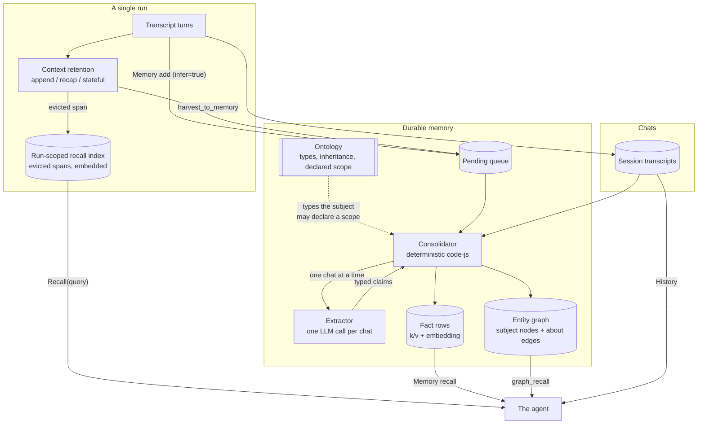
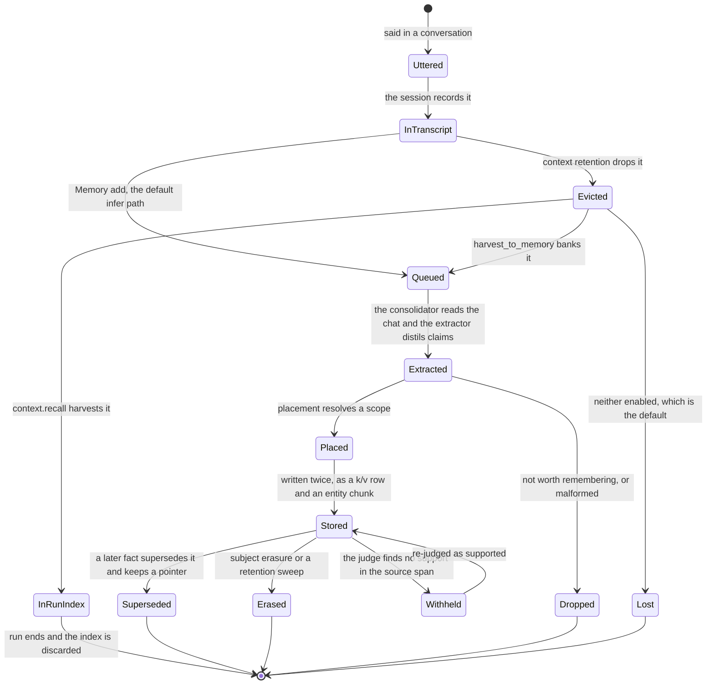
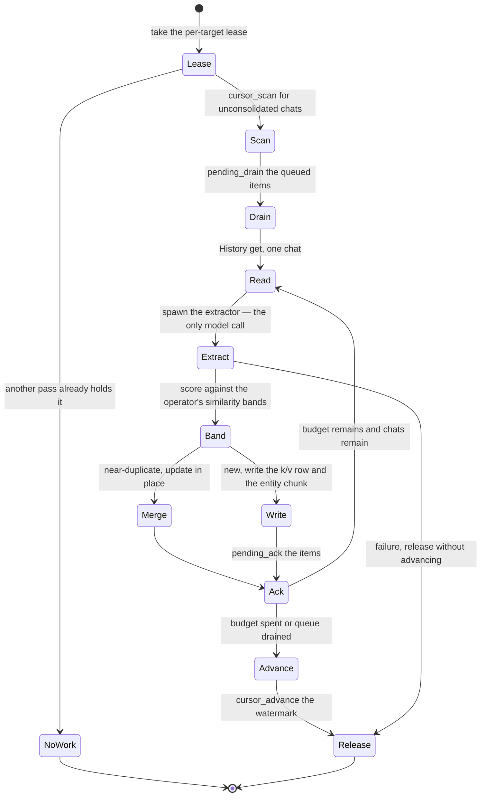

<!-- EXPORTED FROM THE LOOMCYCLE DOCUMENT STORE — DO NOT EDIT HERE.
     Source of truth: /loomcycle/docs/memory-architecture (scope=user)
     Regenerate with `document op=export_md` rather than editing this file;
     an edit here is lost on the next export. -->

# Memory architecture

loomcycle keeps four kinds of memory, and the useful thing to understand first is that they are not layers of one store — they are different answers to different questions, with different lifetimes and different failure modes.

**The case for this shape, against the obvious alternative.** The obvious alternative is to embed every conversation turn and search it. That is what most published systems do, it is simple, and — measured on a long-conversation QA benchmark — it *beats* the distilled fact store by a wide margin (see **What has actually been measured**). So the design has to justify itself on something other than answering questions about a conversation you still have. It does: durable facts are what survive when the transcript is gone or too large to search, what can be shared between users who never had the conversation, and what can be corrected in one place. Distillation is lossy on purpose; the mistake is treating it as a replacement for the source rather than a layer above it.

## The four kinds

**Chats** are the raw transcripts. Every conversation is a session and the full text is retained. Reachable through the `History` tool — list, search, recap, resume — but *not* through semantic recall, because chats are not embedded rows.

**The pending queue** is where turns wait. `Memory add` with the default `infer=true` does **not** store a retrievable row; it enqueues the turns for a background consolidator and returns `pending`. This is the single most surprising property of the system and the source of its biggest measured weakness.

**Facts** are what a consolidator distils from chats: short, self-contained statements, deduplicated and reconciled, each carrying provenance and a time axis. These are what semantic `recall` searches.

**In-run context** is not durable memory at all. It is the working set of a single run — what the model can currently see — and it shrinks as the run grows. What it discards can now be captured, which is the newest part of the design.

## Structure

Read it as three timescales: the run (minutes), the queue and consolidator (minutes to hours behind), and the durable store (indefinite).

## The life of one piece of information

Two things are worth noticing. **`Lost` is the default path** for an evicted span — capture is opt-in, on both routes. And nothing on the durable side is hard-deleted by the normal flow: a correction supersedes with a pointer, a failed verification withholds rather than removes. Only erasure and the retention sweeper actually delete.

## The consolidator's pass

The consolidator is a deterministic program, not a prompt. Ten of its eleven steps are mechanism; exactly one needs language understanding and is delegated to the extractor, which has no tools at all. That split is deliberate: a prompt can only *ask* for an invariant, and every invariant below is one a prompt-driven pass dropped in production.

The watermark only advances once a chat is fully consolidated, so a pass that runs out of budget re-reads the same chats next time and carries on. The lease is what stops two passes consolidating the same target at once, and a failed extraction releases without advancing so nothing is skipped.

## A fact is stored twice, and both halves must agree

Every durable fact exists in two places:

- a **key-value row**, keyed `memory/<class>/<slug>`, carrying the text, an embedding, provenance and the time axis — this is what semantic `recall` searches;
- a **typed chunk in the entity graph**: a subject node (natural key `type:slug-of-subject`) plus the claim, joined by an `about` edge — this is what a graph walk traverses.

If the two halves land in different scopes, the fact is stored and yet unreachable from the thing it describes. That was a real defect: placed facts got their nodes in the shared plane and their joining edge in the caller's scope, so a walk from the person's name found nothing.

## Scopes and isolation

Every row lives in exactly one scope inside exactly one tenant:

| scope | keyed by | shared with |
|---|---|---|
| `agent` | the agent name | every user of that agent |
| `user` | the end user | every agent that may read it |
| `run` | one run | nothing; discarded after |
| `tenant` | the tenant | everyone in the tenant |

An agent reaches only what `memory_scopes` grants, and a `recall` reads **one** scope per call — consulting two means two calls. The tenant scope additionally requires the grant on `sql_scopes`, because the chunk half of a fact is structured in SQL Memory.

Underneath, SQL Memory gives each scope its own Postgres schema and its own LOGIN role with a derived password, holding `USAGE` on that schema alone. Caller-authored SQL runs as that role and never as the admin; identifiers are hashes of the validated scope key, so no caller text reaches DDL. A statement validator adds a closed allow-list of leading keywords plus targeted denials for the escapes those keywords would otherwise permit.

## The ontology, and placement

Each tenant has an ontology document: entity types with inheritance and fields. The extractor types every subject against it, and an undeclared type becomes an inert candidate for an operator to accept rather than a lost write.

A type may also declare which scope facts about that kind of thing belong in. A claim then reaches its scope through the subject it is already linked to — `claim → subject → the subject's type → the type's declared scope` — so placement is operator configuration rather than a per-fact judgement, and no model is asked a second question.

It declines rather than guesses. No type, an unknown type, a subject typed inconsistently across writes, a fact about the profile owner, an isolated member, a missing grant: each resolves to the writer's own scope with a reason recorded.

**It is off by default twice over.** No shipped type declares a scope, and the declaration does nothing unless the consolidator holds the tenant grant on both axes.

## In-run context, and recall over what it discards

A run's working set is managed one of three ways: `append` keeps everything until it cannot, `recap` keeps a reasoning summary, `stateful` keeps a validated structured state. `mode: auto` picks by the model that actually resolved — schema-free recap on a local backend, structured state on a frontier API, because structured state needs reliable structured output.

All three discard work by design. Two opt-ins capture it:

- **`context.recall`** harvests each evicted span into a run-scoped, in-memory, embedded index and grants the agent a free-text `Recall(query)` tool over it, falling back to durable memory. Enabling recall auto-grants the tool, because an empty `tools:` allowlist is default-deny and a recall-enabled agent with no way to query its index would simply confabulate.
- **`context.harvest_to_memory`** banks the evicted span for the consolidator, so what a distillation drops can become a durable fact instead of vanishing at the end of the run.

Neither is wired on the resume path: a resumed run replays its past distillations, and harvesting there would double-index.

## What has actually been measured

**Consolidated facts versus raw turns.** Same corpus, same 199 paired questions, one variable — whether the partition holds distilled facts or the raw turns:

| | facts | turns |
|---|---|---|
| accuracy | 0.157 | **0.738** |
| abstention | 0.764 | 0.146 |
| temporal | **0.036** | **0.873** |
| single-hop | 0.199 | 0.775 |
| multi-hop | 0.194 | 0.529 |
| open-domain | 0.312 | 0.312 |

Paired McNemar: 111 questions turns-only-right against 3 facts-only-right, exact p = 2.4 × 10⁻²⁹. Of those three, one is a genuine win — a fact the distillation had dated and computed, which raw retrieval could not surface.

The mechanism is **abstention**, not retrieval: the answerer correctly says it cannot find the detail, because distillation removed it. It is not a yield problem either — compression measured 7.2:1 and 9.0:1 with exact counters. Temporal is the sharpest slice because a raw turn carries its timestamp in its text and a distilled fact does not, despite the storage having a full time axis.

**Placement.** On a two-user corpus, duplicate copies fell from 30 to 23 — a 23% reduction, not elimination, because cross-user duplication was replaced by tenant-to-owner duplication. The payoff that does hold is sharing: 94 facts readable by both users where none were before. An unpredicted second-order effect was cross-user type stability — subjects keep one identity across users instead of one per scope.

## Known limitations

**The default path is the losing one.** `Memory add` stores no retrievable row, so a deployment's recall path is facts-only — the arm that scored 0.157. Recall-augmented distillation exists to close this and has only recently become reachable.

**The self-guard cannot protect what a counterparty recorded.** Placement never publishes a fact about the profile owner — but only for facts learned from *that owner's* conversations. Another user recording the same thing is recording a fact about a third party, so their copy is placed. Measured on a two-party corpus, each user published the other's facts tenant-wide, leaving each owner's facts *more* exposed than before placement was enabled. This is not a bug; it is what per-scope decisions with no global view produce. The control that works is the declaration: declare the impersonal types and leave `person` alone.

**Erasure of a promoted fact is unsettled.** Once a fact is in the shared plane, whose deletion removes it is not defined.

**Retrieval is only real on Postgres.** SQLite has no working vector tier in practice, so semantic recall needs Postgres with pgvector.

## What needs to be done

**1. Keep the source material retrievable, and measure it.** The highest-value change, and the machinery is now in place. Re-run the paired benchmark with `context.recall` enabled on the answerer and see how much of the 54-point gap it recovers. The baseline, the sample and the significance test all already exist.

**2. Fix time.** Facts lose their dates even though the rows carry `observed_at`, `valid_at` and `invalid_at`. It is the largest single slice at 0.036 against 0.873, and it looks recoverable rather than fundamental — the axis exists and is not reaching the answer.

**3. Define the benchmark before building a semantic graph over facts.** A graph improves traversal of what is stored; it cannot recover a date that was never kept, so on this workload it is the wrong lever. If the goal is cross-session synthesis it may well pay — but the corpus above cannot show that, and two previous efforts shipped deltas nobody could confirm.

**4. Finish the isolation review.** The Postgres scope boundary holds link by link and the SQL validator survived active probing. Four files in that subsystem remain unreviewed, including the transaction-nesting logic.

**5. Settle erasure for placed facts.**

**6. Reconcile the documentation.** The project treats the document store as authoritative and repo markdown as an export, while the repo has run ahead. Either re-sync the store or stop calling it primary.
